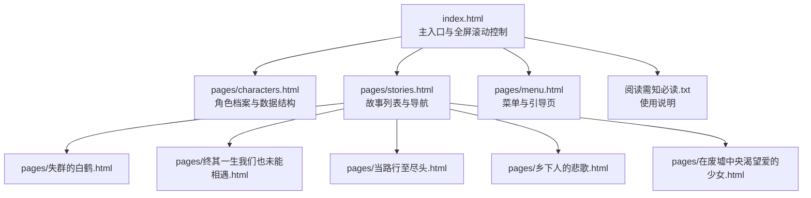
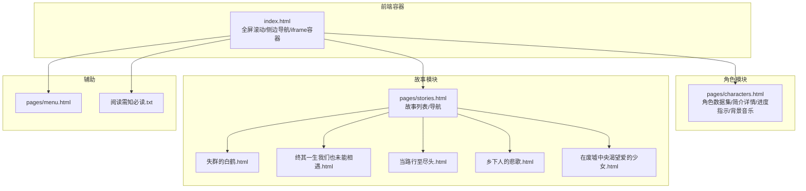
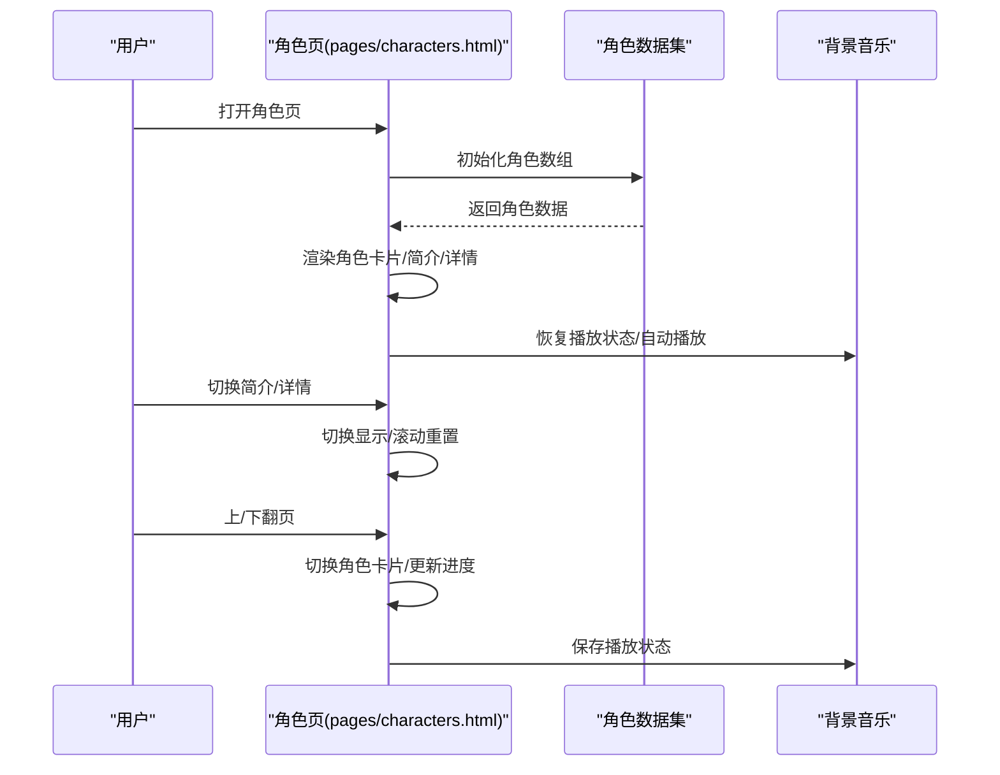
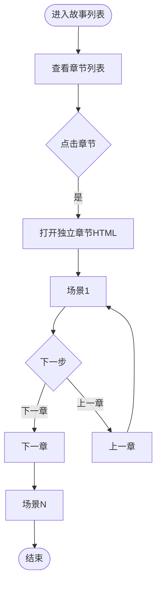
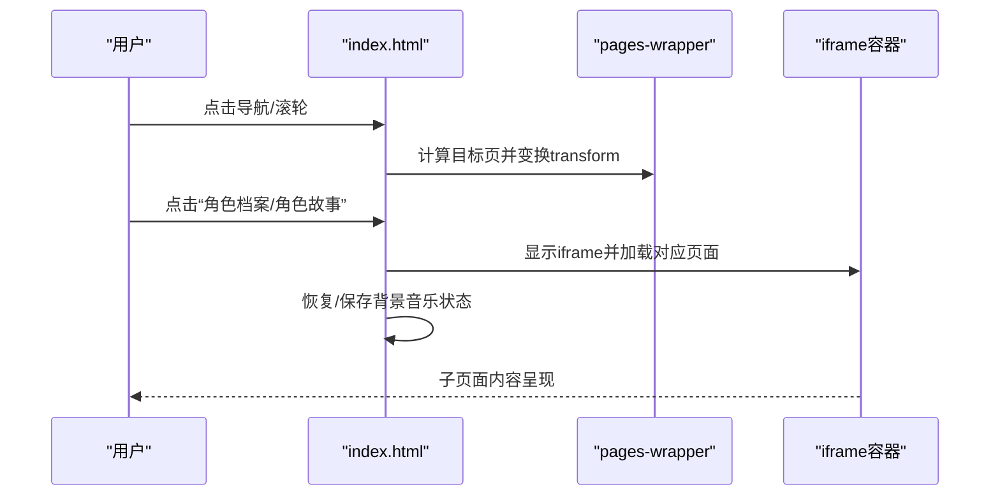
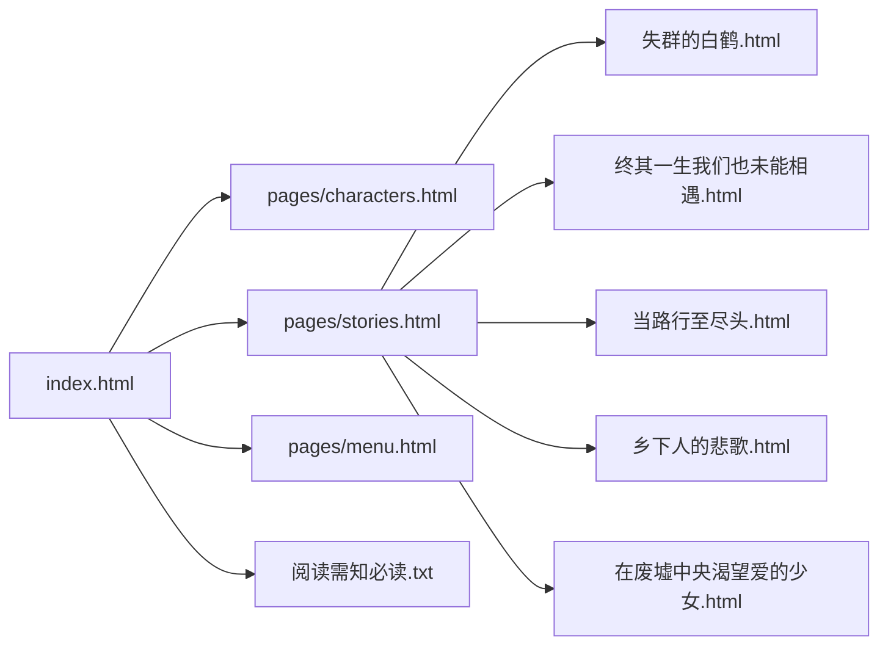

# 内容管理

<cite>
**本文档引用的文件**
- [index.html](file://index.html)
- [characters.html](file://pages/characters.html)
- [stories.html](file://pages/stories.html)
- [menu.html](file://pages/menu.html)
- [失群的白鹤.html](file://pages/失群的白鹤.html)
- [终其一生我们也未能相遇.html](file://pages/终其一生我们也未能相遇.html)
- [当路行至尽头.html](file://pages/当路行至尽头.html)
- [乡下人的悲歌.html](file://pages/乡下人的悲歌.html)
- [在废墟中央渴望爱的少女.html](file://pages/在废墟中央渴望爱的少女.html)
- [阅读需知（必读）.txt](file://阅读需知（必读）.txt)
</cite>

## 目录
1. [引言](#引言)
2. [项目结构](#项目结构)
3. [核心组件](#核心组件)
4. [架构总览](#架构总览)
5. [详细组件分析](#详细组件分析)
6. [依赖分析](#依赖分析)
7. [性能考虑](#性能考虑)
8. [故障排查指南](#故障排查指南)
9. [结论](#结论)
10. [附录](#附录)

## 引言
本文件面向《夙日不再世界观》内容管理系统，系统性梳理角色数据结构与管理方式、故事内容组织架构与链接管理、多媒体资源集成策略，以及新增内容的完整流程、内容更新最佳实践、版本管理与发布流程、创作指导原则与质量标准。文档兼顾技术实现细节与非技术读者的可读性，提供可视化图表与流程图帮助理解。

## 项目结构
项目采用静态站点结构，主入口为 index.html，角色与故事内容分别通过独立 HTML 页面承载，菜单与引导页作为入口导航。故事内容以“章节”形式组织，每个故事为独立 HTML 文件，通过 stories.html 提供统一入口与导航。

**图表来源**
- [index.html](file://index.html)
- [characters.html](file://pages/characters.html)
- [stories.html](file://pages/stories.html)
- [menu.html](file://pages/menu.html)
- [失群的白鹤.html](file://pages/失群的白鹤.html)
- [终其一生我们也未能相遇.html](file://pages/终其一生我们也未能相遇.html)
- [当路行至尽头.html](file://pages/当路行至尽头.html)
- [乡下人的悲歌.html](file://pages/乡下人的悲歌.html)
- [在废墟中央渴望爱的少女.html](file://pages/在废墟中央渴望爱的少女.html)
- [阅读需知（必读）.txt](file://阅读需知（必读）.txt)

**章节来源**
- [index.html](file://index.html)
- [characters.html](file://pages/characters.html)
- [stories.html](file://pages/stories.html)
- [menu.html](file://pages/menu.html)
- [阅读需知（必读）.txt](file://阅读需知（必读）.txt)

## 核心组件
- 主入口与全屏滚动控制：index.html 负责全局样式、背景层、全屏滚动、侧边导航、iframe 子页面切换、背景音乐状态持久化与自动播放控制。
- 角色档案系统：pages/characters.html 以“角色数据集”为核心，动态渲染角色卡片、简介/详情切换、进度指示、背景音乐与状态持久化。
- 故事列表与导航：pages/stories.html 提供故事章节的统一入口，包含章节标题、简介与链接。
- 独立故事章节：每个故事以独立 HTML 文件组织，采用场景分页结构，提供“上一章/下一章”导航。
- 菜单与引导页：pages/menu.html 提供站点入口与引导信息。
- 使用说明：阅读需知（必读）.txt 提供加载提示、背景音乐与特效加载注意事项。

**章节来源**
- [index.html](file://index.html)
- [characters.html](file://pages/characters.html)
- [stories.html](file://pages/stories.html)
- [menu.html](file://pages/menu.html)
- [阅读需知（必读）.txt](file://阅读需知（必读）.txt)

## 架构总览
系统采用“主页面 + 子页面（角色/故事）”的混合架构。index.html 作为“容器页”，通过 iframe 展示子页面，实现全屏滚动与侧边导航；角色与故事以静态 HTML 承载，便于离线阅读与快速加载。

**图表来源**
- [index.html](file://index.html)
- [characters.html](file://pages/characters.html)
- [stories.html](file://pages/stories.html)
- [menu.html](file://pages/menu.html)
- [阅读需知（必读）.txt](file://阅读需知（必读）.txt)
- [失群的白鹤.html](file://pages/失群的白鹤.html)
- [终其一生我们也未能相遇.html](file://pages/终其一生我们也未能相遇.html)
- [当路行至尽头.html](file://pages/当路行至尽头.html)
- [乡下人的悲歌.html](file://pages/乡下人的悲歌.html)
- [在废墟中央渴望爱的少女.html](file://pages/在废墟中央渴望爱的少女.html)

## 详细组件分析

### 角色数据结构与管理
- 数据结构：角色数据以数组形式存储，每条记录包含 id、name、subtitle、skill、brief、detail、img、hasAudio、audioSrc 等字段。简介与详情通过“简介/详情切换”按钮在页面内切换显示。
- 动态渲染：页面加载时遍历角色数组，生成角色卡片与场景元素，支持键盘与滚轮导航，实现上下章节切换与进度指示。
- 背景音乐：角色页内置背景音乐播放与状态持久化，支持自动播放与暂停、音量控制与状态保存。
- 图片与占位：角色头像通过 img 标签加载，onerror 时回退到占位图，确保加载失败时页面可用。

**图表来源**
- [characters.html](file://pages/characters.html)

**章节来源**
- [characters.html](file://pages/characters.html)

### 故事内容组织与链接管理
- 故事列表：stories.html 提供统一入口，列出各故事章节标题与简介，点击后跳转至对应独立 HTML 文件。
- 独立章节：每个故事章节采用“场景分页”结构，包含章节标题、时间地点、角色与对白、场景描述与导航按钮。章节间通过“上一章/下一章”按钮切换。
- 外部资源集成：故事章节内可嵌入图片、图标与背景元素，配合 CSS 动画与过渡效果，提升沉浸感。

**图表来源**
- [stories.html](file://pages/stories.html)
- [失群的白鹤.html](file://pages/失群的白鹤.html)
- [终其一生我们也未能相遇.html](file://pages/终其一生我们也未能相遇.html)
- [当路行至尽头.html](file://pages/当路行至尽头.html)
- [乡下人的悲歌.html](file://pages/乡下人的悲歌.html)
- [在废墟中央渴望爱的少女.html](file://pages/在废墟中央渴望爱的少女.html)

**章节来源**
- [stories.html](file://pages/stories.html)
- [失群的白鹤.html](file://pages/失群的白鹤.html)
- [终其一生我们也未能相遇.html](file://pages/终其一生我们也未能相遇.html)
- [当路行至尽头.html](file://pages/当路行至尽头.html)
- [乡下人的悲歌.html](file://pages/乡下人的悲歌.html)
- [在废墟中央渴望爱的少女.html](file://pages/在废墟中央渴望爱的少女.html)

### 主入口与全屏滚动控制
- 全屏滚动：index.html 通过 pages-wrapper 与 page 元素实现全屏滚动，支持鼠标滚轮与侧边导航点击切换。
- iframe 子页面：通过 iframeContainer 展示子页面，支持 fitIframe 自适应高度与 ResizeObserver 监听。
- 背景音乐：全局背景音乐通过 localStorage 持久化播放状态，支持自动播放与手动控制。

**图表来源**
- [index.html](file://index.html)

**章节来源**
- [index.html](file://index.html)

### 菜单与引导页
- menu.html 提供站点入口与引导信息，适合作为初始加载页或入口页。
- 与 index.html 的关系：menu.html 可作为 index.html 的一部分或替代入口，两者功能互补。

**章节来源**
- [menu.html](file://pages/menu.html)

## 依赖分析
- 主入口依赖：index.html 依赖 pages/characters.html 与 pages/stories.html 的导航与 iframe 加载。
- 角色页依赖：pages/characters.html 依赖角色数据集与背景音乐脚本。
- 故事页依赖：pages/stories.html 依赖各独立故事章节 HTML 文件。
- 使用说明：阅读需知（必读）.txt 为用户使用提示，与页面逻辑无直接依赖。

**图表来源**
- [index.html](file://index.html)
- [characters.html](file://pages/characters.html)
- [stories.html](file://pages/stories.html)
- [menu.html](file://pages/menu.html)
- [阅读需知（必读）.txt](file://阅读需知（必读）.txt)
- [失群的白鹤.html](file://pages/失群的白鹤.html)
- [终其一生我们也未能相遇.html](file://pages/终其一生我们也未能相遇.html)
- [当路行至尽头.html](file://pages/当路行至尽头.html)
- [乡下人的悲歌.html](file://pages/乡下人的悲歌.html)
- [在废墟中央渴望爱的少女.html](file://pages/在废墟中央渴望爱的少女.html)

**章节来源**
- [index.html](file://index.html)
- [characters.html](file://pages/characters.html)
- [stories.html](file://pages/stories.html)
- [menu.html](file://pages/menu.html)
- [阅读需知（必读）.txt](file://阅读需知（必读）.txt)

## 性能考虑
- 静态资源优化：所有页面均为静态 HTML/CSS/JS，减少服务器端负载，适合本地部署与离线阅读。
- 图片与媒体：角色头像与故事章节图片采用懒加载与 onerror 回退策略，降低加载失败影响。
- 背景音乐：通过 localStorage 持久化播放状态，避免重复初始化；自动播放需用户交互触发，符合浏览器策略。
- 滚动与动画：全屏滚动与章节切换使用 transform 与过渡，避免重排重绘；iframe 高度自适应通过 ResizeObserver 优化。

## 故障排查指南
- 页面无法加载或空白：检查 index.html 中 iframe 加载路径与 stories.html 中各章节链接是否正确。
- 角色图片加载失败：确认角色头像路径与占位图 fallback 是否生效。
- 背景音乐无法播放：检查浏览器自动播放策略与用户交互要求；查看 localStorage 中播放状态是否异常。
- 故事章节导航无效：确认场景分页 ID 与“上一章/下一章”按钮绑定逻辑是否一致。
- 使用说明：根据阅读需知（必读）.txt 的提示，确认本地加载耗时与网络环境对资源加载的影响。

**章节来源**
- [index.html](file://index.html)
- [characters.html](file://pages/characters.html)
- [stories.html](file://pages/stories.html)
- [阅读需知（必读）.txt](file://阅读需知（必读）.txt)

## 结论
本内容管理系统以静态 HTML 为核心，结合角色数据集与故事章节的独立组织，实现了清晰的内容结构与良好的用户体验。通过主入口的全屏滚动与 iframe 子页面切换，系统在保持简洁的同时提供了丰富的交互体验。建议在新增内容时遵循统一的数据结构与章节组织规范，确保一致性与可维护性。

## 附录

### 新增内容流程（角色）
- 步骤
  1. 在 pages/characters.html 的角色数据集中新增一条记录，包含 id、name、subtitle、skill、brief、detail、img、hasAudio、audioSrc 等字段。
  2. 在 DOM 中动态渲染角色卡片与场景元素，确保简介/详情切换与进度指示正常。
  3. 如需背景音乐，配置音频资源与状态持久化逻辑。
  4. 本地测试：确认角色页加载、切换与导航功能正常。

**章节来源**
- [characters.html](file://pages/characters.html)

### 新增内容流程（故事章节）
- 步骤
  1. 在 pages/stories.html 中新增章节条目，包含标题与简介链接。
  2. 创建独立 HTML 文件，采用场景分页结构，编写章节内容与导航按钮。
  3. 本地测试：确认章节列表与独立章节的导航与切换功能正常。

**章节来源**
- [stories.html](file://pages/stories.html)
- [失群的白鹤.html](file://pages/失群的白鹤.html)
- [终其一生我们也未能相遇.html](file://pages/终其一生我们也未能相遇.html)
- [当路行至尽头.html](file://pages/当路行至尽头.html)
- [乡下人的悲歌.html](file://pages/乡下人的悲歌.html)
- [在废墟中央渴望爱的少女.html](file://pages/在废墟中央渴望爱的少女.html)

### 内容更新最佳实践
- 版本管理：使用 Git 管理静态页面变更，建立分支策略与提交规范。
- 备份策略：定期备份 pages/ 与根目录关键文件，确保可回滚。
- 发布流程：在本地验证通过后，同步至目标服务器或静态托管平台，核对链接与资源路径。

### 内容创作指导原则与质量标准
- 角色档案：信息完整、语言统一、图片清晰、音频可选。
- 故事章节：结构清晰、对白自然、场景描述细腻、章节衔接顺畅。
- 用户体验：导航直观、加载快速、兼容性良好、无障碍友好。