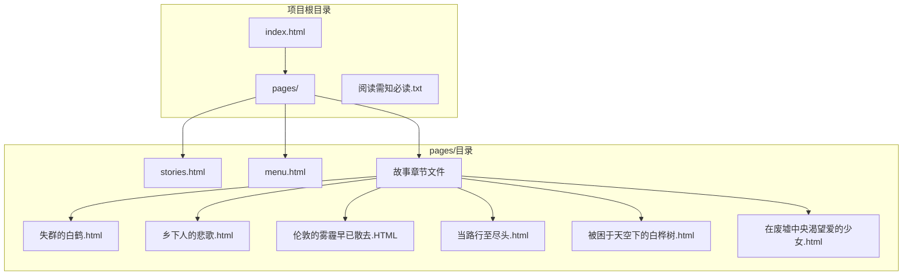
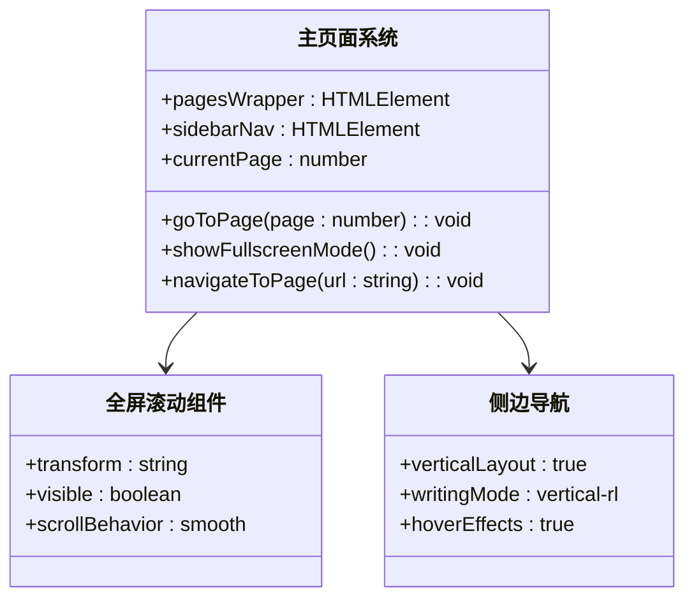
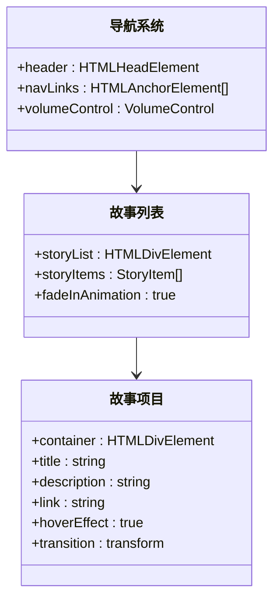
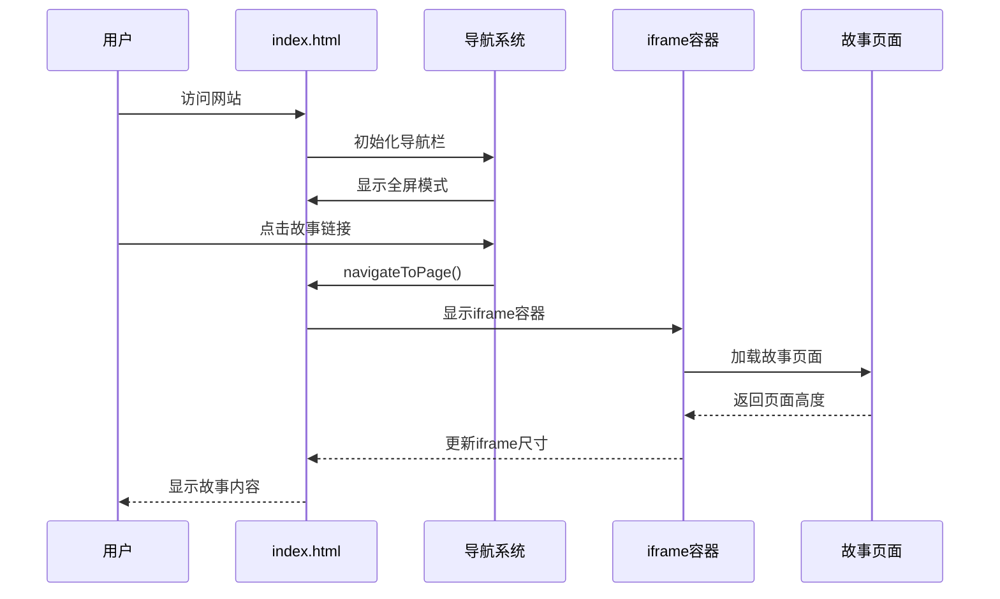
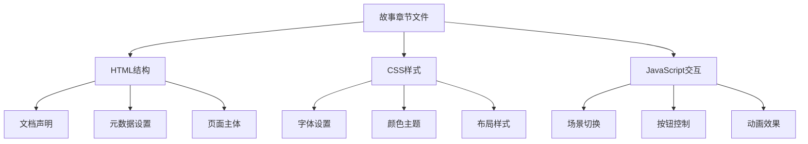
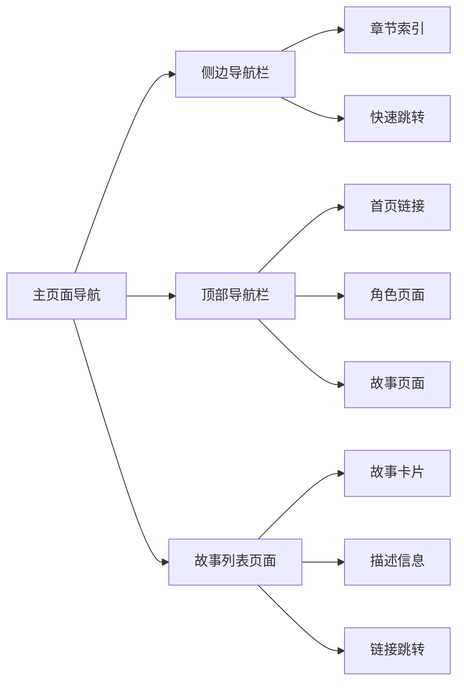
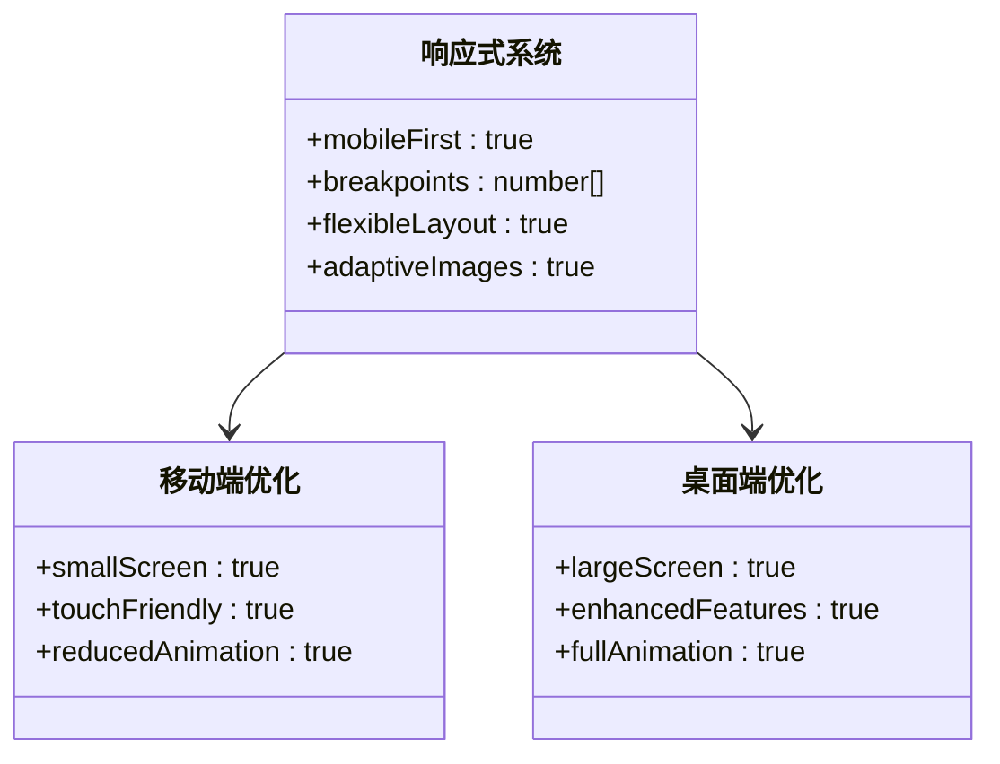
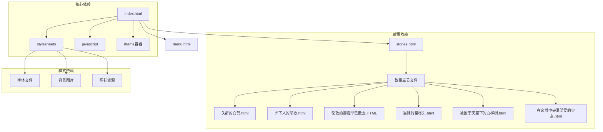

# 故事内容组织

<cite>
**本文档引用的文件**
- [index.html](file://index.html)
- [stories.html](file://pages/stories.html)
- [menu.html](file://pages/menu.html)
- [失群的白鹤.html](file://pages/失群的白鹤.html)
- [乡下人的悲歌.html](file://pages/乡下人的悲歌.html)
- [伦敦的雾霾早已散去.HTML](file://pages/伦敦的雾霾早已散去.HTML)
- [当路行至尽头.html](file://pages/当路行至尽头.html)
- [被困于天空下的白桦树.html](file://pages/被困于天空下的白桦树.html)
- [在废墟中央渴望爱的少女.html](file://pages/在废墟中央渴望爱的少女.html)
- [阅读需知（必读）.txt](file://阅读需知（必读）.txt)
</cite>

## 目录
1. [简介](#简介)
2. [项目结构](#项目结构)
3. [核心组件](#核心组件)
4. [架构概览](#架构概览)
5. [详细组件分析](#详细组件分析)
6. [依赖关系分析](#依赖关系分析)
7. [性能考量](#性能考量)
8. [故障排除指南](#故障排除指南)
9. [结论](#结论)
10. [附录](#附录)

## 简介

《夙日不再》是一个基于HTML/CSS/JavaScript的单页应用故事内容组织系统。该项目采用全屏滚动架构，将多个历史背景下的故事章节整合在一个统一的界面框架中，通过iframe技术实现子页面的嵌入式浏览。

该系统的核心特色在于：
- **统一的视觉风格**：采用复古风格设计，营造沉浸式阅读体验
- **模块化故事结构**：每个故事章节都是独立的HTML文件，便于维护和扩展
- **响应式布局**：适配不同设备和屏幕尺寸
- **多媒体内容集成**：支持文本、对话、场景描述等多种内容形式

## 项目结构

项目采用清晰的目录结构，将主页面与故事内容分离：

**图表来源**
- [index.html](file://index.html)
- [stories.html](file://pages/stories.html)

**章节来源**
- [index.html:1-759](file://index.html#L1-L759)
- [stories.html:1-253](file://pages/stories.html#L1-L253)

## 核心组件

### 主页面系统

主页面采用全屏滚动架构，提供统一的导航体验：

**图表来源**
- [index.html:581-756](file://index.html#L581-L756)

### 故事列表管理系统

故事列表采用卡片式布局，提供直观的导航体验：

**图表来源**
- [stories.html:74-247](file://pages/stories.html#L74-L247)

**章节来源**
- [index.html:581-756](file://index.html#L581-L756)
- [stories.html:1-253](file://pages/stories.html#L1-L253)

## 架构概览

系统采用客户端单页应用架构，通过JavaScript实现动态内容加载和页面切换：

**图表来源**
- [index.html:634-676](file://index.html#L634-L676)

### 技术实现特点

1. **全屏滚动**: 使用CSS transform实现流畅的页面切换效果
2. **响应式设计**: 通过媒体查询适配不同屏幕尺寸
3. **iframe嵌入**: 采用iframe容器实现子页面的独立加载
4. **本地存储**: 使用localStorage保存音频播放状态

**章节来源**
- [index.html:581-756](file://index.html#L581-L756)

## 详细组件分析

### 故事章节组织系统

每个故事章节都是独立的HTML文件，具有完整的结构和样式：

**图表来源**
- [失群的白鹤.html:1-299](file://pages/失群的白鹤.html#L1-L299)
- [乡下人的悲歌.html:1-457](file://pages/乡下人的悲歌.html#L1-L457)

#### 故事章节结构分析

每个故事章节都遵循统一的结构模式：

1. **标题区域**: 居中显示故事标题
2. **描述区域**: 提供简短的故事介绍
3. **场景容器**: 包含多个场景的切换
4. **导航按钮**: 上一章/下一章按钮
5. **对话系统**: 使用特定格式标记对话内容

**章节来源**
- [失群的白鹤.html:1-299](file://pages/失群的白鹤.html#L1-L299)
- [乡下人的悲歌.html:1-457](file://pages/乡下人的悲歌.html#L1-L457)

### 导航系统设计

导航系统采用多层次的设计理念：

**图表来源**
- [index.html:456-487](file://index.html#L456-L487)
- [stories.html:201-247](file://pages/stories.html#L201-L247)

**章节来源**
- [index.html:456-487](file://index.html#L456-L487)
- [stories.html:201-247](file://pages/stories.html#L201-L247)

### 响应式布局实现

系统采用移动优先的设计策略：

**图表来源**
- [stories.html:158-196](file://pages/stories.html#L158-L196)
- [index.html:426-435](file://index.html#L426-L435)

**章节来源**
- [stories.html:158-196](file://pages/stories.html#L158-L196)
- [index.html:426-435](file://index.html#L426-L435)

## 依赖关系分析

系统各组件之间的依赖关系如下：

**图表来源**
- [index.html:11-11](file://index.html#L11-L11)
- [stories.html:11-12](file://pages/stories.html#L11-L12)

**章节来源**
- [index.html:11-11](file://index.html#L11-L11)
- [stories.html:11-12](file://pages/stories.html#L11-L12)

### 文件命名规范

系统采用统一的文件命名约定：

| 类型 | 命名规则 | 示例 |
|------|----------|------|
| 主页面 | index.html | 主入口页面 |
| 故事列表 | stories.html | 故事章节列表 |
| 菜单页面 | menu.html | 系统菜单页面 |
| 故事章节 | 中文标题.html | 如：失群的白鹤.html |
| 角色页面 | characters.html | 角色介绍页面 |

**章节来源**
- [index.html:1-759](file://index.html#L1-L759)
- [stories.html:1-253](file://pages/stories.html#L1-L253)

## 性能考量

### 加载优化策略

1. **延迟加载**: 图片和资源采用延迟加载策略
2. **缓存机制**: 使用浏览器缓存减少重复加载
3. **压缩资源**: CSS和JavaScript文件经过压缩处理
4. **CDN加速**: 字体和静态资源使用CDN服务

### 内存管理

系统采用以下内存管理策略：
- 及时清理DOM事件监听器
- 合理使用WeakMap避免内存泄漏
- 动态释放大对象引用

## 故障排除指南

### 常见问题及解决方案

| 问题类型 | 症状描述 | 解决方案 |
|----------|----------|----------|
| 页面加载缓慢 | 页面响应慢，资源加载时间长 | 检查网络连接，清理浏览器缓存 |
| 导航失效 | 点击链接无响应 | 确认JavaScript文件加载正常 |
| 图片显示异常 | 图片无法显示或显示错误 | 检查图片路径和权限设置 |
| 响应式布局问题 | 移动端显示异常 | 检查viewport设置和媒体查询 |

**章节来源**
- [阅读需知（必读）.txt:1-7](file://阅读需知（必读）.txt#L1-L7)

### 调试技巧

1. **开发者工具**: 使用浏览器开发者工具检查控制台错误
2. **网络面板**: 分析资源加载时间和状态码
3. **性能面板**: 监控页面性能指标
4. **移动端模拟**: 使用设备模拟器测试响应式效果

## 结论

《夙日不再》故事内容组织系统通过精心设计的架构和统一的开发规范，成功实现了多故事章节的高效管理和用户体验优化。系统的主要优势包括：

1. **统一的视觉风格**: 通过一致的设计语言营造沉浸式阅读体验
2. **模块化的结构**: 每个故事章节独立维护，便于扩展和更新
3. **响应式设计**: 适配多种设备和屏幕尺寸
4. **易于维护**: 清晰的文件组织和标准化的命名规范

该系统为类似的历史题材故事内容提供了优秀的参考模板，其设计理念和技术实现值得在相关项目中借鉴和应用。

## 附录

### 开发规范

1. **代码风格**: 遵循HTML5和CSS3标准
2. **注释规范**: 关键代码添加中文注释
3. **版本控制**: 使用Git进行版本管理
4. **测试策略**: 在不同浏览器和设备上进行兼容性测试

### 扩展建议

1. **内容管理系统**: 考虑集成CMS系统实现内容动态管理
2. **多语言支持**: 添加国际化功能支持多语言版本
3. **搜索功能**: 实现全文搜索功能提升用户体验
4. **社交分享**: 集成社交媒体分享功能