# 角色数据管理

<cite>
**本文档引用的文件**
- [characters.html](file://pages/characters.html)
- [index.html](file://index.html)
- [stories.html](file://pages/stories.html)
- [阅读需知（必读）.txt](file://阅读需知（必读）.txt)
</cite>

## 目录
1. [项目概述](#项目概述)
2. [项目结构](#项目结构)
3. [核心组件](#核心组件)
4. [架构概览](#架构概览)
5. [详细组件分析](#详细组件分析)
6. [依赖关系分析](#依赖关系分析)
7. [性能考虑](#性能考虑)
8. [故障排除指南](#故障排除指南)
9. [结论](#结论)

## 项目概述

《夙日不再》角色数据管理系统是一个基于Web的角色展示平台，专门为展示游戏《夙日不再》中的主要角色而设计。该系统采用现代化的前端技术栈，提供了流畅的用户体验和丰富的视觉效果。

### 主要特性
- **角色档案展示**：展示米斯泰研究院主要角色的详细信息
- **动态切换**：支持鼠标滚轮和键盘导航的角色切换
- **多媒体集成**：支持角色配音和背景音乐
- **响应式设计**：适配不同屏幕尺寸的设备
- **状态持久化**：支持用户偏好的保存和恢复

## 项目结构

该项目采用模块化的文件组织方式，主要包含以下核心文件：

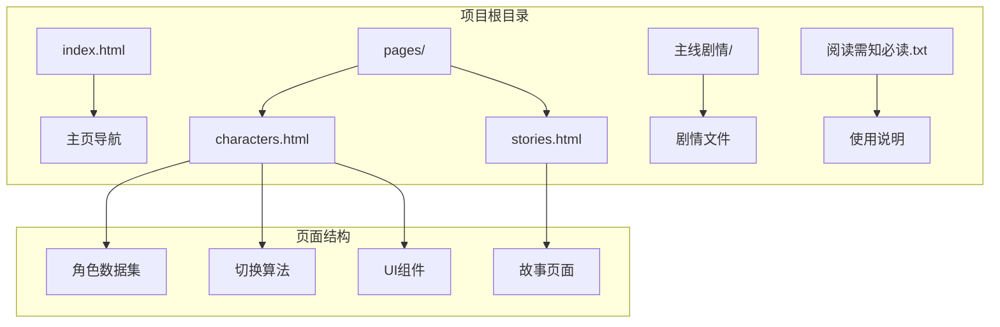

**图表来源**
- [characters.html:1-611](file://pages/characters.html#L1-L611)
- [index.html:448-664](file://index.html#L448-L664)

**章节来源**
- [characters.html:1-611](file://pages/characters.html#L1-L611)
- [index.html:448-664](file://index.html#L448-L664)

## 核心组件

### 角色数据结构设计

系统的核心是精心设计的角色数据结构，每个角色对象都包含完整的个人信息和展示数据：

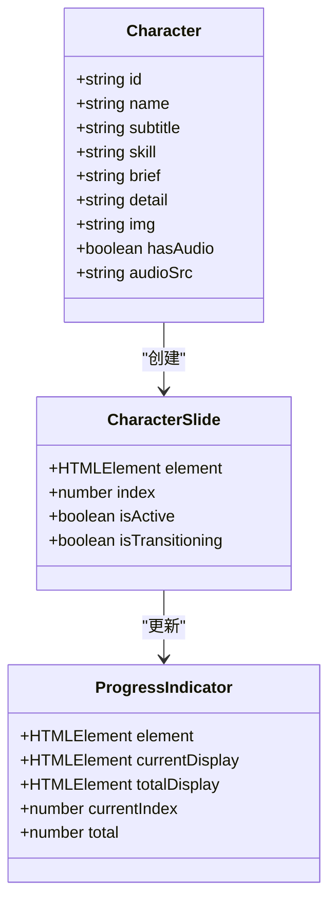

**图表来源**
- [characters.html:435-485](file://pages/characters.html#L435-L485)

### 数据类型和验证规则

每个角色对象遵循严格的数据类型规范：

| 字段名 | 数据类型 | 必填 | 验证规则 | 示例 |
|--------|----------|------|----------|------|
| id | string | 是 | 唯一标识符，字母数字 | "xingxiu" |
| name | string | 是 | 中文名称，长度限制 | "星宿" |
| subtitle | string | 是 | 英文副标题 | "Xingxiu · 星宿" |
| skill | string | 是 | 技能描述，格式固定 | "所属 · 米斯泰研究院" |
| brief | string | 是 | 简介文本，HTML格式 | "从小在研究院..." |
| detail | string | 是 | 详细描述，HTML格式 | 包含多个标题和段落 |
| img | string | 是 | 图片路径或URL | "星宿.png" |
| hasAudio | boolean | 否 | 是否包含音频 | false |
| audioSrc | string | 条件 | 有音频时必需 | "你好！星宿.mp3" |

**章节来源**
- [characters.html:435-485](file://pages/characters.html#L435-L485)

## 架构概览

系统采用单页应用架构，所有功能集中在单一HTML文件中实现：

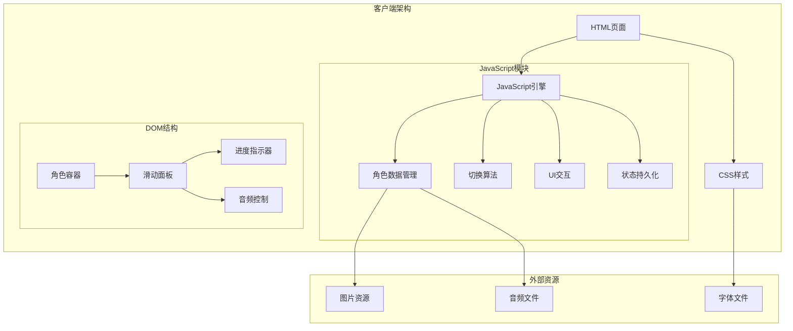

**图表来源**
- [characters.html:364-611](file://pages/characters.html#L364-L611)

### 控制流分析

系统的主要控制流程如下：

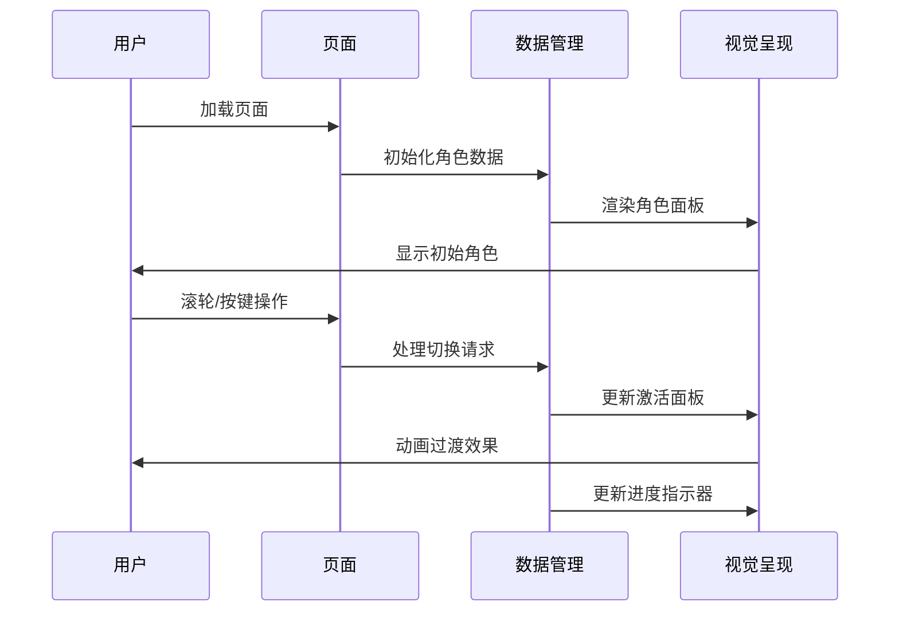

**图表来源**
- [characters.html:487-581](file://pages/characters.html#L487-L581)

## 详细组件分析

### 角色数据管理模块

#### 数据结构定义

角色数据采用统一的对象结构，确保数据的一致性和可扩展性：

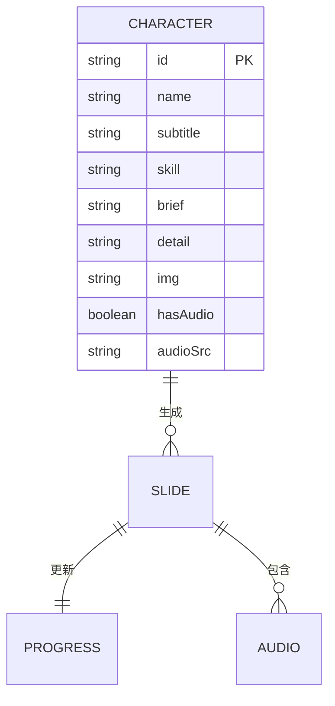

**图表来源**
- [characters.html:435-485](file://pages/characters.html#L435-L485)

#### 数据验证机制

系统实现了多层次的数据验证：

1. **类型验证**：确保每个字段具有正确的数据类型
2. **格式验证**：检查字符串格式和长度限制
3. **完整性验证**：验证必需字段的存在性
4. **一致性验证**：确保相关字段之间的逻辑关系

**章节来源**
- [characters.html:435-485](file://pages/characters.html#L435-L485)

### 动态渲染实现

#### DOM操作策略

系统采用高效的DOM操作策略来管理角色面板：

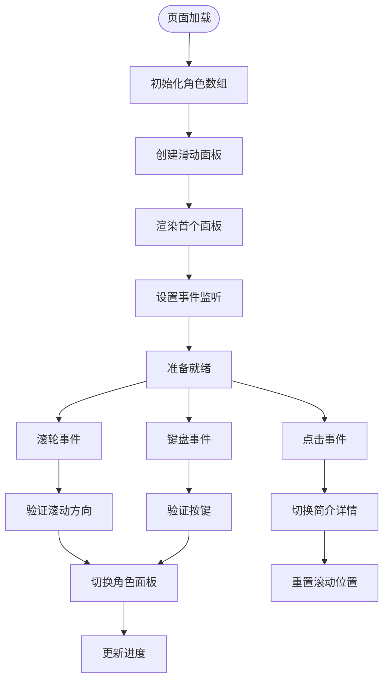

**图表来源**
- [characters.html:492-521](file://pages/characters.html#L492-L521)

#### 模板生成过程

角色面板采用模板字符串生成，支持动态内容填充：

| 模板元素 | 功能 | 动态内容 | 验证规则 |
|----------|------|----------|----------|
| 角色头像 | 展示角色图像 | char.img | URL有效性 |
| 角色名称 | 标题显示 | char.name | 非空验证 |
| 副标题 | 英文标识 | char.subtitle | 格式验证 |
| 技能描述 | 职业信息 | char.skill | 结构验证 |
| 简介内容 | 快速浏览 | char.brief | HTML安全 |
| 详细描述 | 深入了解 | char.detail | HTML格式 |
| 音频控件 | 声音播放 | 条件渲染 | 文件存在性 |

**章节来源**
- [characters.html:497-518](file://pages/characters.html#L497-L518)

### 角色切换算法

#### 滑动切换机制

系统实现了复杂的滑动切换算法，支持多种输入方式：

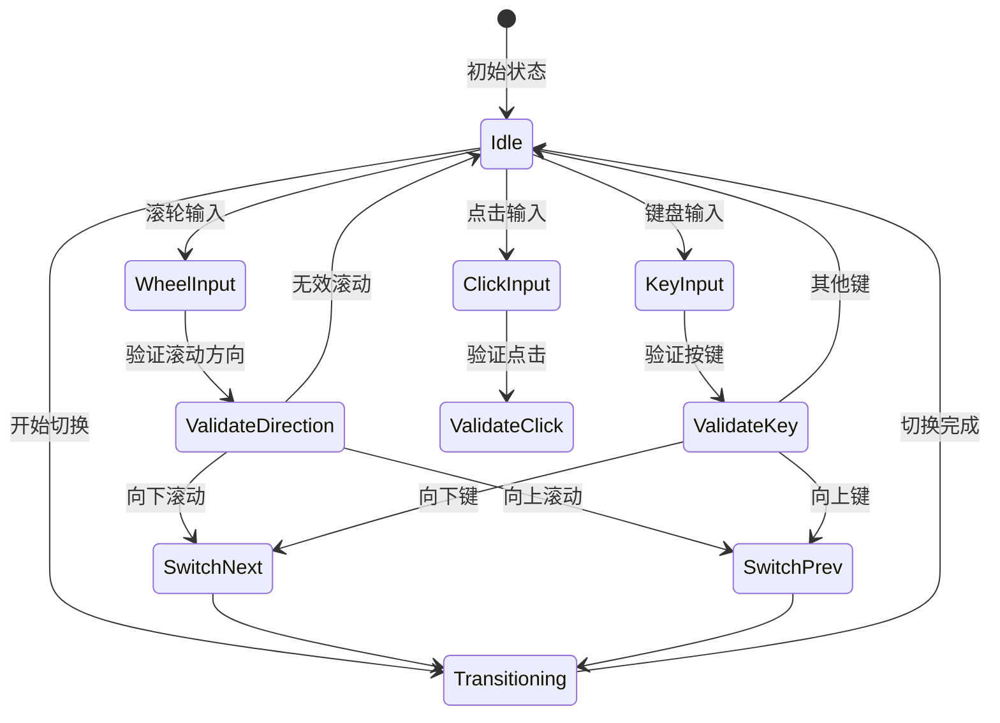

**图表来源**
- [characters.html:530-547](file://pages/characters.html#L530-L547)

#### 进度指示管理

进度指示器实时反映当前角色位置和总数：

| 元素 | 功能 | 更新时机 | 样式特性 |
|------|------|----------|----------|
| 当前索引 | 显示当前位置 | 切换完成后 | 突出显示 |
| 总数显示 | 显示角色总数 | 页面加载时 | 次要显示 |
| 卷·录标签 | 文化装饰元素 | 始终显示 | 保持可见 |

**章节来源**
- [characters.html:523-528](file://pages/characters.html#L523-L528)

### 状态管理机制

#### 防抖和节流控制

系统实现了多重防抖机制防止重复操作：

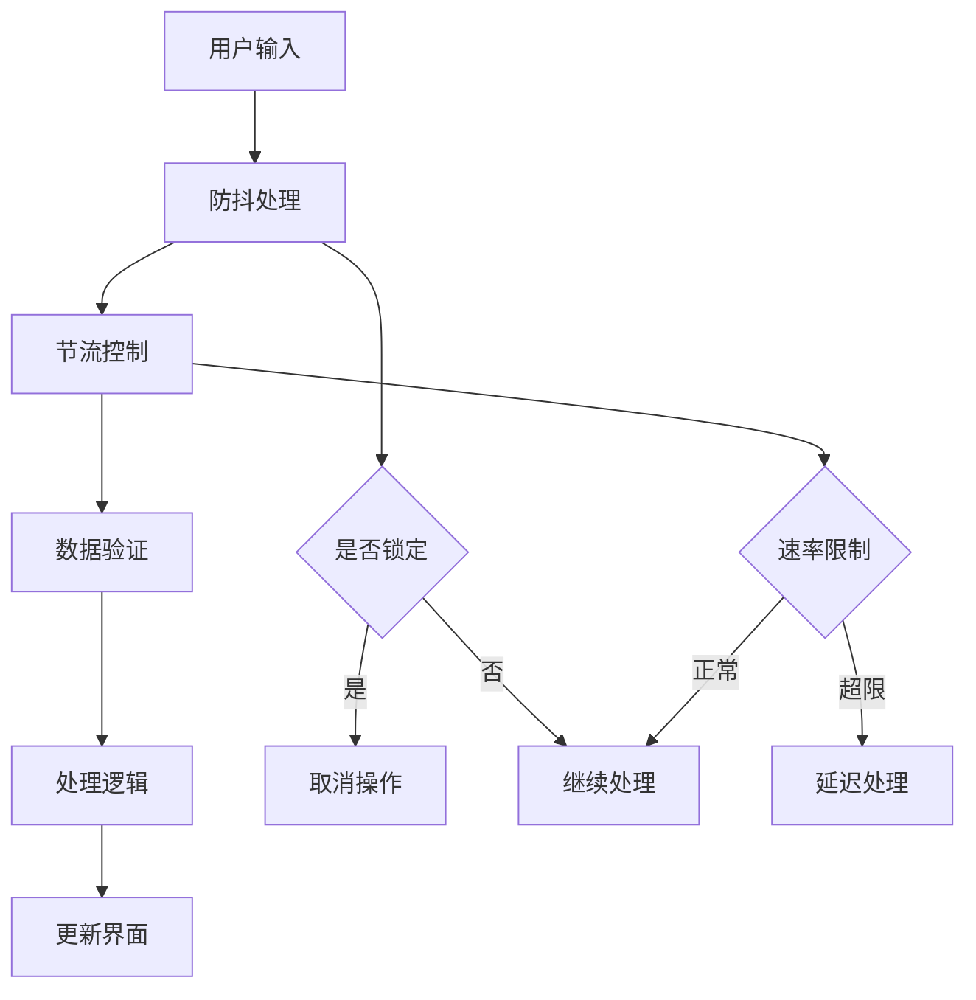

**图表来源**
- [characters.html:530-547](file://pages/characters.html#L530-L547)

#### 内存管理策略

系统采用渐进式内存管理：

1. **滑动面板复用**：只维护当前激活的面板
2. **事件监听清理**：及时移除不需要的事件处理器
3. **定时器管理**：合理使用和清理定时器
4. **缓存策略**：智能缓存静态资源

**章节来源**
- [characters.html:577-581](file://pages/characters.html#L577-L581)

## 依赖关系分析

### 外部依赖

系统主要依赖以下外部资源：

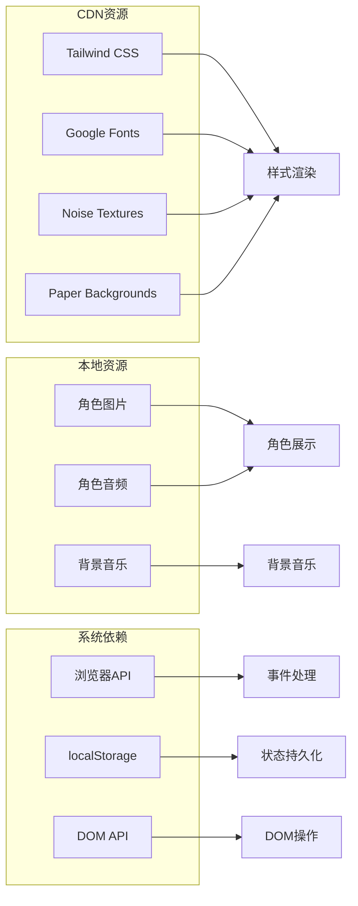

**图表来源**
- [characters.html:10-11](file://pages/characters.html#L10-L11)

### 内部模块依赖

系统内部模块之间的依赖关系清晰且低耦合：

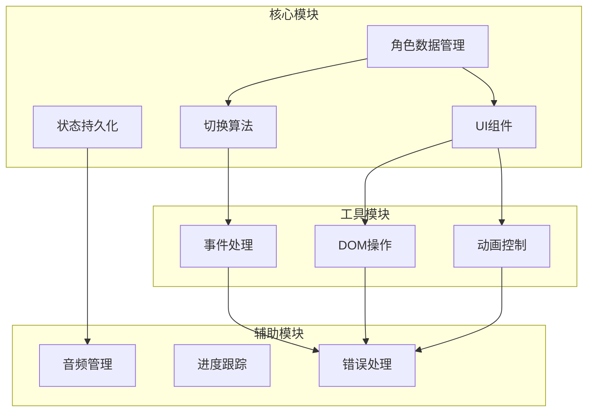

**图表来源**
- [characters.html:487-581](file://pages/characters.html#L487-L581)

**章节来源**
- [characters.html:10-11](file://pages/characters.html#L10-L11)

## 性能考虑

### 加载优化

系统采用了多项性能优化措施：

1. **懒加载策略**：图片使用异步加载，提升首屏速度
2. **资源压缩**：所有静态资源经过压缩处理
3. **缓存机制**：利用浏览器缓存减少重复加载
4. **按需渲染**：只渲染当前可见的面板

### 内存优化

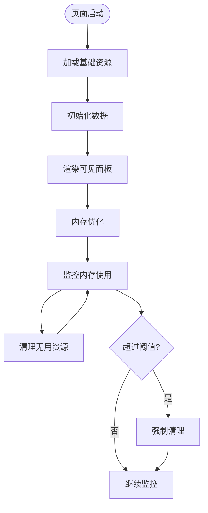

### 动画性能

系统使用硬件加速的CSS3动画：

- **GPU加速**：使用transform和opacity属性
- **贝塞尔曲线**：优化动画曲线
- **帧率控制**：限制动画频率
- **回流最小化**：减少DOM重排

## 故障排除指南

### 常见问题诊断

#### 角色图片加载失败

**症状**：角色头像显示为占位符

**解决方案**：
1. 检查图片路径是否正确
2. 验证图片文件是否存在
3. 确认文件权限设置
4. 检查网络连接状态

#### 音频播放问题

**症状**：角色配音无法播放

**解决方案**：
1. 检查音频文件格式兼容性
2. 验证音频文件路径
3. 确认浏览器音频权限
4. 尝试手动触发播放

#### 切换功能失效

**症状**：无法通过滚轮或键盘切换角色

**解决方案**：
1. 检查JavaScript错误控制台
2. 验证事件监听器绑定
3. 确认CSS样式冲突
4. 测试其他输入设备

### 调试技巧

#### 开发者工具使用

1. **Network面板**：监控资源加载状态
2. **Console面板**：查看JavaScript错误
3. **Elements面板**：检查DOM结构
4. **Performance面板**：分析性能瓶颈

#### 日志记录

系统提供了完善的日志记录机制：

```javascript
// 示例：调试日志
console.log('角色切换开始', { currentIndex, newIndex });
console.log('DOM元素状态', { element, isVisible });
console.log('性能指标', { duration, memory });
```

**章节来源**
- [characters.html:369-432](file://pages/characters.html#L369-L432)

## 结论

《夙日不再》角色数据管理系统展现了现代Web开发的最佳实践，通过精心设计的数据结构、高效的算法实现和优雅的用户界面，为用户提供了一个沉浸式的角色体验平台。

### 主要成就

1. **架构设计**：采用模块化设计，代码结构清晰
2. **性能优化**：实现了多项性能优化措施
3. **用户体验**：提供了流畅的交互体验
4. **可扩展性**：预留了充足的功能扩展空间

### 技术亮点

- **响应式设计**：完美适配各种设备
- **动画效果**：使用CSS3硬件加速
- **状态管理**：实现了复杂的状态控制
- **错误处理**：提供了完善的错误处理机制

### 发展建议

1. **功能扩展**：可以考虑添加角色搜索和筛选功能
2. **数据同步**：实现云端数据同步功能
3. **个性化定制**：允许用户自定义界面主题
4. **多语言支持**：扩展国际化支持

该系统为类似的角色展示项目提供了优秀的参考模板，其设计理念和技术实现值得进一步推广和应用。