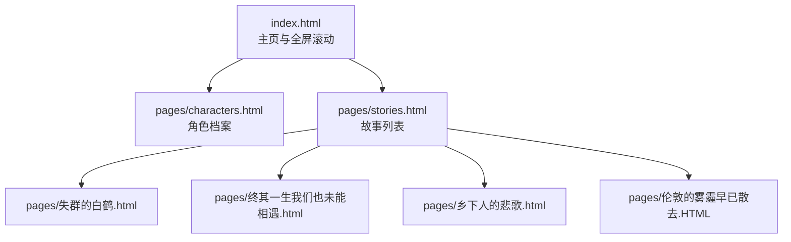
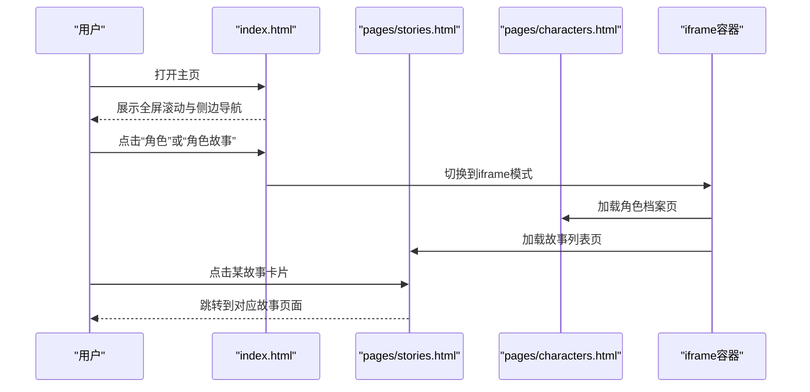
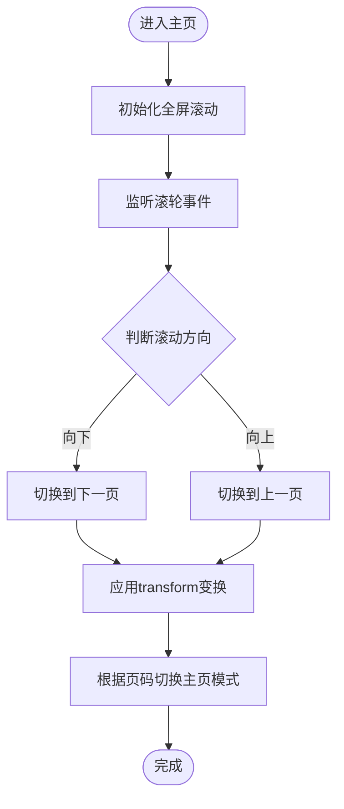
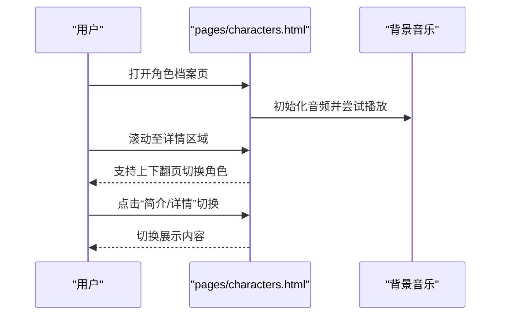
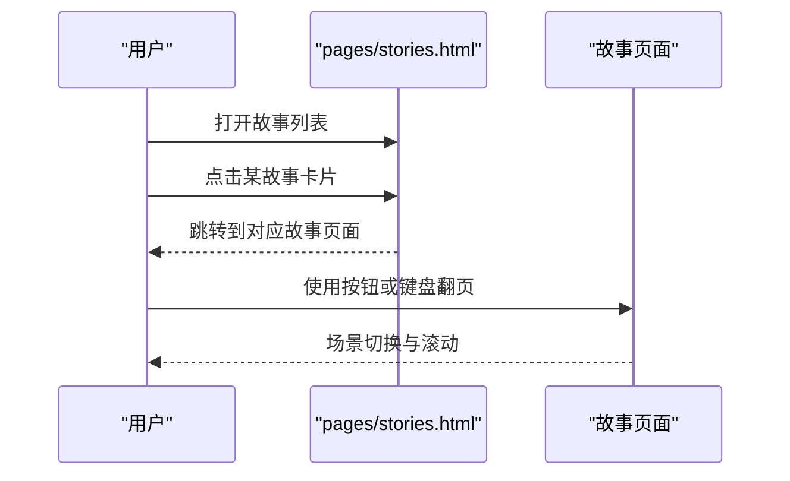
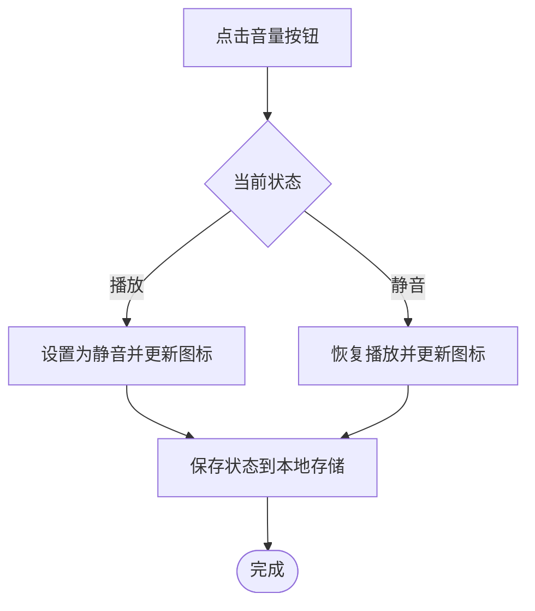
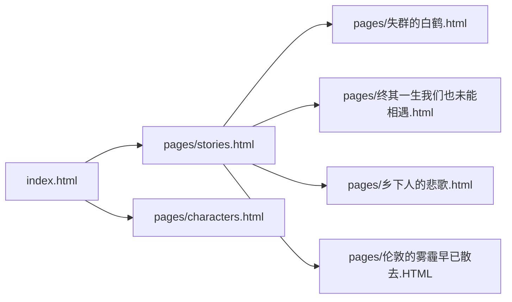

# 快速开始

<cite>
**本文引用的文件**
- [index.html](file://index.html)
- [阅读需知（必读）.txt](file://阅读需知（必读）.txt)
- [pages/characters.html](file://pages/characters.html)
- [pages/stories.html](file://pages/stories.html)
- [pages/失群的白鹤.html](file://pages/失群的白鹤.html)
- [pages/终其一生我们也未能相遇.html](file://pages/终其一生我们也未能相遇.html)
- [pages/乡下人的悲歌.html](file://pages/乡下人的悲歌.html)
- [pages/伦敦的雾霾早已散去.HTML](file://pages/伦敦的雾霾早已散去.HTML)
</cite>

## 目录
1. [简介](#简介)
2. [项目结构](#项目结构)
3. [核心组件](#核心组件)
4. [架构总览](#架构总览)
5. [详细组件解析](#详细组件解析)
6. [依赖关系分析](#依赖关系分析)
7. [性能与体验建议](#性能与体验建议)
8. [故障排查与常见问题](#故障排查与常见问题)
9. [结论](#结论)
10. [附录：首次使用最佳实践](#附录首次使用最佳实践)

## 简介
本指南面向首次访问《夙日不再世界观》的用户，帮助你在本地快速运行并沉浸式体验本项目。你将了解环境要求、本地运行步骤、基础操作方式（全屏滚动导航、角色切换、音效控制）、最佳实践与常见问题解决方案，从而顺畅开启这段跨越时空与历史的叙事之旅。

## 项目结构
本项目采用静态网页结构，核心入口为根目录的主页文件，配套页面位于 pages 子目录中，包含角色档案、故事列表与多篇独立故事页面。项目通过内嵌脚本实现全屏滚动、侧边导航、音视频播放与跨页面跳转。

图表来源
- [index.html](file://index.html)
- [pages/characters.html](file://pages/characters.html)
- [pages/stories.html](file://pages/stories.html)
- [pages/失群的白鹤.html](file://pages/失群的白鹤.html)
- [pages/终其一生我们也未能相遇.html](file://pages/终其一生我们也未能相遇.html)
- [pages/乡下人的悲歌.html](file://pages/乡下人的悲歌.html)
- [pages/伦敦的雾霾早已散去.HTML](file://pages/伦敦的雾霾早已散去.HTML)

章节来源
- [index.html](file://index.html)
- [pages/characters.html](file://pages/characters.html)
- [pages/stories.html](file://pages/stories.html)

## 核心组件
- 全屏滚动与侧边导航：通过页面容器与侧边栏联动，实现上下翻页与直达章节。
- 角色档案：提供角色简介与详情切换、音效播放与进度指示。
- 故事列表：以卡片形式列出可阅读的故事，点击进入对应故事页面。
- 故事页面：采用分场景阅读模式，支持前后场景切换。
- 音频控制：主页与角色页均内置背景音乐，支持静音/播放与状态持久化。

章节来源
- [index.html](file://index.html)
- [pages/characters.html](file://pages/characters.html)
- [pages/stories.html](file://pages/stories.html)

## 架构总览
项目采用单页应用（SPA）风格的静态页面组合，通过内联脚本实现页面切换与交互逻辑。iframe 容器用于承载子页面，避免与主页样式与交互冲突。

图表来源
- [index.html](file://index.html)
- [pages/stories.html](file://pages/stories.html)
- [pages/characters.html](file://pages/characters.html)

## 详细组件解析

### 主页与全屏滚动
- 通过页面容器与侧边栏联动，实现上下翻页与直达章节。
- 首屏采用“主页模式”，隐藏干扰层，突出背景图。
- 支持鼠标滚轮与移动端手势进行翻页。

图表来源
- [index.html](file://index.html)

章节来源
- [index.html](file://index.html)

### 角色档案页
- 提供角色简介与详情切换，支持滚轮穿透至角色详情区域时的上下翻页。
- 内置背景音乐，支持自动播放与状态持久化。
- 右侧进度指示器显示当前角色序号与总数。

图表来源
- [pages/characters.html](file://pages/characters.html)

章节来源
- [pages/characters.html](file://pages/characters.html)

### 故事列表与故事页面
- 故事列表以卡片形式呈现，点击进入对应故事页面。
- 故事页面采用分场景阅读，支持前后场景切换与平滑滚动。

图表来源
- [pages/stories.html](file://pages/stories.html)
- [pages/失群的白鹤.html](file://pages/失群的白鹤.html)
- [pages/终其一生我们也未能相遇.html](file://pages/终其一生我们也未能相遇.html)
- [pages/乡下人的悲歌.html](file://pages/乡下人的悲歌.html)
- [pages/伦敦的雾霾早已散去.HTML](file://pages/伦敦的雾霾早已散去.HTML)

章节来源
- [pages/stories.html](file://pages/stories.html)
- [pages/失群的白鹤.html](file://pages/失群的白鹤.html)
- [pages/终其一生我们也未能相遇.html](file://pages/终其一生我们也未能相遇.html)
- [pages/乡下人的悲歌.html](file://pages/乡下人的悲歌.html)
- [pages/伦敦的雾霾早已散去.HTML](file://pages/伦敦的雾霾早已散去.HTML)

### 音效控制
- 主页与角色页均内置背景音乐，支持静音/播放与状态持久化。
- 音频状态保存在本地存储中，刷新或关闭页面后仍可恢复。

图表来源
- [index.html](file://index.html)
- [pages/characters.html](file://pages/characters.html)

章节来源
- [index.html](file://index.html)
- [pages/characters.html](file://pages/characters.html)

## 依赖关系分析
- 主页依赖：全局样式、半调层与复古浮动元素、全屏滚动脚本、iframe容器与音效脚本。
- 角色页依赖：角色数据数组、角色切换脚本、音效脚本与进度指示器。
- 故事页依赖：场景切换脚本与页面内样式。

图表来源
- [index.html](file://index.html)
- [pages/stories.html](file://pages/stories.html)
- [pages/characters.html](file://pages/characters.html)
- [pages/失群的白鹤.html](file://pages/失群的白鹤.html)
- [pages/终其一生我们也未能相遇.html](file://pages/终其一生我们也未能相遇.html)
- [pages/乡下人的悲歌.html](file://pages/乡下人的悲歌.html)
- [pages/伦敦的雾霾早已散去.HTML](file://pages/伦敦的雾霾早已散去.HTML)

章节来源
- [index.html](file://index.html)
- [pages/stories.html](file://pages/stories.html)
- [pages/characters.html](file://pages/characters.html)

## 性能与体验建议
- 首次加载：角色页可能需要短暂时间加载本地资源，属正常现象。
- 音频播放：若浏览器限制自动播放，首次交互后将自动尝试播放。
- 视口与滚动：项目针对移动端与桌面端做了适配，建议使用较新版本浏览器以获得最佳体验。
- 特效提示：部分页面特效在特定网络环境下可能受限，建议在稳定网络下体验。

## 故障排查与常见问题
- 问：打开主页后无法滚动？
  - 答：请确认鼠标滚轮可用，或使用触摸板/触控屏进行上下滑动。若仍无法滚动，尝试刷新页面。
- 问：角色页长时间空白或加载缓慢？
  - 答：属正常现象，页面需要从本地加载资源，请耐心等待约10秒。
- 问：背景音乐没有声音？
  - 答：浏览器可能限制自动播放。请在页面任意位置进行点击或触摸，随后点击音量按钮恢复播放。
- 问：故事页面无法翻页？
  - 答：请在场景内容区域内滚动以触发翻页；或使用页面提供的前后按钮进行切换。
- 问：部分特效无法显示？
  - 答：根据阅读需知，部分特效需要特定网络环境支持，建议在具备相应条件的网络下体验。

章节来源
- [阅读需知（必读）.txt](file://阅读需知（必读）.txt)
- [index.html](file://index.html)
- [pages/characters.html](file://pages/characters.html)
- [pages/stories.html](file://pages/stories.html)

## 结论
通过本快速开始指南，你可以在本地顺利运行《夙日不再世界观》，并使用全屏滚动、角色切换与音效控制等基础功能，沉浸式体验多段跨越历史与时空的叙事。遇到问题时，可参考故障排查章节快速定位与解决。祝你阅读愉快！

## 附录：首次使用最佳实践
- 环境准备：使用最新版 Chrome/Firefox/Edge 等主流浏览器；确保网络稳定。
- 本地运行：直接双击根目录的 index.html 文件打开主页；如需查看角色与故事，请通过顶部导航或侧边栏进入对应页面。
- 首次体验：建议先浏览主页与世界观板块，再进入角色档案与故事列表，逐步深入体验。
- 音效建议：首次进入页面时，可在任意位置进行点击/触摸以解除浏览器自动播放限制，随后使用音量按钮控制背景音乐。
- 互动建议：使用鼠标滚轮或触摸屏进行全屏滚动；在角色详情与故事场景中，合理使用前后翻页按钮与键盘方向键。
- 体验提示：部分页面特效与资源加载可能需要时间，请耐心等待；如遇网络受限，可稍后再试。

章节来源
- [index.html](file://index.html)
- [pages/characters.html](file://pages/characters.html)
- [pages/stories.html](file://pages/stories.html)
- [阅读需知（必读）.txt](file://阅读需知（必读）.txt)