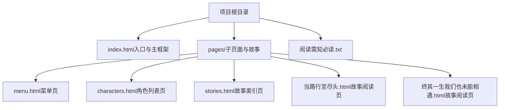
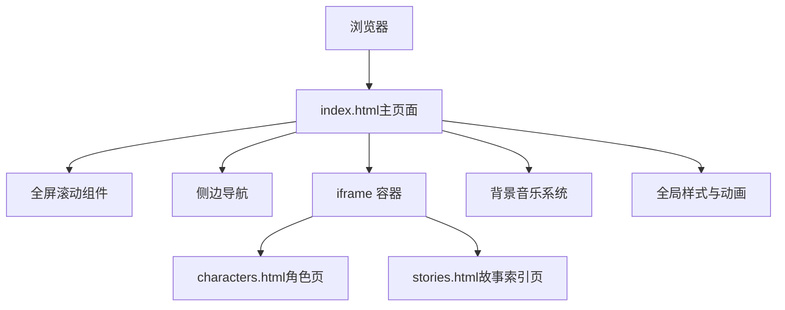
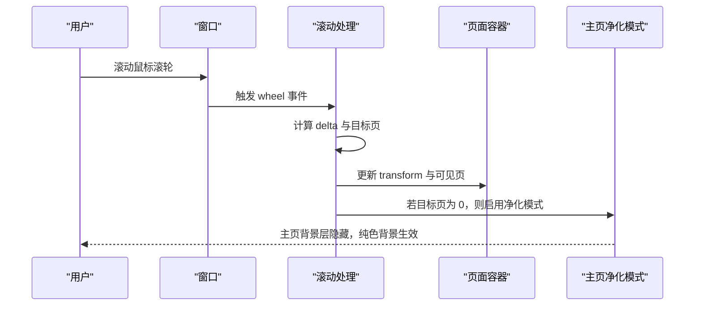
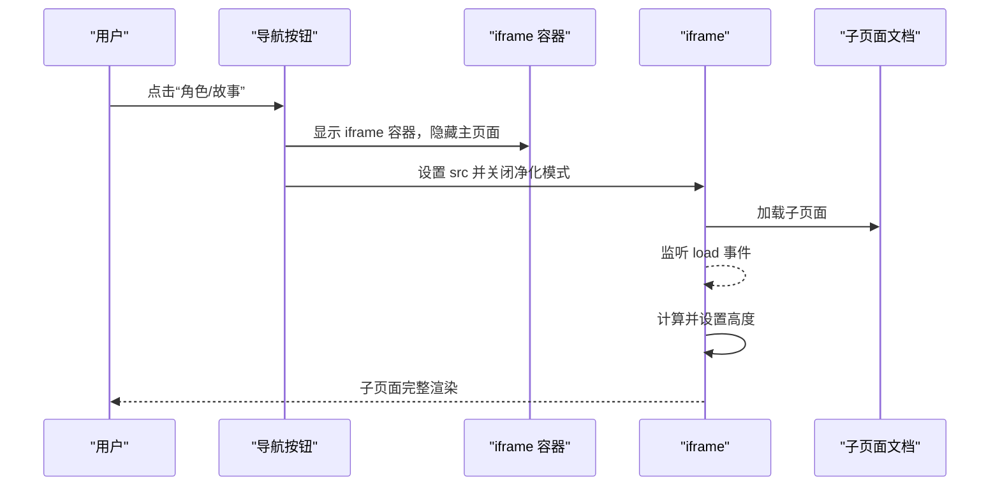
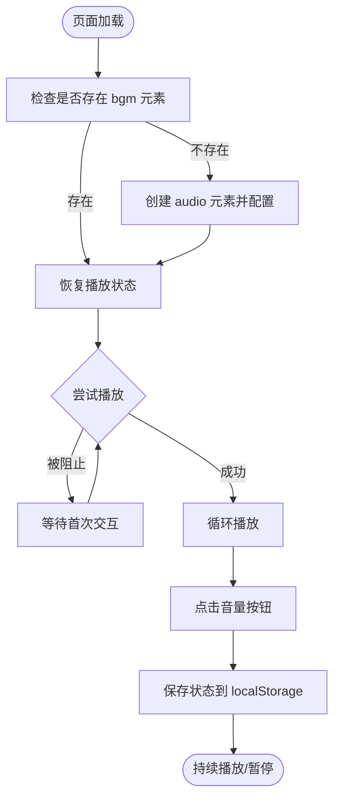
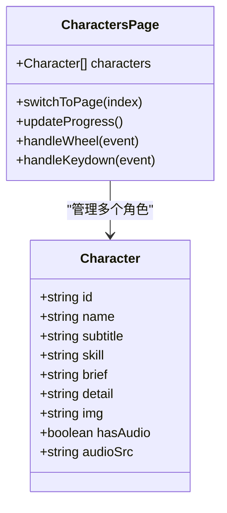
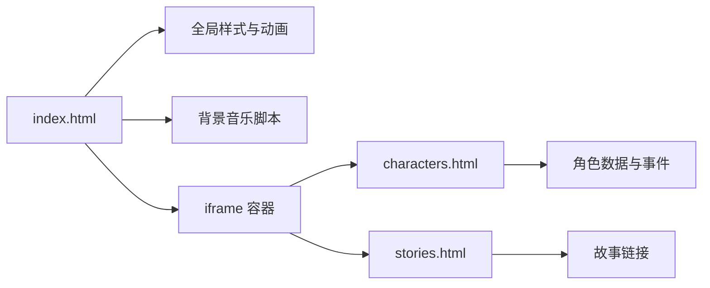

# 技术架构

<cite>
**本文引用的文件**
- [index.html](file://index.html)
- [menu.html](file://pages/menu.html)
- [characters.html](file://pages/characters.html)
- [stories.html](file://pages/stories.html)
- [当路行至尽头.html](file://pages/当路行至尽头.html)
- [终其一生我们也未能相遇.html](file://pages/终其一生我们也未能相遇.html)
- [阅读需知（必读）.txt](file://阅读需知（必读）.txt)
</cite>

## 目录
1. [引言](#引言)
2. [项目结构](#项目结构)
3. [核心组件](#核心组件)
4. [架构总览](#架构总览)
5. [详细组件分析](#详细组件分析)
6. [依赖关系分析](#依赖关系分析)
7. [性能考量](#性能考量)
8. [故障排查指南](#故障排查指南)
9. [结论](#结论)
10. [附录](#附录)

## 引言
本项目以“夙日不再”为主题，构建了一个基于 HTML5、CSS3、JavaScript 的单页应用（SPA）型官网与阅读体验平台。整体采用全屏滚动与 iframe 子页面相结合的导航模式，配合复古风格视觉与背景音乐状态持久化，形成沉浸式的阅读与浏览体验。本文档从架构设计、模块化思路、技术选型、数据流与组件通信、性能优化、扩展性与可维护性等方面进行全面解析。

## 项目结构
项目采用扁平化的静态站点结构，根目录包含入口页面与说明文档，页面主体内容集中在 pages 目录中，辅以少量媒体资源与音频文件。整体布局清晰，便于维护与扩展。

图表来源
- [index.html](file://index.html)
- [menu.html](file://pages/menu.html)
- [characters.html](file://pages/characters.html)
- [stories.html](file://pages/stories.html)
- [当路行至尽头.html](file://pages/当路行至尽头.html)
- [终其一生我们也未能相遇.html](file://pages/终其一生我们也未能相遇.html)

章节来源
- [index.html](file://index.html)
- [menu.html](file://pages/menu.html)
- [characters.html](file://pages/characters.html)
- [stories.html](file://pages/stories.html)
- [当路行至尽头.html](file://pages/当路行至尽头.html)
- [终其一生我们也未能相遇.html](file://pages/终其一生我们也未能相遇.html)
- [阅读需知（必读）.txt](file://阅读需知（必读）.txt)

## 核心组件
- 全屏滚动主框架：负责页面切换、过渡动画与主页背景净化模式控制。
- 侧边导航：提供快速跳转到各主题页。
- iframe 子页面容器：承载角色与故事等外部页面，实现内容隔离与动态加载。
- 背景音乐系统：音频自动播放策略、静音状态与播放进度持久化。
- 响应式与复古视觉：全局样式、动画与移动端适配。

章节来源
- [index.html](file://index.html)

## 架构总览
整体采用“主页面 + 子页面 iframe”的混合 SPA 架构。index.html 作为主控制器，负责全屏滚动导航、背景净化模式切换、iframe 子页面的显示/隐藏与尺寸自适应。子页面（角色、故事）以独立 HTML 文件存在，通过 iframe 动态加载，实现内容解耦与缓存复用。

图表来源
- [index.html](file://index.html)
- [characters.html](file://pages/characters.html)
- [stories.html](file://pages/stories.html)

## 详细组件分析

### 全屏滚动与页面切换
- 控制器：维护当前页索引、过渡锁与总页数，监听滚轮事件计算下一页，更新 transform 实现垂直滚动。
- 主页净化模式：切换到第 0 页时移除复古纹理层，使主页背景图完全显示。
- 侧边导航联动：点击侧边项触发对应页切换。

图表来源
- [index.html](file://index.html)

章节来源
- [index.html](file://index.html)

### iframe 子页面与尺寸自适应
- 显示/隐藏：点击“角色”“故事”导航项时，切换 iframe 容器显隐，同时隐藏侧边导航，保证子页面沉浸式阅读。
- 尺寸自适应：监听 iframe load 事件与 ResizeObserver，动态计算并设置 iframe 高度；窗口 resize 时延迟调整。
- 背景净化：进入子页面时强制关闭主页净化模式，恢复复古风格。

图表来源
- [index.html](file://index.html)

章节来源
- [index.html](file://index.html)

### 背景音乐系统
- 音频初始化：若不存在则动态创建 audio 元素，设置循环、预加载与音量。
- 自动播放策略：浏览器阻止自动播放时，等待首次交互后尝试播放。
- 状态持久化：使用 localStorage 保存静音状态与播放进度，页面卸载与定时器周期保存。
- 图标同步：根据静音状态更新音量按钮图标。

图表来源
- [index.html](file://index.html)

章节来源
- [index.html](file://index.html)

### 角色页（characters.html）
- 模块化数据：角色数组集中定义，包含头像、名称、标签、技能、简介与详情、音频等字段。
- 轮播切换：基于 transform 的滑动过渡，支持键盘上下方向键与滚轮切换。
- 简介/详情切换：通过事件委托切换对应角色的简介与详情区域显示。

图表来源
- [characters.html](file://pages/characters.html)

章节来源
- [characters.html](file://pages/characters.html)

### 故事页（stories.html）
- 导航与索引：提供故事链接列表，点击跳转至对应 HTML。
- 响应式布局：针对不同屏幕尺寸优化导航与间距。

章节来源
- [stories.html](file://pages/stories.html)

### 故事阅读页（当路行至尽头.html、终其一生我们也未能相遇.html）
- 场景驱动阅读：每篇故事以场景为单位，通过“下一幕/上一幕”按钮切换，使用 CSS 动画实现淡入效果。
- 文本风格：统一的字体、颜色与对话格式，突出叙述、场景介绍与角色对话。

章节来源
- [当路行至尽头.html](file://pages/当路行至尽头.html)
- [终其一生我们也未能相遇.html](file://pages/终其一生我们也未能相遇.html)

## 依赖关系分析
- index.html 依赖全局样式与脚本，控制全屏滚动、iframe 容器与背景音乐。
- 子页面（characters.html、stories.html）作为独立模块，通过 iframe 注入主页面，降低耦合度。
- 角色页内部依赖角色数据与 DOM 事件，实现轮播与切换。
- 故事阅读页内部依赖场景切换逻辑与样式。

图表来源
- [index.html](file://index.html)
- [characters.html](file://pages/characters.html)
- [stories.html](file://pages/stories.html)

章节来源
- [index.html](file://index.html)
- [characters.html](file://pages/characters.html)
- [stories.html](file://pages/stories.html)

## 性能考量
- 资源加载优化
  - 预加载与懒加载：音频设置预加载；图片提供占位符与错误回退，减少加载失败影响。
  - CDN 与缓存：背景音乐与字体通过 CDN 提供，提升跨地域访问速度。
- 渲染性能
  - GPU 加速：关键动画与页面容器使用 will-change 与 transform，减少重排。
  - 过渡节流：滚轮切换使用过渡锁与固定延时，避免频繁切换导致的卡顿。
- 内存使用优化
  - iframe 隔离：子页面独立渲染，退出时隐藏容器，释放主页面资源。
  - 状态持久化：localStorage 仅存储必要字段，避免大对象占用。
- 移动端适配
  - 响应式断点：针对 768px 与 480px 进行布局与字体优化，侧边导航在小屏隐藏。
  - 触摸友好：按钮尺寸与间距适配移动端操作。

章节来源
- [index.html](file://index.html)
- [characters.html](file://pages/characters.html)

## 故障排查指南
- 页面无法加载或空白
  - 检查 index.html 中 iframe 的 src 是否正确，确认 pages 目录下对应文件存在。
  - 查看浏览器控制台是否存在跨域或资源加载错误。
- 背景音乐无法播放
  - 确认浏览器未阻止自动播放；首次交互后应允许播放。
  - 检查音频文件路径与格式是否正确。
- 滚轮切换无效
  - 确认 isTransitioning 未被长时间锁定；检查滚轮事件监听是否被覆盖。
- 子页面高度异常
  - 确认 iframe load 事件已触发 ResizeObserver 初始化；窗口 resize 时的延迟调整是否生效。
- 阅读提示
  - 部分角色页面首次加载可能较慢，属本地化加载所需时间；请耐心等待。

章节来源
- [index.html](file://index.html)
- [阅读需知（必读）.txt](file://阅读需知（必读）.txt)

## 结论
本项目以简洁的 HTML5/CSS3/JavaScript 技术栈实现了沉浸式单页应用体验。通过全屏滚动与 iframe 子页面的组合，兼顾了内容的模块化与导航的流畅性；背景音乐与状态持久化提升了用户体验；响应式设计保障了多端一致性。在可维护性与可扩展性方面，建议后续引入模块化打包与构建工具，以进一步规范资源管理与版本迭代。

## 附录
- 技术选型说明
  - HTML5：语义化结构与多媒体支持，满足故事与角色信息展示。
  - CSS3：动画、滤镜与渐变，营造复古风格与沉浸感。
  - JavaScript：DOM 操作、事件处理与本地存储，实现交互与状态持久化。
- 扩展性与限制
  - 扩展性：可引入前端框架或模块化方案，统一角色数据与页面组件；增加路由与懒加载策略。
  - 限制：当前为静态站点，动态内容与用户交互需通过 iframe 或独立页面实现，不利于 SEO 与深度链接优化。