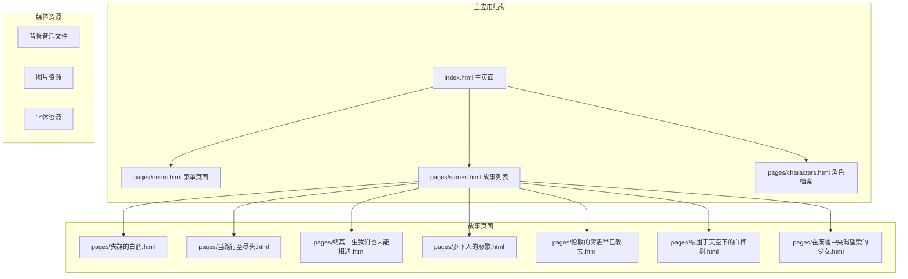
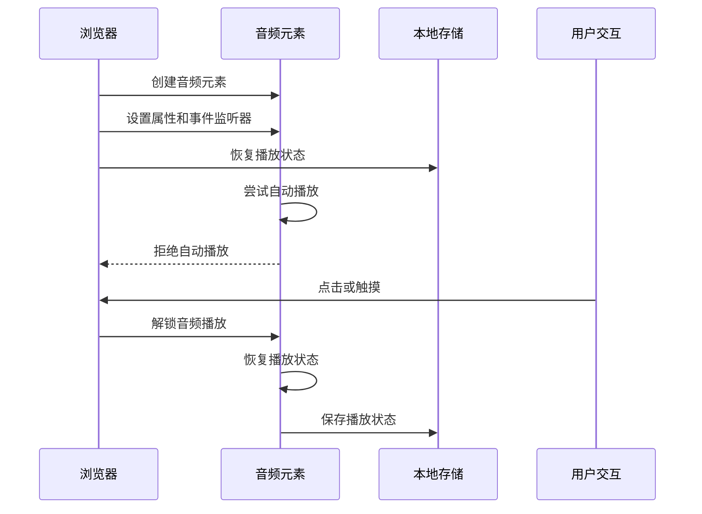
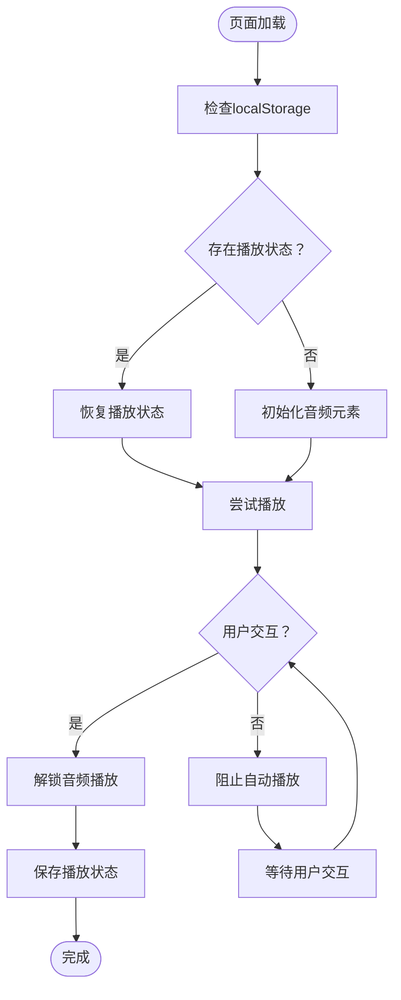
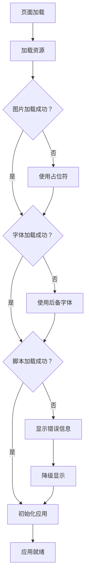
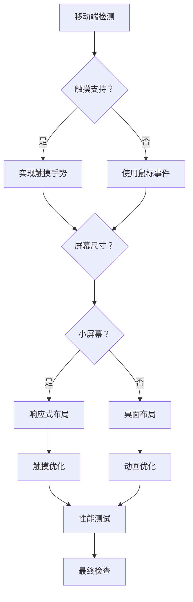
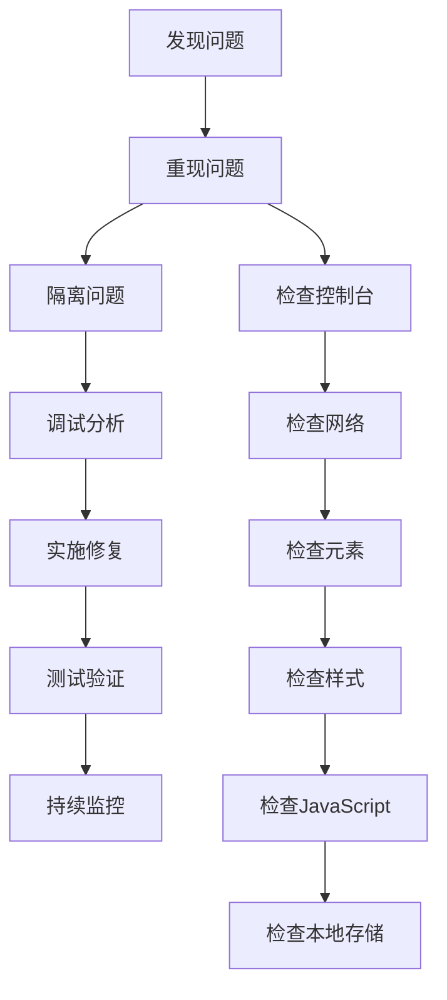
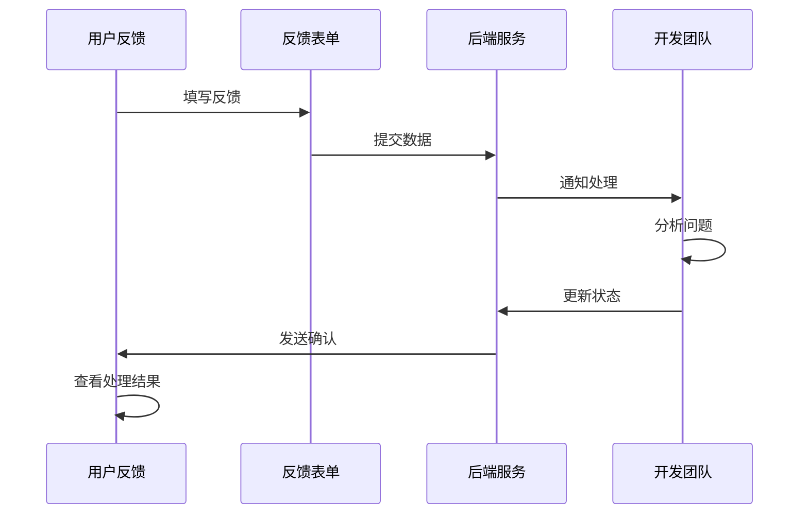

# 故障排除

<cite>
**本文档引用的文件**
- [index.html](file://index.html)
- [pages/menu.html](file://pages/menu.html)
- [pages/stories.html](file://pages/stories.html)
- [pages/characters.html](file://pages/characters.html)
- [pages/失群的白鹤.html](file://pages/失群的白鹤.html)
- [阅读需知（必读）.txt](file://阅读需知（必读）.txt)
- [pages/你好，星宿同志.mp3](file://pages/你好，星宿同志.mp3)
- [pages/背景.mp3](file://pages/背景.mp3)
- [背景.mp3](file://背景.mp3)
- [pages/失重.jpg](file://pages/失重.jpg)
- [pages/星宿2.jpg](file://pages/星宿2.jpg)
</cite>

## 目录
1. [简介](#简介)
2. [项目结构](#项目结构)
3. [常见问题诊断](#常见问题诊断)
4. [浏览器兼容性问题](#浏览器兼容性问题)
5. [音效播放异常](#音效播放异常)
6. [页面加载失败](#页面加载失败)
7. [性能问题识别与优化](#性能问题识别与优化)
8. [移动设备问题](#移动设备问题)
9. [调试技巧与工具](#调试技巧与工具)
10. [用户反馈收集](#用户反馈收集)
11. [预防性维护建议](#预防性维护建议)
12. [结论](#结论)

## 简介

《夙日不再世界观》是一个基于HTML5和CSS3构建的单页应用，采用全屏滚动技术展示游戏的世界观和角色故事。该项目包含复杂的动画效果、背景音乐播放、响应式设计以及跨页面导航功能。由于项目采用了较多的现代Web技术特性，用户在不同设备和浏览器环境下可能会遇到各种问题。

## 项目结构

该项目采用模块化设计，主要包含以下核心组件：



**图表来源**
- [index.html:1-763](file://index.html#L1-L763)
- [pages/stories.html:1-253](file://pages/stories.html#L1-L253)

**章节来源**
- [index.html:1-763](file://index.html#L1-L763)
- [pages/menu.html:1-207](file://pages/menu.html#L1-L207)
- [pages/stories.html:1-253](file://pages/stories.html#L1-L253)

## 常见问题诊断

### 1. 页面无法正常加载

**症状表现：**
- 页面空白或部分内容缺失
- JavaScript错误提示
- 背景图片加载失败
- 音效无法播放

**诊断步骤：**
1. 检查网络连接状态
2. 验证文件路径正确性
3. 确认浏览器支持情况
4. 查看控制台错误信息

**解决方案：**
- 确保所有HTML文件在同一目录结构下
- 检查相对路径引用是否正确
- 验证服务器配置允许跨域访问

### 2. 动画效果异常

**症状表现：**
- 页面滚动不流畅
- CSS动画卡顿
- 元素定位错误
- 响应式布局失效

**诊断步骤：**
1. 检查GPU加速设置
2. 验证CSS动画属性
3. 确认JavaScript事件监听器
4. 测试不同分辨率下的表现

**解决方案：**
- 添加will-change属性优化动画
- 使用backface-visibility防止闪烁
- 实施适当的节流机制

### 3. 音频播放问题

**症状表现：**
- 背景音乐无法自动播放
- 用户交互后仍无法播放
- 音频文件格式不支持
- 播放状态丢失

**诊断步骤：**
1. 检查浏览器自动播放策略
2. 验证音频文件完整性
3. 确认localStorage权限
4. 测试不同音频格式

**解决方案：**
- 实现用户手势解锁机制
- 提供手动播放控制
- 支持多种音频格式
- 实施状态持久化

## 浏览器兼容性问题

### Chrome浏览器问题

**问题类型：** 自动播放限制
- **症状：** 背景音乐无法自动播放
- **原因：** Chrome浏览器的自动播放策略
- **解决方案：** 实现用户交互解锁机制

**问题类型：** GPU加速问题
- **症状：** 动画卡顿或闪烁
- **原因：** GPU硬件加速不兼容
- **解决方案：** 添加will-change和backface-visibility属性

### Firefox浏览器问题

**问题类型：** CSS变量支持
- **症状：** 自定义属性不生效
- **原因：** CSS变量兼容性问题
- **解决方案：** 提供降级方案或polyfill

**问题类型：** 滚轮事件处理
- **症状：** 页面滚动响应异常
- **原因：** passive事件监听器差异
- **解决方案：** 实现兼容性检测

### Safari浏览器问题

**问题类型：** WebKit私有属性
- **症状：** 动画效果异常
- **原因：** -webkit-前缀缺失
- **解决方案：** 添加必要的前缀

**问题类型：** 视频播放问题
- **症状：** 音频播放异常
- **原因：** Safari的媒体播放限制
- **解决方案：** 实现备用播放方案

### Edge浏览器问题

**问题类型：** 渲染性能
- **症状：** 页面加载缓慢
- **原因：** 渲染引擎差异
- **解决方案：** 优化CSS和JavaScript

**章节来源**
- [index.html:682-755](file://index.html#L682-L755)
- [pages/characters.html:362-432](file://pages/characters.html#L362-L432)

## 音效播放异常

### 自动播放策略问题

项目实现了复杂的音频播放机制，但不同浏览器的自动播放策略存在差异：



**图表来源**
- [index.html:682-755](file://index.html#L682-L755)
- [pages/characters.html:365-432](file://pages/characters.html#L365-L432)

### 音频文件管理

**问题类型：** 文件路径错误
- **症状：** 音频文件404错误
- **解决方案：** 验证相对路径和文件存在性

**问题类型：** 格式不支持
- **症状：** 音频无法播放
- **解决方案：** 提供多种格式支持（MP3/WAV/Ogg）

**问题类型：** 缓存问题
- **症状：** 音频加载缓慢
- **解决方案：** 实施适当的缓存策略

### 音频状态持久化

项目使用localStorage来保存音频播放状态：



**图表来源**
- [index.html:696-712](file://index.html#L696-L712)

**章节来源**
- [index.html:682-755](file://index.html#L682-L755)
- [pages/characters.html:365-432](file://pages/characters.html#L365-L432)

## 页面加载失败

### 资源加载问题

**问题类型：** 图片资源加载失败
- **症状：** 背景图片显示为占位符
- **原因：** CDN链接失效或网络问题
- **解决方案：** 实施备用图片源和错误处理

**问题类型：** 字体加载问题
- **症状：** 文字显示异常或闪烁
- **原因：** Google Fonts加载失败
- **解决方案：** 提供本地字体备份

**问题类型：** 脚本加载错误
- **症状：** 功能异常或页面空白
- **原因：** JavaScript文件路径错误
- **解决方案：** 实施脚本加载监控

### 性能优化问题

**问题类型：** 首屏加载缓慢
- **症状：** 页面长时间空白
- **原因：** 资源过多或过大
- **解决方案：** 实施懒加载和预加载

**问题类型：** 内存泄漏
- **症状：** 页面运行时间越长越慢
- **原因：** 事件监听器未正确清理
- **解决方案：** 实施内存泄漏检测

### 错误处理机制

项目实现了多层次的错误处理：



**图表来源**
- [pages/characters.html:500](file://pages/characters.html#L500)

**章节来源**
- [pages/characters.html:500-520](file://pages/characters.html#L500-L520)
- [pages/失群的白鹤.html:286-297](file://pages/失群的白鹤.html#L286-L297)

## 性能问题识别与优化

### 性能监控指标

**CPU使用率监控：**
- 检查动画帧率（FPS）
- 监控JavaScript执行时间
- 分析DOM操作频率

**内存使用监控：**
- 监测内存增长趋势
- 检查事件监听器数量
- 分析闭包内存泄漏

**网络性能监控：**
- 页面加载时间
- 资源请求延迟
- 带宽使用情况

### 优化策略

**CSS优化：**
- 减少重绘和回流
- 使用transform和opacity动画
- 避免深层嵌套选择器

**JavaScript优化：**
- 实施函数节流和防抖
- 优化DOM查询和操作
- 使用requestAnimationFrame

**资源优化：**
- 图片压缩和格式选择
- CSS和JavaScript合并
- 启用HTTP缓存

### 性能测试方法

**基准测试：**
1. 使用浏览器开发者工具的Performance面板
2. 测量页面加载时间
3. 分析关键渲染路径

**持续监控：**
1. 实施用户行为分析
2. 监控页面崩溃率
3. 跟踪用户停留时间

**章节来源**
- [index.html:37-42](file://index.html#L37-L42)
- [pages/characters.html:139-140](file://pages/characters.html#L139-L140)

## 移动设备问题

### 移动端适配问题

**问题类型：** 触摸事件处理
- **症状：** 滚动和点击响应异常
- **原因：** 触摸事件与鼠标事件冲突
- **解决方案：** 实现统一的事件处理机制

**问题类型：** 屏幕尺寸适配
- **症状：** 元素溢出或显示不完整
- **原因：** 响应式设计不完善
- **解决方案：** 使用媒体查询和弹性布局

**问题类型：** 性能优化不足
- **症状：** 移动设备运行缓慢
- **原因：** 复杂动画和大量资源
- **解决方案：** 实施移动端优化策略

### 移动端特定问题

**iOS Safari问题：**
- 自动播放限制更严格
- 滚动事件处理差异
- 视频播放行为不同

**Android浏览器问题：**
- WebView兼容性问题
- 触摸事件响应延迟
- 内存管理差异

**跨平台一致性：**
- 统一的用户体验设计
- 兼容性测试覆盖
- 逐步降级支持

### 移动端优化策略



**图表来源**
- [index.html:426-435](file://index.html#L426-L435)
- [pages/stories.html:158-196](file://pages/stories.html#L158-L196)

**章节来源**
- [index.html:426-435](file://index.html#L426-L435)
- [pages/stories.html:158-196](file://pages/stories.html#L158-L196)

## 调试技巧与工具

### 开发者工具使用

**浏览器开发者工具：**
1. Elements面板：检查DOM结构和CSS样式
2. Console面板：查看JavaScript错误和警告
3. Network面板：监控资源加载和网络请求
4. Performance面板：分析页面性能
5. Memory面板：检测内存使用和泄漏

**移动端调试：**
1. Chrome DevTools的设备模拟器
2. 远程调试功能
3. 移动端网络条件模拟

### 日志记录和监控

**错误捕获机制：**
```javascript
// 全局错误处理
window.addEventListener('error', function(event) {
    console.error('全局错误:', event.error);
});

// Promise错误处理
window.addEventListener('unhandledrejection', function(event) {
    console.error('未处理的Promise错误:', event.reason);
});
```

**性能监控：**
```javascript
// 性能计时
const perfObserver = new PerformanceObserver((list) => {
    for (const entry of list.getEntries()) {
        console.log(`${entry.name}: ${entry.duration}ms`);
    }
});
perfObserver.observe({entryTypes: ['measure']});
```

### 问题诊断流程



**章节来源**
- [index.html:682-755](file://index.html#L682-L755)
- [pages/characters.html:365-432](file://pages/characters.html#L365-L432)

## 用户反馈收集

### 反馈收集机制

**内置反馈表单：**
- 简洁的表单设计
- 必填字段标识
- 自动填充设备信息

**错误报告系统：**
- 自动捕获JavaScript错误
- 收集用户操作轨迹
- 发送调试信息

**用户满意度调查：**
- 简短的体验问卷
- 多选题和评分系统
- 匿名提交选项

### 数据收集和隐私保护

**数据最小化原则：**
- 仅收集必要信息
- 匿名化处理
- 用户明确同意

**隐私保护措施：**
- 数据加密传输
- 本地存储优先
- 定期清理过期数据

### 反馈处理流程



## 预防性维护建议

### 代码质量保证

**代码审查流程：**
1. 新功能开发前的架构评审
2. 代码变更的同行评审
3. 性能影响的评估
4. 兼容性影响的分析

**自动化测试：**
- 单元测试覆盖率要求
- 集成测试自动化
- 端到端测试场景
- 性能回归测试

### 系统监控

**健康检查：**
- 定期系统状态检查
- 性能指标监控告警
- 用户体验指标跟踪
- 安全漏洞扫描

**备份和恢复：**
- 自动备份策略
- 数据完整性验证
- 快速恢复机制
- 灾难恢复演练

### 技术债务管理

**债务识别：**
- 技术债务清单
- 影响评估矩阵
- 优先级排序
- 计划性偿还

**最佳实践推广：**
- 团队技术分享
- 文档更新维护
- 工具链优化
- 开发流程改进

## 结论

《夙日不再世界观》作为一个复杂的单页应用，涉及多个层面的技术挑战。通过建立完善的故障排除体系，可以有效提升用户体验和应用稳定性。

**关键要点总结：**

1. **预防为主：** 通过代码审查、自动化测试和监控系统，提前发现和解决问题
2. **用户为中心：** 建立有效的反馈收集和问题追踪机制
3. **持续改进：** 定期评估和优化系统性能，适应不断变化的技术环境
4. **文档完善：** 保持技术文档的及时更新，便于问题快速定位和解决

**未来发展方向：**
- 实施更智能的错误预测和预防机制
- 增强移动端的用户体验优化
- 探索新技术在项目中的应用
- 建立更完善的用户支持体系

通过遵循本文档的指导原则和最佳实践，可以确保《夙日不再世界观》项目在各种环境下都能为用户提供稳定、流畅的体验。