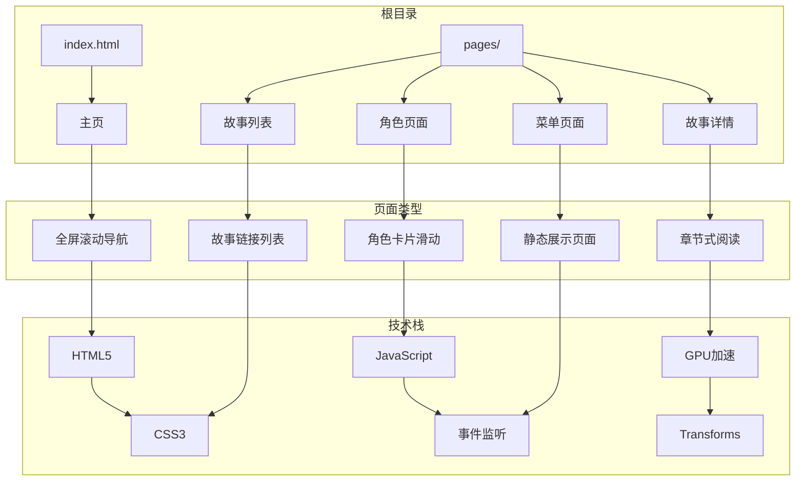
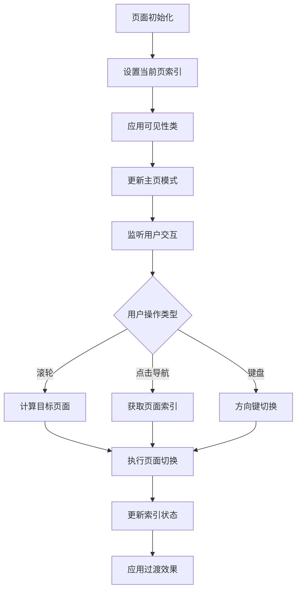
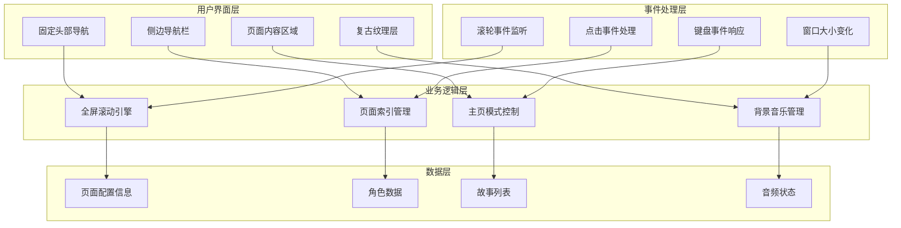
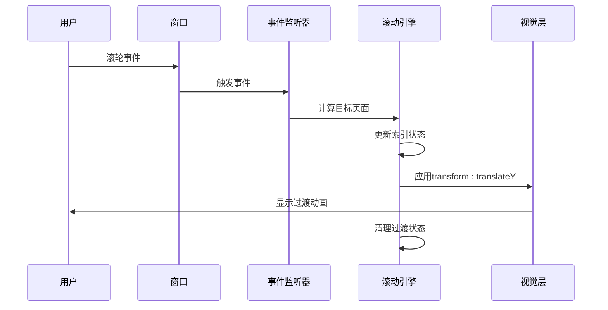
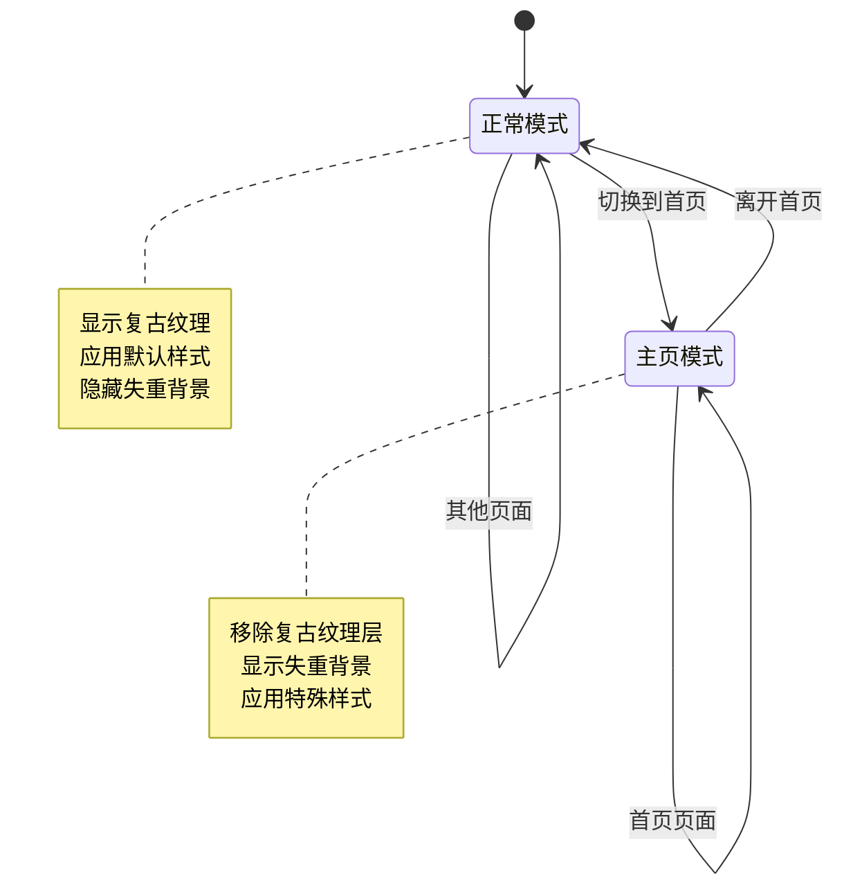
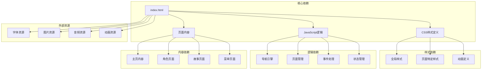

# 全屏滚动导航系统

<cite>
**本文档引用的文件**
- [index.html](file://index.html)
- [characters.html](file://pages/characters.html)
- [stories.html](file://pages/stories.html)
- [menu.html](file://pages/menu.html)
- [失群的白鹤.html](file://pages/失群的白鹤.html)
- [终其一生我们也未能相遇.html](file://pages/终其一生我们也未能相遇.html)
</cite>

## 目录
1. [引言](#引言)
2. [项目结构](#项目结构)
3. [核心组件](#核心组件)
4. [架构概览](#架构概览)
5. [详细组件分析](#详细组件分析)
6. [依赖关系分析](#依赖关系分析)
7. [性能考虑](#性能考虑)
8. [故障排除指南](#故障排除指南)
9. [结论](#结论)

## 引言

《夙日不再》全屏滚动导航系统是一个基于现代Web技术构建的沉浸式网页体验平台。该系统实现了流畅的全屏滚动导航、动态背景管理、响应式布局和丰富的视觉效果，为用户提供跨越历史时空的探索体验。

系统采用CSS3 transforms和JavaScript事件监听相结合的方式，实现了高性能的页面切换动画和页面可见性管理。通过精心设计的复古纹理层和主页特殊模式，营造出独特的视觉氛围，让用户沉浸在游戏的世界观中。

## 项目结构

该项目采用模块化设计，包含主页、角色介绍、故事页面等多个功能模块：

**图表来源**
- [index.html:1-759](file://index.html#L1-L759)
- [characters.html:1-648](file://pages/characters.html#L1-L648)
- [stories.html:1-253](file://pages/stories.html#L1-L253)

**章节来源**
- [index.html:1-759](file://index.html#L1-L759)
- [pages/characters.html:1-648](file://pages/characters.html#L1-L648)
- [pages/stories.html:1-253](file://pages/stories.html#L1-L253)

## 核心组件

### 全屏滚动引擎

系统的核心是基于CSS3 transforms的全屏滚动引擎，通过`translateY`变换实现页面的垂直滚动效果。

**关键特性：**
- 使用CSS3 `transform: translateY()` 实现硬件加速
- 采用 `will-change: transform` 提升渲染性能
- 通过 `cubic-bezier` 缓动函数实现自然的动画曲线
- 支持页面可见性管理和过渡状态控制

### 页面索引管理系统

系统实现了完整的页面索引管理机制，确保页面切换的准确性和一致性：

**图表来源**
- [index.html:582-632](file://index.html#L582-L632)

### 复古纹理层控制系统

系统实现了多层次的复古纹理背景系统，为非主页页面提供丰富的视觉效果：

**纹理层组成：**
- 半调斑点覆层 (`halftone-overlay`)
- 复古浮动元素组 (`vintage-bg`)
- 全局复古纹理背景 (`body::before`)

每个纹理层都具有独立的动画效果和混合模式，通过CSS3动画实现动态的视觉效果。

**章节来源**
- [index.html:43-117](file://index.html#L43-L117)
- [index.html:335-349](file://index.html#L335-L349)

## 架构概览

系统采用分层架构设计，将导航逻辑、页面管理、视觉效果和交互处理分离：

**图表来源**
- [index.html:444-759](file://index.html#L444-L759)
- [characters.html:401-646](file://pages/characters.html#L401-L646)

## 详细组件分析

### 全屏滚动导航引擎

#### 核心实现原理

系统使用CSS3 transforms实现高性能的全屏滚动效果：

**图表来源**
- [index.html:612-624](file://index.html#L612-L624)

#### 页面切换算法

系统实现了智能的页面切换算法，确保用户交互的流畅性和准确性：

**滚轮事件处理：**
- 使用 `deltaY` 值判断滚动方向
- 设置阈值防止误触发 (`> 20` 或 `< -20`)
- 实现防抖机制 (`wheelLock` 锁定)
- 支持连续滚动的节流控制

**页面索引管理：**
- `currentPage`: 当前激活页面索引
- `totalPages`: 总页面数量
- `isTransitioning`: 过渡状态标志
- `wheelLock`: 滚轮锁定状态

**章节来源**
- [index.html:582-632](file://index.html#L582-L632)
- [index.html:612-624](file://index.html#L612-L624)

### 主页特殊模式控制系统

#### 实现原理

系统为首页实现了特殊的背景管理模式，确保主页的视觉效果达到最佳：

**图表来源**
- [index.html:589-596](file://index.html#L589-L596)
- [index.html:335-349](file://index.html#L335-L349)

#### 控制逻辑

主页模式通过CSS类切换实现动态控制：

**类名控制：**
- `homepage-clean`: 主页模式类
- 自动移除复古纹理层
- 隐藏半调斑点覆层
- 隐藏复古浮动元素

**背景管理：**
- 首页背景图片优先级最高
- 背景图片完全不透明显示
- 文字内容区域增强可读性

**章节来源**
- [index.html:286-350](file://index.html#L286-L350)
- [index.html:589-596](file://index.html#L589-L596)

### 复古纹理层系统

#### 纹理层设计

系统实现了多层次的复古纹理效果，为非主页页面提供丰富的视觉层次：

**纹理层结构：**
1. **全局背景纹理** (`body::before`)
   - 半透明渐变网格
   - 重复线条纹理
   - 噪点背景叠加
   - 径向渐变背景

2. **半调斑点覆层** (`halftone-overlay`)
   - 透明度控制
   - 混合模式叠加
   - 固定层级管理

3. **复古浮动元素** (`vintage-bg`)
   - 多个浮动元素组合
   - 独立动画控制
   - 混合模式效果

**动画效果：**
- `driftVintage`: 平移动画
- `pulseVintage`: 亮度脉冲
- 时间参数独立控制

**章节来源**
- [index.html:43-117](file://index.html#L43-L117)
- [index.html:77-117](file://index.html#L77-L117)

### 角色页面滑动引擎

#### 实现特点

角色页面采用了独立的滑动引擎，针对内容展示进行了优化：

**滑动机制：**
- 使用 `character-slide` 类控制可见性
- 通过 `active` 类标识当前页面
- 实现 `slide-in` 动画效果
- 支持简介/详情切换

**滚动处理：**
- 智能检测可滚动元素
- 边界检测防止页面切换
- 支持鼠标滚轮和键盘导航
- 自动滚动到顶部

**章节来源**
- [characters.html:110-137](file://pages/characters.html#L110-L137)
- [characters.html:567-584](file://pages/characters.html#L567-L584)
- [characters.html:586-614](file://pages/characters.html#L586-L614)

### 背景音乐管理系统

#### 音频控制逻辑

系统实现了完整的背景音乐管理功能，包括状态持久化和自动播放控制：

**音频状态管理：**
- 使用 `localStorage` 持久化音频状态
- 存储播放状态和当前位置
- 支持静音模式切换
- 实现自动播放解锁机制

**播放控制：**
- 检测浏览器自动播放限制
- 等待用户首次交互后播放
- 支持手动播放/暂停控制
- 实现循环播放和状态恢复

**章节来源**
- [index.html:678-751](file://index.html#L678-L751)
- [characters.html:402-470](file://pages/characters.html#L402-L470)

## 依赖关系分析

系统采用松耦合的设计，各组件之间的依赖关系清晰明确：

**图表来源**
- [index.html:11-13](file://index.html#L11-L13)
- [index.html:444-759](file://index.html#L444-L759)

**章节来源**
- [index.html:11-13](file://index.html#L11-L13)
- [index.html:444-759](file://index.html#L444-L759)

## 性能考虑

### GPU加速优化

系统充分利用现代浏览器的GPU加速能力，提升动画性能：

**优化技术：**
- 使用 `transform: translateZ(0)` 启用硬件加速
- 设置 `will-change: transform` 提示浏览器优化
- 采用 `backface-visibility: hidden` 避免背面渲染
- 使用 `cubic-bezier` 缓动函数实现流畅动画

**内存管理：**
- 合理使用 `setTimeout` 清理过渡状态
- 避免内存泄漏的事件监听器清理
- 及时释放不必要的DOM引用

### 响应式设计

系统实现了完整的响应式布局，适配不同设备和屏幕尺寸：

**媒体查询策略：**
- 移动端隐藏侧边导航栏
- 调整字体大小和间距
- 优化触摸交互体验
- 自适应页面布局

**性能优化：**
- 使用 `clamp()` 函数实现流式字体大小
- 合理使用 `vw` 和 `vh` 单位
- 避免复杂的CSS选择器
- 优化图片加载和缓存

## 故障排除指南

### 常见问题及解决方案

**页面滚动异常：**
- 检查 `overflow: hidden` 设置
- 验证 `transform` 属性应用
- 确认 `will-change` 属性设置
- 检查 `transition` 动画时长

**音频播放问题：**
- 确认浏览器自动播放策略
- 检查 `localStorage` 访问权限
- 验证音频文件路径正确性
- 检查网络连接和跨域设置

**纹理层显示异常：**
- 验证CSS类名正确性
- 检查 `z-index` 层级设置
- 确认 `pointer-events` 属性
- 检查 `mix-blend-mode` 兼容性

**章节来源**
- [index.html:21-25](file://index.html#L21-L25)
- [index.html:38-41](file://index.html#L38-L41)
- [index.html:678-751](file://index.html#L678-L751)

### 调试技巧

**开发者工具使用：**
- 使用性能面板监控GPU使用率
- 检查CSS动画性能统计
- 监控JavaScript内存使用
- 分析网络请求和资源加载

**测试方法：**
- 在不同浏览器中验证兼容性
- 测试移动端触摸交互
- 验证音频播放功能
- 检查页面切换流畅度

## 结论

《夙日不再》全屏滚动导航系统展现了现代Web技术在用户体验方面的巨大潜力。通过精心设计的CSS3 transforms、JavaScript事件监听和页面切换动画机制，系统为用户提供了流畅、沉浸式的浏览体验。

系统的主要优势包括：
- **高性能动画**：利用GPU加速实现流畅的页面切换
- **灵活的布局**：支持多种页面类型和内容格式
- **丰富的视觉效果**：复古纹理层和主页特殊模式营造独特氛围
- **完善的交互控制**：滚轮事件、点击导航和键盘支持
- **响应式设计**：适配各种设备和屏幕尺寸

该系统为类似的全屏滚动导航项目提供了优秀的参考模板，展示了如何在保证性能的同时实现丰富的视觉效果和良好的用户体验。