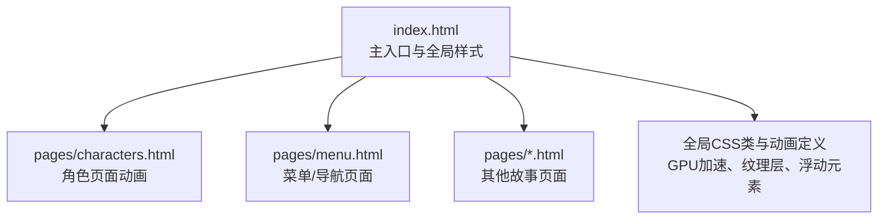
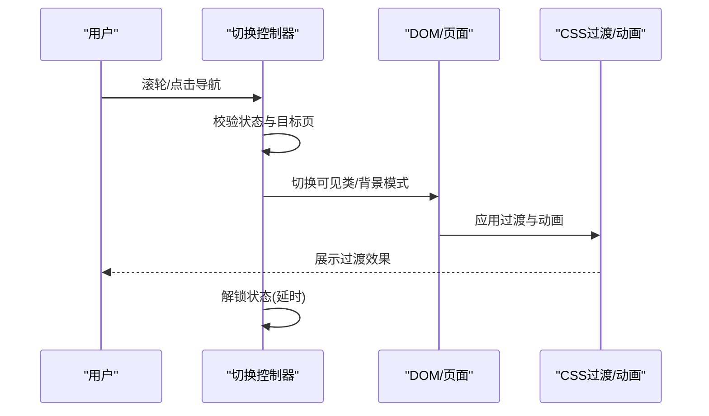
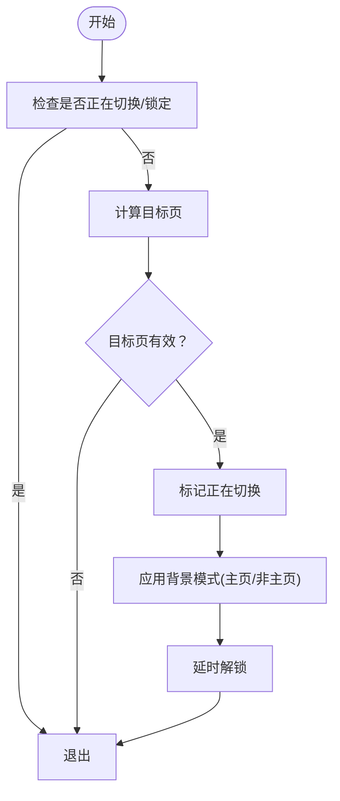

# 动画过渡效果

<cite>
**本文引用的文件**
- [index.html](file://index.html)
- [pages/characters.html](file://pages/characters.html)
- [pages/menu.html](file://pages/menu.html)
</cite>

## 目录
1. [引言](#引言)
2. [项目结构](#项目结构)
3. [核心组件](#核心组件)
4. [架构总览](#架构总览)
5. [详细组件分析](#详细组件分析)
6. [依赖关系分析](#依赖关系分析)
7. [性能考量](#性能考量)
8. [故障排查指南](#故障排查指南)
9. [结论](#结论)
10. [附录](#附录)

## 引言
本技术文档聚焦于“动画过渡效果”的实现与优化，围绕页面切换动画展开，系统讲解以下主题：
- CSS3 缓动函数、transform 过渡与 opacity 渐变的组合使用
- 动画时序控制、延迟设置与同步机制
- 页面可见性管理、动画状态检测与性能监控策略
- 硬件加速与内存管理的最佳实践
- 提供可定位的代码片段路径，便于快速查阅与落地实施

## 项目结构
该项目采用多页面静态站点结构，主入口为 index.html，子页面位于 pages/ 目录。页面切换通过 JavaScript 控制，CSS 提供过渡与动画基础能力；部分页面包含独立的动画与视觉装饰。

图表来源
- [index.html](file://index.html)
- [pages/characters.html](file://pages/characters.html)
- [pages/menu.html](file://pages/menu.html)

章节来源
- [index.html](file://index.html)
- [pages/characters.html](file://pages/characters.html)
- [pages/menu.html](file://pages/menu.html)

## 核心组件
- 页面切换控制器：负责监听滚轮事件与侧边栏点击，控制当前页索引与可见性，并在切换前后设置“纯净背景模式”以适配主页展示需求。
- 视觉装饰层：包含复古纹理、半调覆层、浮动复古元素等，通过 CSS transition 与 animation 实现平滑过渡与持续动画。
- 动画状态机：通过布尔标志位与定时器实现防抖与节流，避免频繁切换导致的动画冲突与性能抖动。

章节来源
- [index.html](file://index.html)
- [pages/characters.html](file://pages/characters.html)

## 架构总览
页面切换流程由用户交互触发，JavaScript 更新 DOM 可见性并切换背景模式，随后 CSS 执行过渡与动画，最终完成一次平滑的页面过渡。

图表来源
- [index.html](file://index.html)

## 详细组件分析

### 页面切换控制器（index.html）
- 监听滚轮事件，根据方向计算目标页，避免短时间内重复触发。
- 使用布尔标志位与定时器实现“正在切换”状态的节流，确保动画不会被并发触发。
- 切换时根据当前页是否为主页，动态启用或关闭“纯净背景模式”，以保证主页背景不受装饰层影响。
- 通过类名控制页面可见性，配合 CSS 的过渡与动画实现平滑切换。

图表来源
- [index.html](file://index.html)

章节来源
- [index.html](file://index.html)

### 视觉装饰层与过渡（index.html）
- GPU 加速与可见变化提示：通过 will-change 与 backface-visibility 提升渲染性能，减少回流与重绘。
- 背景层过渡：全局背景纹理、半调覆层与复古浮动元素均配置了统一的过渡时长与缓动，确保整体氛围一致。
- 浮动元素动画：使用复合动画（translate + rotate + 透明度 + 亮度）实现自然漂移与呼吸感，配合不同动画时长形成层次感。

章节来源
- [index.html](file://index.html)

### 页面可见性与状态检测（index.html）
- 通过给页面元素添加/移除可见类，驱动 CSS 过渡与动画。
- 使用定时器在切换完成后重置“正在切换”状态，防止误触。
- 通过类名切换控制背景层的显示/隐藏，避免主页与非主页场景的视觉冲突。

章节来源
- [index.html](file://index.html)

### 页面切换动画（pages/menu.html）
- 使用淡入动画类对关键内容进行入场过渡，结合媒体查询适配移动端布局。
- 该页面展示了如何通过 CSS 类与动画名称组合，实现简洁可控的过渡效果。

章节来源
- [pages/menu.html](file://pages/menu.html)

### 角色页面动画（pages/characters.html）
- 包含复古胶片颗粒动画、径向遮罩与多层背景装饰，强调复古风格。
- 通过 animation-duration 与 animation-timing-function 控制元素运动节奏与时间分配。
- 同样具备切换状态的节流逻辑，避免频繁切换引发的动画堆积。

章节来源
- [pages/characters.html](file://pages/characters.html)

## 依赖关系分析
- JavaScript 依赖 DOM 结构与 CSS 类名约定，通过切换类名驱动 CSS 过渡与动画。
- CSS 依赖浏览器对 transform、opacity、animation 的支持，以及 will-change 的性能提示。
- 页面间切换依赖统一的状态机与延时策略，避免竞态条件与视觉撕裂。

图表来源
- [index.html](file://index.html)
- [pages/menu.html](file://pages/menu.html)
- [pages/characters.html](file://pages/characters.html)

章节来源
- [index.html](file://index.html)
- [pages/menu.html](file://pages/menu.html)
- [pages/characters.html](file://pages/characters.html)

## 性能考量
- 硬件加速
  - 使用 will-change 提示浏览器对 transform 与 opacity 进行优化。
  - 通过 backface-visibility 隐藏背面，减少不必要的绘制。
- 动画时序与同步
  - 使用统一的过渡时长与缓动函数，确保各层装饰与内容过渡节奏一致。
  - 通过定时器与状态标志位实现节流，避免动画叠加与掉帧。
- 内存与资源
  - 合理控制浮动元素数量与尺寸，避免过多大图资源造成内存压力。
  - 在主页场景下禁用装饰层，降低渲染负担。

章节来源
- [index.html](file://index.html)

## 故障排查指南
- 页面切换卡顿
  - 检查是否存在频繁触发切换的事件源（如滚轮事件未正确节流）。
  - 确认过渡时长与动画时长是否过长，必要时缩短或减少动画层级。
- 背景层未按预期显示/隐藏
  - 核对背景模式切换逻辑与类名绑定，确认在主页与非主页场景下的分支处理。
- 动画闪烁或撕裂
  - 检查是否遗漏 will-change 或 backface-visibility 的声明。
  - 确认动画属性是否仅限于 transform 与 opacity，避免触发布局与绘制。
- 移动端体验差
  - 检查媒体查询与动画时长，适当提升移动端的性能表现。

章节来源
- [index.html](file://index.html)
- [pages/characters.html](file://pages/characters.html)

## 结论
本项目通过“JavaScript 控制器 + CSS 过渡/动画 + GPU 加速”的组合，实现了稳定、顺滑且具风格化的页面切换效果。通过状态机与节流策略，有效避免了动画冲突与性能问题；通过背景模式切换与装饰层管理，兼顾了主页与非主页场景的视觉一致性。建议在后续迭代中进一步细化动画参数与资源加载策略，以获得更佳的跨设备体验。

## 附录
- 代码片段路径参考（请在对应文件中查看具体实现）：
  - 页面切换控制器与状态机：[index.html](file://index.html)
  - 视觉装饰层与过渡：[index.html](file://index.html)
  - 页面可见性与背景模式切换：[index.html](file://index.html)
  - 页面淡入动画示例：[pages/menu.html](file://pages/menu.html)
  - 角色页面动画与装饰：[pages/characters.html](file://pages/characters.html)