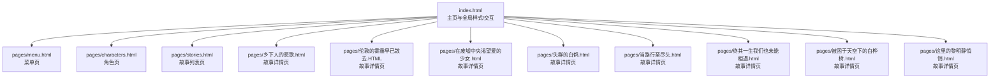
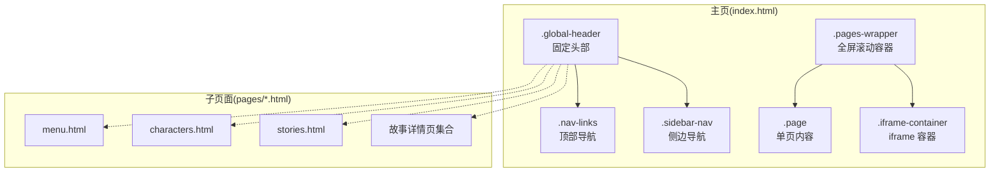
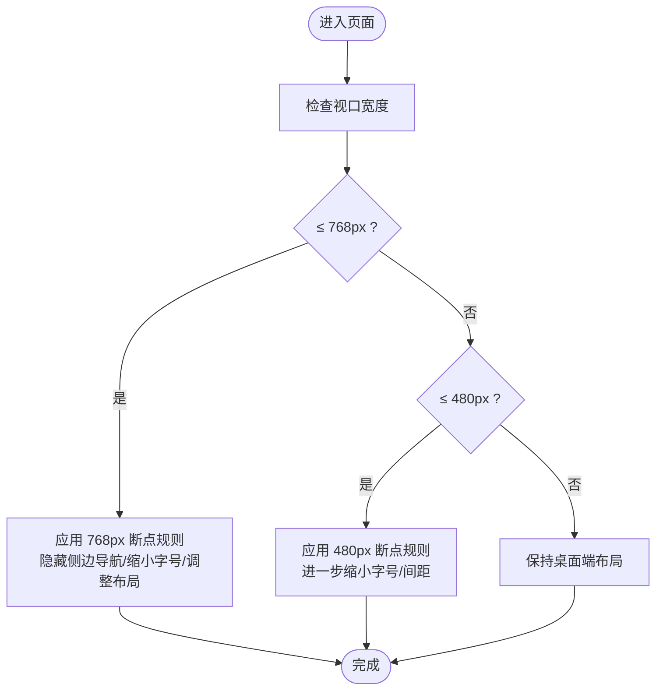
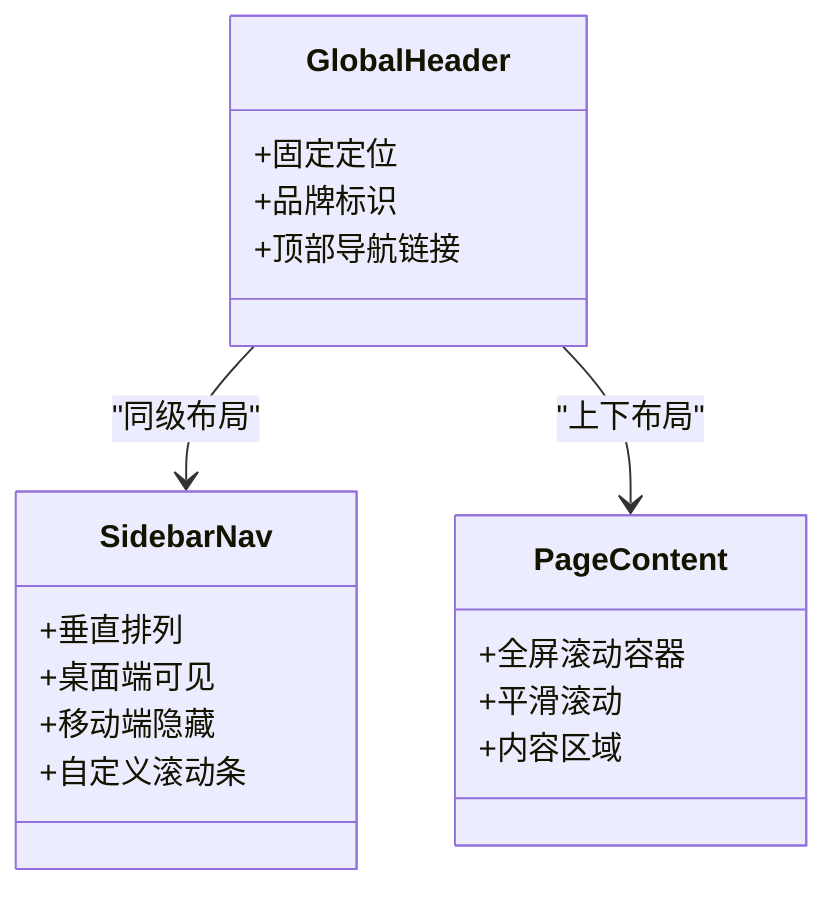
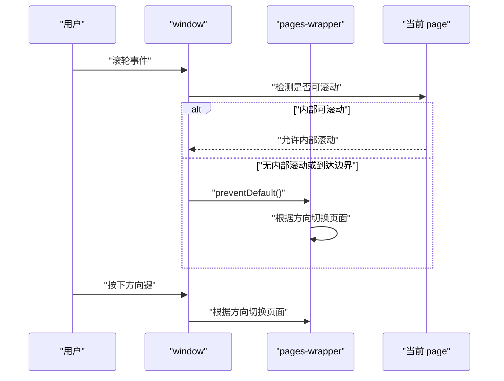
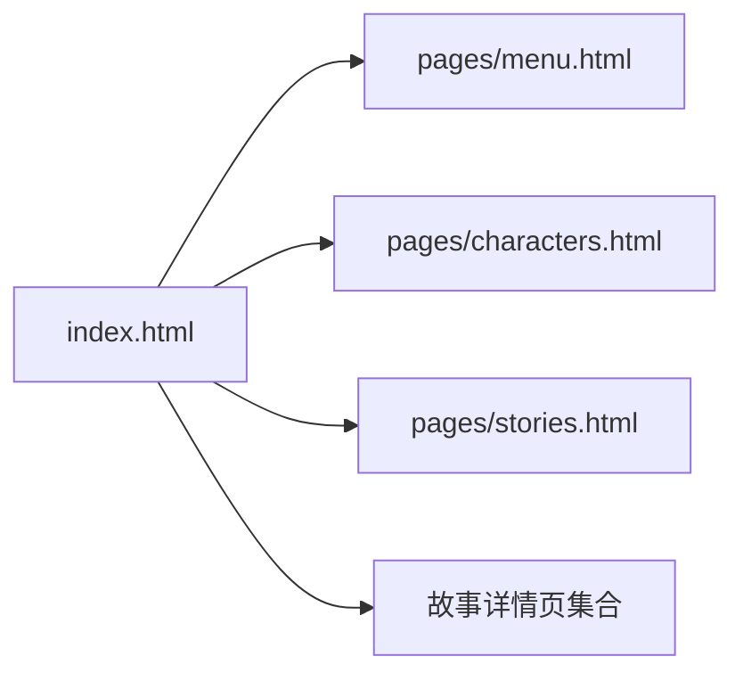

# 响应式适配策略

<cite>
**本文引用的文件**
- [index.html](file://index.html)
- [pages/menu.html](file://pages/menu.html)
- [pages/characters.html](file://pages/characters.html)
- [pages/stories.html](file://pages/stories.html)
- [pages/乡下人的悲歌.html](file://pages/乡下人的悲歌.html)
- [pages/伦敦的雾霾早已散去.HTML](file://pages/伦敦的雾霾早已散去.HTML)
- [pages/在废墟中央渴望爱的少女.html](file://pages/在废墟中央渴望爱的少女.html)
- [pages/失群的白鹤.html](file://pages/失群的白鹤.html)
- [pages/当路行至尽头.html](file://pages/当路行至尽头.html)
- [pages/终其一生我们也未能相遇.html](file://pages/终其一生我们也未能相遇.html)
- [pages/被困于天空下的白桦树.html](file://pages/被困于天空下的白桦树.html)
- [pages/这里的黎明静悄悄.html](file://pages/这里的黎明静悄悄.html)
</cite>

## 目录
1. [引言](#引言)
2. [项目结构](#项目结构)
3. [核心组件](#核心组件)
4. [架构总览](#架构总览)
5. [详细组件分析](#详细组件分析)
6. [依赖分析](#依赖分析)
7. [性能考量](#性能考量)
8. [故障排查指南](#故障排查指南)
9. [结论](#结论)
10. [附录](#附录)

## 引言
本文件围绕“响应式适配策略”展开，结合仓库中的 HTML/CSS/JS 实现，系统梳理移动端与桌面端的适配方案，包括视口配置、断点设置、布局调整、侧边导航栏隐藏逻辑、滚动与键盘事件处理、媒体查询与动态样式计算、性能优化与用户体验一致性保障等。文档以实际源码为依据，提供可追溯的章节来源与图示。

## 项目结构
该项目采用多页面静态站点结构，入口页面为 index.html，子页面位于 pages/ 目录下，包含角色介绍、故事列表、以及若干故事详情页。整体风格强调复古质感与沉浸式阅读体验，同时通过媒体查询与交互脚本实现跨设备适配。

**图表来源**
- [index.html](file://index.html)
- [pages/menu.html](file://pages/menu.html)
- [pages/characters.html](file://pages/characters.html)
- [pages/stories.html](file://pages/stories.html)
- [pages/乡下人的悲歌.html](file://pages/乡下人的悲歌.html)
- [pages/伦敦的雾霾早已散去.HTML](file://pages/伦敦的雾霾早已散去.HTML)
- [pages/在废墟中央渴望爱的少女.html](file://pages/在废墟中央渴望爱的少女.html)
- [pages/失群的白鹤.html](file://pages/失群的白鹤.html)
- [pages/当路行至尽头.html](file://pages/当路行至尽头.html)
- [pages/终其一生我们也未能相遇.html](file://pages/终其一生我们也未能相遇.html)
- [pages/被困于天空下的白桦树.html](file://pages/被困于天空下的白桦树.html)
- [pages/这里的黎明静悄悄.html](file://pages/这里的黎明静悄悄.html)

**章节来源**
- [index.html](file://index.html)
- [pages/menu.html](file://pages/menu.html)
- [pages/characters.html](file://pages/characters.html)
- [pages/stories.html](file://pages/stories.html)
- [pages/乡下人的悲歌.html](file://pages/乡下人的悲歌.html)
- [pages/伦敦的雾霾早已散去.HTML](file://pages/伦敦的雾霾早已散去.HTML)
- [pages/在废墟中央渴望爱的少女.html](file://pages/在废墟中央渴望爱的少女.html)
- [pages/失群的白鹤.html](file://pages/失群的白鹤.html)
- [pages/当路行至尽头.html](file://pages/当路行至尽头.html)
- [pages/终其一生我们也未能相遇.html](file://pages/终其一生我们也未能相遇.html)
- [pages/被困于天空下的白桦树.html](file://pages/被困于天空下的白桦树.html)
- [pages/这里的黎明静悄悄.html](file://pages/这里的黎明静悄悄.html)

## 核心组件
- 视口配置与缩放控制：各页面均设置 viewport meta，部分页面对 user-scalable 进行限制，以保证阅读稳定性与一致性。
- 全局样式与复古质感：通过伪元素叠加纹理、渐变与滤镜，营造复古氛围；主页模式下可隐藏干扰层，突出背景图像。
- 固定头部与侧边导航：固定顶部导航条与垂直方向的侧边导航栏，桌面端显示，移动端通过媒体查询隐藏。
- 滚动与交互：全屏滚动容器、平滑滚动、滚轮事件拦截与分页切换、键盘方向键导航、滚动条自定义样式。
- 媒体查询断点：统一在 768px 与 480px 左右设置断点，配合字体大小、间距、布局方向与显示/隐藏策略进行适配。
- 动态样式与状态类：通过 JS 切换类名（如 homepage-clean）以控制背景层显隐；通过类名切换实现内容区的过渡与状态管理。

**章节来源**
- [index.html](file://index.html)
- [pages/menu.html](file://pages/menu.html)
- [pages/characters.html](file://pages/characters.html)
- [pages/stories.html](file://pages/stories.html)

## 架构总览
整体采用“静态页面 + 原生 JavaScript 交互”的轻量架构。index.html 作为中枢，负责全局样式、导航与交互；各子页面按需引入自身样式与脚本，遵循统一的断点与交互规范。

**图表来源**
- [index.html](file://index.html)
- [pages/menu.html](file://pages/menu.html)
- [pages/characters.html](file://pages/characters.html)
- [pages/stories.html](file://pages/stories.html)

## 详细组件分析

### 视口配置与缩放控制
- 各页面均设置 viewport，确保在移动设备上正确缩放。
- 部分页面对 user-scalable 进行限制，避免用户手动缩放影响排版与交互一致性。
- 主页模式可通过切换类名隐藏干扰层，使背景图成为唯一焦点。

**章节来源**
- [index.html](file://index.html)
- [pages/menu.html](file://pages/menu.html)
- [pages/characters.html](file://pages/characters.html)
- [pages/stories.html](file://pages/stories.html)
- [pages/乡下人的悲歌.html](file://pages/乡下人的悲歌.html)
- [pages/伦敦的雾霾早已散去.HTML](file://pages/伦敦的雾霾早已散去.HTML)
- [pages/在废墟中央渴望爱的少女.html](file://pages/在废墟中央渴望爱的少女.html)
- [pages/失群的白鹤.html](file://pages/失群的白鹤.html)
- [pages/当路行至尽头.html](file://pages/当路行至尽头.html)
- [pages/终其一生我们也未能相遇.html](file://pages/终其一生我们也未能相遇.html)
- [pages/被困于天空下的白桦树.html](file://pages/被困于天空下的白桦树.html)
- [pages/这里的黎明静悄悄.html](file://pages/这里的黎明静悄悄.html)

### 媒体查询与断点策略
- 统一断点：768px 与 480px 左右，分别用于“中屏”和“小屏”场景。
- 桌面端：保留侧边导航栏与较大字号、间距；移动端：隐藏侧边导航，缩小字号与间距，必要时改变布局方向。
- 特殊页面：角色页在更宽的断点下进行额外调整，确保内容可读性与视觉平衡。

**图表来源**
- [index.html](file://index.html)
- [pages/menu.html](file://pages/menu.html)
- [pages/characters.html](file://pages/characters.html)
- [pages/stories.html](file://pages/stories.html)

**章节来源**
- [index.html](file://index.html)
- [pages/menu.html](file://pages/menu.html)
- [pages/characters.html](file://pages/characters.html)
- [pages/stories.html](file://pages/stories.html)

### 固定头部与侧边导航栏
- 固定头部：包含品牌标识与顶部导航链接，移动端在断点下进行紧凑化处理。
- 侧边导航：垂直排列，桌面端可见；移动端断点下隐藏，避免遮挡主要内容。
- 自定义滚动条：针对侧边导航与页面内容区域分别设置滚动条样式，提升阅读体验。

**图表来源**
- [index.html](file://index.html)

**章节来源**
- [index.html](file://index.html)

### 滚动与键盘事件处理
- 全屏滚动容器：使用 transform 与过渡实现页面切换动画，开启 GPU 加速以提升流畅度。
- 滚轮事件拦截：在特定可滚动区域内优先处理内部滚动，否则触发页面切换；通过 preventDefault 控制滚动传播。
- 键盘方向键：向上/向下箭头切换页面，避免与系统滚动冲突。
- 平滑滚动：启用 scroll-behavior 以获得顺滑的滚动体验。

**图表来源**
- [index.html](file://index.html)

**章节来源**
- [index.html](file://index.html)

### 媒体查询与动态样式计算
- 媒体查询：在 768px 与 480px 断点下分别调整头部、导航、内容区的尺寸与布局。
- 动态类名：通过 JS 切换类名控制背景层显隐（如 homepage-clean），实现动态样式计算与状态切换。
- 条件样式应用：根据设备宽度与交互状态，选择性地应用不同样式规则，确保在不同屏幕尺寸下的一致体验。

**章节来源**
- [index.html](file://index.html)
- [pages/menu.html](file://pages/menu.html)
- [pages/characters.html](file://pages/characters.html)
- [pages/stories.html](file://pages/stories.html)

### 侧边导航栏的隐藏逻辑
- 断点隐藏：在 768px 断点下，侧边导航栏被隐藏，释放横向空间给主要内容。
- 手动控制：通过点击事件切换页面或打开 iframe 内容，不依赖侧边栏显示。
- 触摸友好：在移动端，侧边栏隐藏后，主要交互集中在页面内容与顶部导航，减少误触风险。

**章节来源**
- [index.html](file://index.html)

### 媒体查询的使用与布局调整策略
- 通用断点：768px 与 480px，分别用于“中屏”和“小屏”场景。
- 字号与间距：随断点缩小字号与间距，保证在小屏上的可读性。
- 布局方向：在小屏下可能调整为纵向堆叠，减少横向滚动需求。
- 内容区适配：在特殊页面（如角色页）增加额外断点，确保内容区的视觉平衡与信息密度。

**章节来源**
- [index.html](file://index.html)
- [pages/menu.html](file://pages/menu.html)
- [pages/characters.html](file://pages/characters.html)
- [pages/stories.html](file://pages/stories.html)

### 动态样式计算与性能优化技巧
- GPU 加速：对关键动画元素启用 will-change 与 transform 优化，减少回流与重绘。
- 背景层控制：通过类名切换隐藏干扰层，降低渲染负担，提升首屏加载与滚动性能。
- 滚动优化：启用平滑滚动与内部滚动优先策略，减少不必要的页面跳转与重排。
- 事件处理：使用事件委托与防抖（如 resize 的节流）减少事件监听开销。

**章节来源**
- [index.html](file://index.html)

### 移动端滚动优化、触摸反馈与一致性保障
- 滚动优化：内部可滚动区域优先处理滚动，超出边界时才触发页面切换；避免与系统滚动冲突。
- 触摸反馈：通过 hover 效果与点击反馈增强交互感知；在小屏下减少需要精确点击的区域。
- 一致性保障：统一断点与交互行为，确保在不同设备与浏览器上的体验一致。

**章节来源**
- [index.html](file://index.html)
- [pages/characters.html](file://pages/characters.html)

## 依赖分析
- 页面间依赖：index.html 作为中枢，其他页面按需引入自身样式与脚本，遵循统一的断点与交互规范。
- 样式依赖：全局样式集中于 index.html，子页面仅在需要时覆盖或扩展。
- 交互依赖：全屏滚动与页面切换依赖于统一的事件处理与状态管理，避免重复实现。

**图表来源**
- [index.html](file://index.html)
- [pages/menu.html](file://pages/menu.html)
- [pages/characters.html](file://pages/characters.html)
- [pages/stories.html](file://pages/stories.html)
- [pages/乡下人的悲歌.html](file://pages/乡下人的悲歌.html)
- [pages/伦敦的雾霾早已散去.HTML](file://pages/伦敦的雾霾早已散去.HTML)
- [pages/在废墟中央渴望爱的少女.html](file://pages/在废墟中央渴望爱的少女.html)
- [pages/失群的白鹤.html](file://pages/失群的白鹤.html)
- [pages/当路行至尽头.html](file://pages/当路行至尽头.html)
- [pages/终其一生我们也未能相遇.html](file://pages/终其一生我们也未能相遇.html)
- [pages/被困于天空下的白桦树.html](file://pages/被困于天空下的白桦树.html)
- [pages/这里的黎明静悄悄.html](file://pages/这里的黎明静悄悄.html)

**章节来源**
- [index.html](file://index.html)
- [pages/menu.html](file://pages/menu.html)
- [pages/characters.html](file://pages/characters.html)
- [pages/stories.html](file://pages/stories.html)
- [pages/乡下人的悲歌.html](file://pages/乡下人的悲歌.html)
- [pages/伦敦的雾霾早已散去.HTML](file://pages/伦敦的雾霾早已散去.HTML)
- [pages/在废墟中央渴望爱的少女.html](file://pages/在废墟中央渴望爱的少女.html)
- [pages/失群的白鹤.html](file://pages/失群的白鹤.html)
- [pages/当路行至尽头.html](file://pages/当路行至尽头.html)
- [pages/终其一生我们也未能相遇.html](file://pages/终其一生我们也未能相遇.html)
- [pages/被困于天空下的白桦树.html](file://pages/被困于天空下的白桦树.html)
- [pages/这里的黎明静悄悄.html](file://pages/这里的黎明静悄悄.html)

## 性能考量
- 使用 GPU 加速与 will-change 提升动画性能。
- 通过类名切换控制背景层显隐，减少不必要的渲染。
- 对 resize 等高频事件进行节流/防抖处理，降低事件回调频率。
- 启用平滑滚动与内部滚动优先策略，减少页面跳转带来的重排成本。

## 故障排查指南
- 滚动异常：确认是否正确阻止了滚轮事件的默认行为，并在内部可滚动区域优先处理滚动。
- 断点不生效：检查媒体查询断点是否与设备宽度匹配，确认 CSS 优先级与覆盖关系。
- 侧边导航未隐藏：核对断点规则与元素选择器，确保在移动端断点下正确隐藏。
- 背景层未隐藏：检查类名切换逻辑与 CSS 选择器，确保 homepage-clean 类正确应用。

**章节来源**
- [index.html](file://index.html)
- [pages/characters.html](file://pages/characters.html)

## 结论
本项目通过统一的视口配置、明确的断点策略与一致的交互设计，实现了从桌面到移动端的平滑适配。侧边导航栏在移动端隐藏、滚轮与键盘事件的优先处理、媒体查询与动态样式的结合，共同保障了在不同设备上的阅读体验与性能表现。建议在后续迭代中持续关注事件处理的健壮性与断点覆盖的完整性，以进一步提升跨设备的一致性与稳定性。

## 附录
- 响应式断点定义与条件样式应用：参考以下文件中的媒体查询段落与类名切换逻辑。
- 事件处理器绑定：参考以下文件中的事件监听与处理函数绑定位置。

**章节来源**
- [index.html](file://index.html)
- [pages/menu.html](file://pages/menu.html)
- [pages/characters.html](file://pages/characters.html)
- [pages/stories.html](file://pages/stories.html)