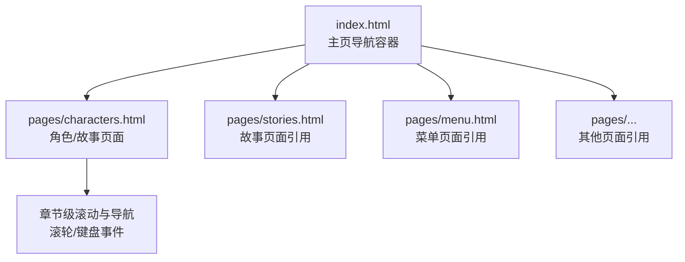
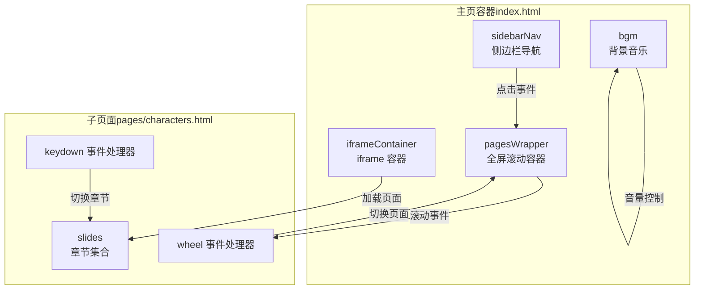
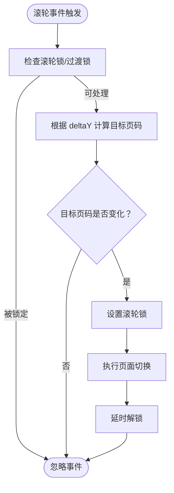
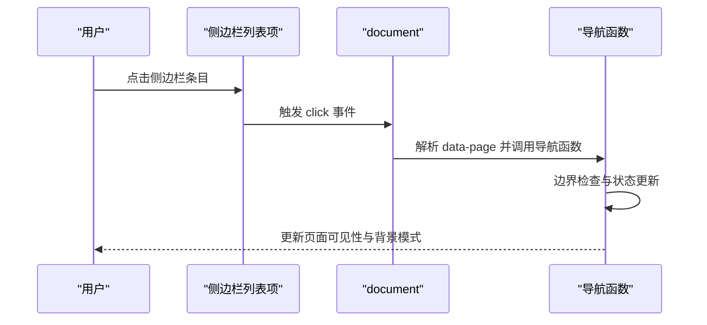
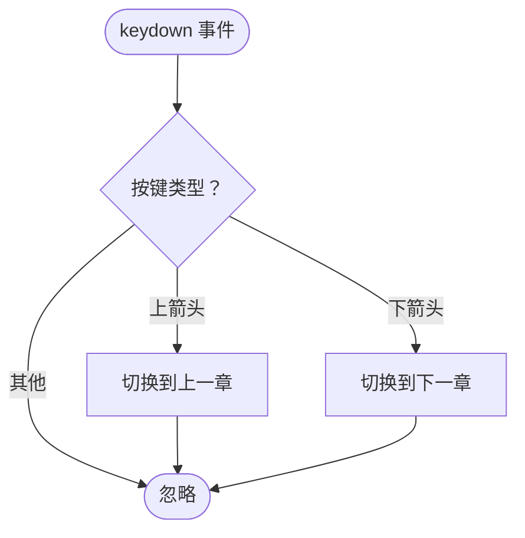
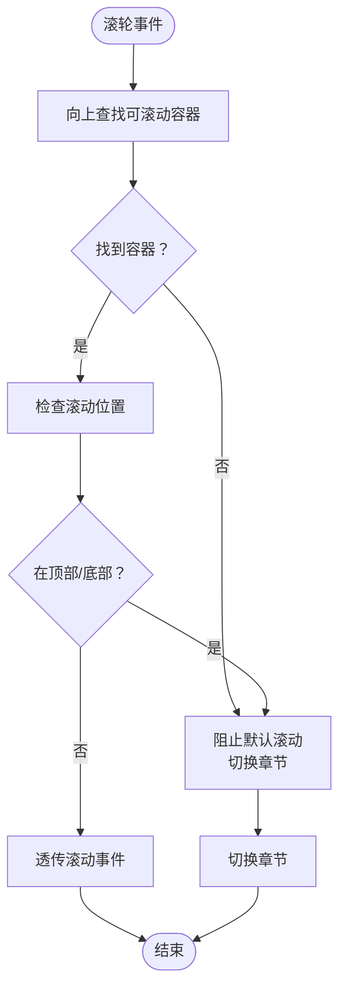
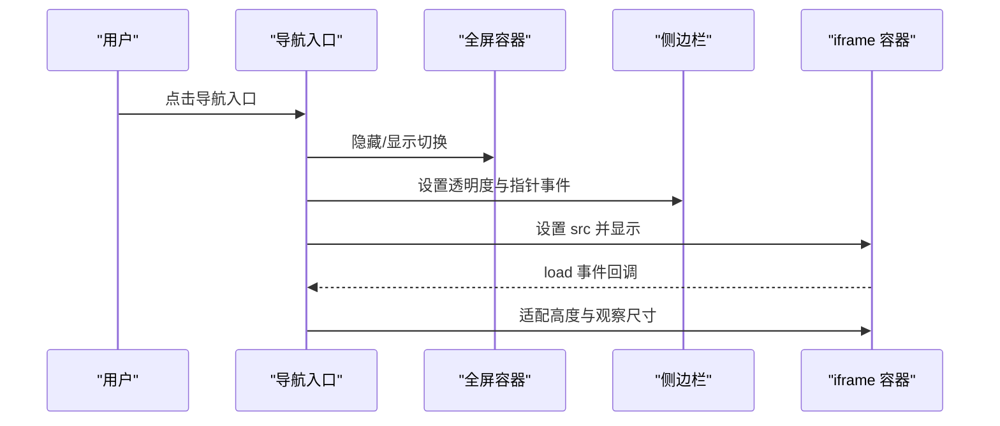
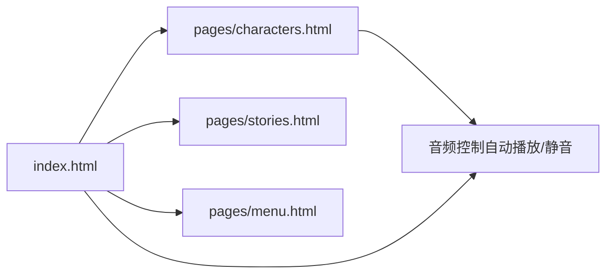

# 导航控制系统

<cite>
**本文引用的文件**
- [index.html](file://index.html)
- [pages/characters.html](file://pages/characters.html)
</cite>

## 目录
1. [简介](#简介)
2. [项目结构](#项目结构)
3. [核心组件](#核心组件)
4. [架构总览](#架构总览)
5. [详细组件分析](#详细组件分析)
6. [依赖关系分析](#依赖关系分析)
7. [性能考量](#性能考量)
8. [故障排查指南](#故障排查指南)
9. [结论](#结论)
10. [附录](#附录)

## 简介
本技术文档围绕导航控制系统展开，重点解析以下导航方式的实现机制与工程细节：
- 鼠标滚轮事件处理：基于垂直滚动方向与阈值判断，触发页面或章节切换，并通过“滚轮锁”与过渡状态防止重复触发。
- 侧边栏点击导航：通过侧边栏列表项绑定点击事件，解析目标页码并调用统一导航函数。
- 键盘快捷键支持：在特定页面中响应上下方向键，实现章节级导航。
- 事件监听器注册与注销：集中初始化与清理逻辑，确保生命周期内资源可控。
- 事件冒泡与默认行为控制：通过事件委托与 preventDefault 精准控制滚动与按键行为。
- 跨浏览器兼容性：采用被动事件监听器配置与通用事件模型，适配现代浏览器。
- 导航状态管理：包含当前页索引、总页数、过渡中状态、滚轮锁等，保障状态一致性。
- 边界检查与循环导航：对越界访问进行保护；当前实现为非循环导航（到达边界即停止）。
- 导航锁定机制与防重复触发：通过滚轮锁与过渡锁双重机制，避免快速连续触发导致的状态错乱。
- 用户体验优化：平滑过渡动画、纯背景模式切换、音量控制与自动播放策略。

## 项目结构
该导航系统主要由两个入口页面构成：
- 主页导航容器：负责全屏分页滚动、侧边栏导航、iframe 子页面切换与背景音乐控制。
- 角色/故事页面：在自身内部实现章节级滚动与导航，支持滚轮与键盘事件。

图表来源
- [index.html](file://index.html)
- [pages/characters.html](file://pages/characters.html)

章节来源
- [index.html](file://index.html)
- [pages/characters.html](file://pages/characters.html)

## 核心组件
- 页面容器与分页滚动
  - 全屏滚动容器与页面元素集合，通过 CSS 动画实现平滑过渡。
  - 导航函数负责更新当前页索引、可见性类与背景模式切换。
- 滚轮事件处理器
  - 基于 deltaY 判断滚动方向与阈值，结合滚轮锁与过渡锁防止重复触发。
- 侧边栏点击事件
  - 通过 data-page 属性传递目标页码，统一调用导航函数。
- 键盘事件处理
  - 在角色/故事页面中响应上下方向键，实现章节级导航。
- iframe 子页面切换
  - 主页提供导航入口，切换时隐藏/显示全屏容器与侧边栏，设置透明度与指针事件。
- 状态管理
  - 当前页索引、总页数、过渡中标志、滚轮锁、主页纯净模式开关等。

章节来源
- [index.html](file://index.html)
- [pages/characters.html](file://pages/characters.html)

## 架构总览
导航系统采用“主页面容器 + 子页面”的双层结构：
- 主页面容器负责全局导航与子页面入口，维护全屏滚动与侧边栏导航。
- 子页面在自身内部实现更细粒度的章节级导航，支持滚轮与键盘事件。

图表来源
- [index.html](file://index.html)
- [pages/characters.html](file://pages/characters.html)

## 详细组件分析

### 鼠标滚轮事件处理（主页）
- 事件监听器注册
  - 在窗口上注册滚轮事件，使用非被动监听以允许 preventDefault。
- 事件处理流程
  - 检查滚轮锁与过渡锁，若处于过渡中则直接返回。
  - 依据 deltaY 的正负与阈值计算目标页码。
  - 若目标页码发生变化，设置滚轮锁并在短暂延迟后解锁，随后执行页面切换。
- 边界检查
  - 使用最小/最大函数限制目标页码在有效范围内。
- 防重复触发
  - 滚轮锁与过渡锁双重保护，避免快速滚动导致的重复切换。
- 跨浏览器兼容性
  - 明确设置 { passive: false } 以支持 preventDefault。
- 用户体验
  - 平滑过渡动画与背景模式切换增强沉浸感。

图表来源
- [index.html](file://index.html)

章节来源
- [index.html](file://index.html)

### 侧边栏点击导航
- 事件绑定
  - 为每个侧边栏列表项绑定点击事件，读取 data-page 属性作为目标页码。
- 导航执行
  - 将目标页码传入统一导航函数，内部进行边界检查与状态更新。
- 用户反馈
  - 点击时高亮与阴影效果提升交互感知。

图表来源
- [index.html](file://index.html)

章节来源
- [index.html](file://index.html)

### 键盘快捷键支持（角色/故事页面）
- 事件监听
  - 在窗口上注册 keydown 事件，识别上下方向键。
- 行为控制
  - 阻止默认滚动行为，根据当前章节索引切换到上一章或下一章。
- 边界检查
  - 仅在有效范围内进行切换，避免越界。

图表来源
- [pages/characters.html](file://pages/characters.html)

章节来源
- [pages/characters.html](file://pages/characters.html)

### 章节级滚轮事件处理（角色/故事页面）
- 事件委托与滚动检测
  - 通过事件冒泡向上查找具有特定类名的可滚动容器。
  - 判断滚动位置（顶部/底部），决定是否透传事件或切换章节。
- 行为控制
  - 在滚动到边界时阻止默认滚动，切换到相邻章节。
  - 在容器内部滚动时，优先透传滚动事件。
- 边界检查
  - 仅在有效范围内切换章节。

图表来源
- [pages/characters.html](file://pages/characters.html)

章节来源
- [pages/characters.html](file://pages/characters.html)

### iframe 子页面切换
- 切换逻辑
  - 隐藏/显示全屏容器与侧边栏，设置透明度与指针事件。
  - 加载指定 URL 的页面，进入子页面时移除主页纯净模式。
- 生命周期
  - 监听 iframe load 事件，动态适配高度并观察尺寸变化。
  - 监听窗口 resize 事件，延迟调整高度。

图表来源
- [index.html](file://index.html)

章节来源
- [index.html](file://index.html)

### 导航状态管理与边界检查
- 状态字段
  - 当前页索引、总页数、过渡中标志、滚轮锁、主页纯净模式开关。
- 边界检查
  - 导航函数在切换前校验索引范围与当前状态，避免无效操作。
- 循环导航
  - 当前实现为非循环导航，到达边界即停止。

章节来源
- [index.html](file://index.html)
- [pages/characters.html](file://pages/characters.html)

### 导航锁定机制与防重复触发
- 滚轮锁
  - 在触发页面切换后设置滚轮锁，在短暂延迟后清除，防止快速连续触发。
- 过渡锁
  - 在页面切换过程中设置过渡锁，等待动画完成后释放。
- 键盘与滚轮协同
  - 在章节级页面中，同样通过过渡锁避免快速切换导致的视觉错乱。

章节来源
- [index.html](file://index.html)
- [pages/characters.html](file://pages/characters.html)

### 跨浏览器兼容性处理
- 被动事件监听器
  - 明确设置 { passive: false } 以支持 preventDefault。
- 自动播放策略
  - 音频自动播放失败时，等待用户首次交互后再次尝试播放。
- 尺寸适配
  - 使用 ResizeObserver 与延迟定时器适配 iframe 内容高度变化。

章节来源
- [index.html](file://index.html)
- [pages/characters.html](file://pages/characters.html)

## 依赖关系分析
- 主页面容器依赖子页面的导航能力（滚轮与键盘）。
- 子页面内部自包含导航逻辑，不依赖外部容器。
- iframe 切换依赖页面 URL 与容器布局。
- 音频控制与页面可见性事件耦合，影响自动播放策略。

图表来源
- [index.html](file://index.html)
- [pages/characters.html](file://pages/characters.html)

章节来源
- [index.html](file://index.html)
- [pages/characters.html](file://pages/characters.html)

## 性能考量
- 动画与渲染
  - 使用 CSS3 变换与过渡，配合 will-change 与 GPU 加速提示，减少主线程压力。
- 事件处理
  - 滚轮事件采用非被动监听，但通过锁机制降低频繁计算开销。
- 尺寸适配
  - 使用延迟与观察者模式，避免高频重排与重绘。
- 资源管理
  - 音频状态持久化与周期性保存，减少不必要的 I/O。

## 故障排查指南
- 滚轮无响应
  - 检查滚轮锁与过渡锁是否被意外保留；确认事件监听器是否正确注册。
- 点击侧边栏无效
  - 确认 data-page 属性是否存在且为有效数字；检查导航函数边界条件。
- 键盘导航失效
  - 确认当前页面是否处于可接收键盘事件的状态；检查事件监听器绑定。
- iframe 高度异常
  - 检查 load 事件回调与 ResizeObserver 是否正常工作；确认跨域限制。
- 自动播放失败
  - 确认用户交互后是否重新尝试播放；检查静音状态与浏览器策略。

章节来源
- [index.html](file://index.html)
- [pages/characters.html](file://pages/characters.html)

## 结论
该导航控制系统通过统一的导航函数与事件处理机制，实现了主页全屏滚动、侧边栏点击导航与子页面内的章节级导航。系统采用多重锁机制与边界检查，有效防止重复触发与越界访问；同时通过平滑动画与背景模式切换提升用户体验。未来可在现有基础上扩展循环导航、手势支持与更精细的跨设备适配。

## 附录
- 事件处理函数路径
  - [滚轮事件处理（主页）](file://index.html)
  - [侧边栏点击事件（主页）](file://index.html)
  - [键盘事件处理（角色/故事页面）](file://pages/characters.html)
  - [章节级滚轮事件处理（角色/故事页面）](file://pages/characters.html)
  - [iframe 子页面切换（主页）](file://index.html)
- 导航验证与错误处理
  - 导航函数内部包含边界检查与状态校验，避免无效切换。
  - 滚轮与键盘事件均调用 preventDefault，确保默认滚动行为被阻断。
- 用户体验优化
  - 平滑过渡动画、侧边栏悬停高亮、主页纯净模式切换、音量控制与自动播放策略。