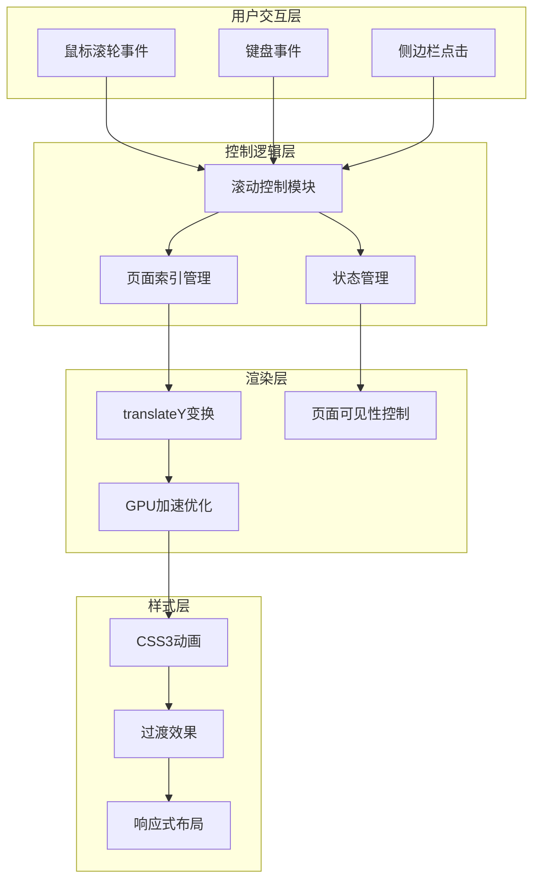
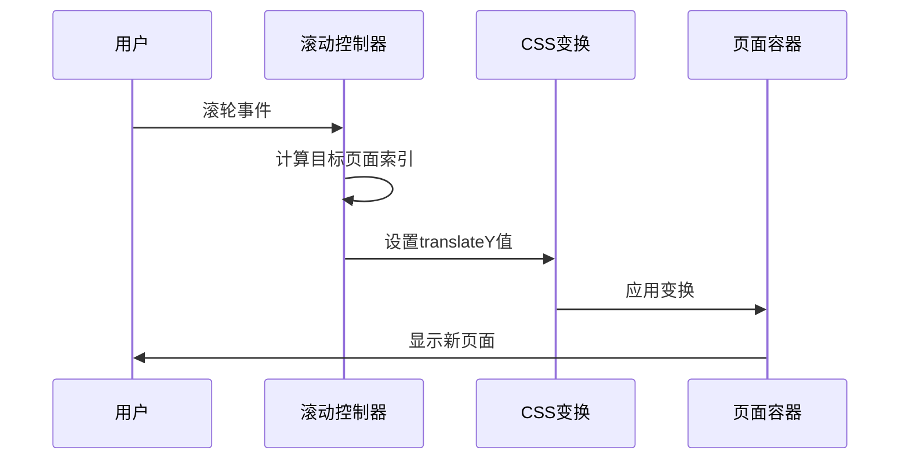
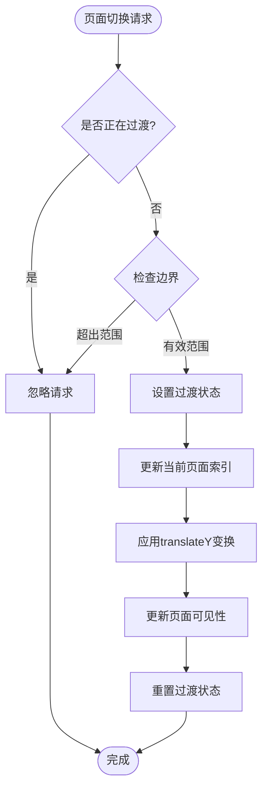
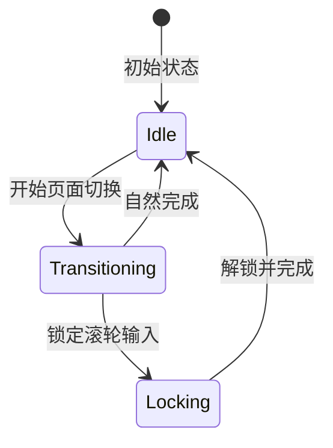
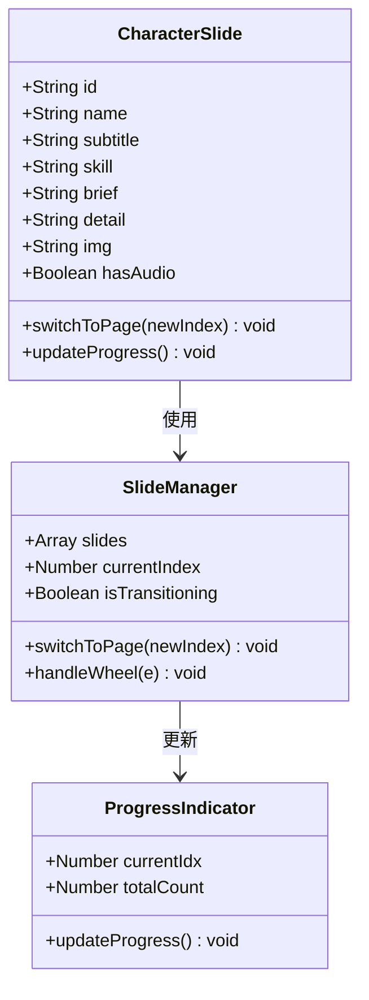
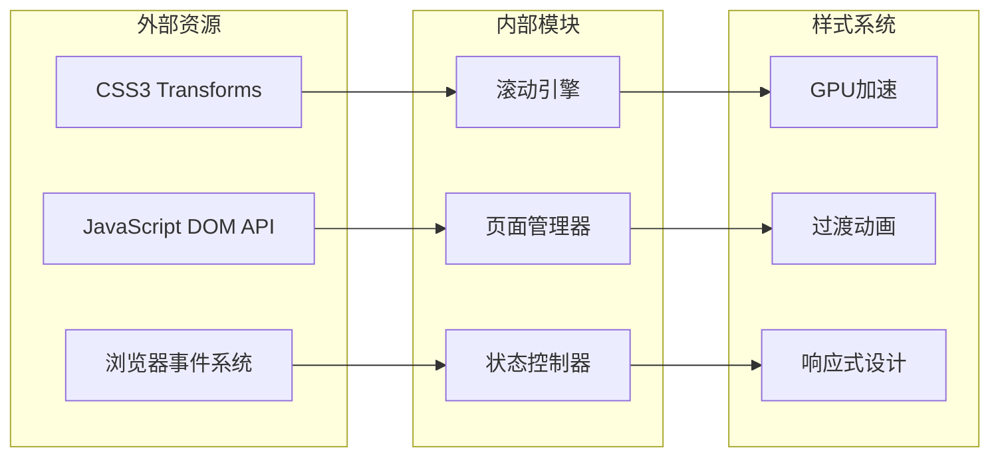
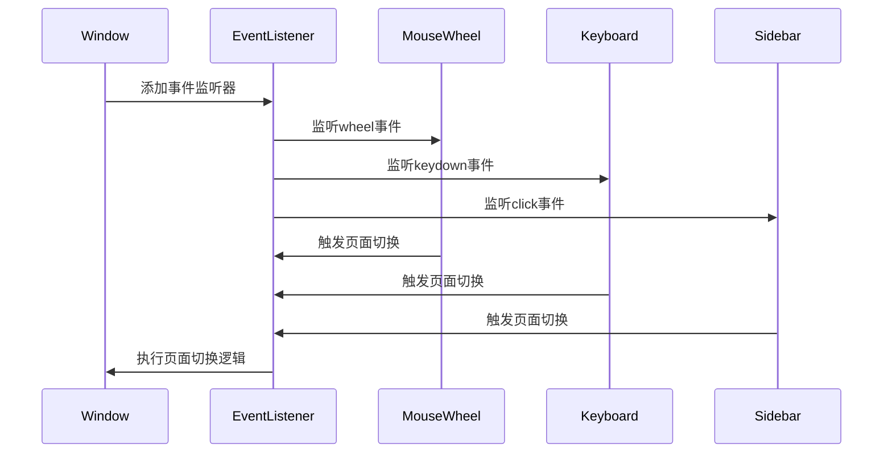

# 滚动引擎核心

<cite>
**本文档引用的文件**
- [index.html](file://index.html)
- [characters.html](file://pages/characters.html)
- [stories.html](file://pages/stories.html)
</cite>

## 目录
1. [简介](#简介)
2. [项目结构](#项目结构)
3. [核心组件](#核心组件)
4. [架构概览](#架构概览)
5. [详细组件分析](#详细组件分析)
6. [依赖关系分析](#依赖关系分析)
7. [性能考虑](#性能考虑)
8. [故障排除指南](#故障排除指南)
9. [结论](#结论)

## 简介
本项目是一个基于全屏滚动的网页应用，采用纯前端技术实现流畅的垂直页面切换体验。项目包含完整的滚动引擎核心，支持鼠标滚轮、键盘导航、侧边栏点击等多种交互方式，具备GPU加速优化、页面索引管理、滚动锁定等高级特性。

## 项目结构
项目采用单页应用架构，核心逻辑集中在主页面中，通过CSS3 transforms实现页面切换，JavaScript控制状态管理和交互逻辑。

```mermaid
graph TB
subgraph "项目结构"
A[index.html 主页面] --> B[全屏滚动引擎]
A --> C[全局样式]
A --> D[导航系统]
E[characters.html 角色页面] --> F[角色滑动引擎]
G[stories.html 故事页面] --> H[故事列表]
B --> I[translateY变换]
B --> J[GPU加速]
B --> K[页面索引管理]
F --> L[角色切换动画]
F --> M[简介详情切换]
</subgraph>
```

**图表来源**
- [index.html:581-756](file://index.html#L581-L756)
- [characters.html:524-646](file://pages/characters.html#L524-L646)

**章节来源**
- [index.html:1-759](file://index.html#L1-L759)
- [characters.html:1-648](file://pages/characters.html#L1-L648)

## 核心组件
滚动引擎由三个核心组件构成：全屏滚动容器、页面索引管理系统、滚动控制模块。

### 全屏滚动容器
使用CSS3 transforms实现页面切换，通过translateY属性控制页面垂直定位。

### 页面索引管理系统
维护当前页面索引，防止重复切换和边界访问。

### 滚动控制模块
处理用户输入事件，实现平滑的页面切换动画。

**章节来源**
- [index.html:582-632](file://index.html#L582-L632)

## 架构概览
整个滚动引擎采用分层架构设计，从底层的CSS3变换到上层的JavaScript控制逻辑形成清晰的层次结构。



**图表来源**
- [index.html:581-756](file://index.html#L581-L756)

## 详细组件分析

### 全屏滚动引擎核心实现

#### transform矩阵计算与translateY变换
滚动引擎使用CSS3 transforms实现页面定位，通过计算translateY值实现精确的页面定位。



**图表来源**
- [index.html:598-610](file://index.html#L598-L610)

#### 页面索引管理机制
系统维护currentPage变量跟踪当前显示页面，通过totalPages限制边界访问。



**图表来源**
- [index.html:598-610](file://index.html#L598-L610)

**章节来源**
- [index.html:585-610](file://index.html#L585-L610)

### GPU加速优化策略

#### will-change属性优化
使用will-change: transform, opacity提示浏览器进行硬件加速。

#### transform3d优化
通过transform: translateZ(0)强制创建GPU加速图层。

#### backface-visibility隐藏
防止页面翻转时的视觉闪烁。

**章节来源**
- [index.html:37-41](file://index.html#L37-L41)
- [index.html:229-234](file://index.html#L229-L234)

### 滚动锁定技术实现

#### 滚轮锁定机制
通过wheelLock变量防止快速连续滚动导致的状态混乱。

#### 过渡锁定机制
isTransitioning变量确保页面切换过程中的稳定性。



**图表来源**
- [index.html:612-624](file://index.html#L612-L624)

**章节来源**
- [index.html:612-624](file://index.html#L612-L624)

### 过渡动画实现

#### CSS3缓动函数
使用cubic-bezier(0.2, 0.9, 0.3, 1.1)实现自然的缓动效果。

#### 页面可见性过渡
通过opacity: 0/1实现页面淡入淡出效果。

#### transform过渡
pagesWrapper的transform属性使用0.9秒过渡时间。

**章节来源**
- [index.html:231-232](file://index.html#L231-L232)
- [index.html:247-252](file://index.html#L247-L252)

### 角色页面滑动引擎

#### 角色切换动画
角色页面使用slide-in动画实现平滑的页面切换效果。

#### 简介/详情切换
通过事件委托实现简介和详细内容的动态切换。



**图表来源**
- [characters.html:524-584](file://pages/characters.html#L524-L584)

**章节来源**
- [characters.html:524-646](file://pages/characters.html#L524-L646)

## 依赖关系分析

### 核心依赖关系



**图表来源**
- [index.html:581-756](file://index.html#L581-L756)

### 事件处理流程



**图表来源**
- [index.html:613-631](file://index.html#L613-L631)

**章节来源**
- [index.html:613-631](file://index.html#L613-L631)

## 性能考虑

### GPU加速优化
- 使用will-change: transform提升渲染性能
- 通过transform3d强制创建独立合成层
- 避免触发强制同步布局操作

### 内存管理
- 合理使用setTimeout清理过渡状态
- 及时移除事件监听器
- 控制DOM节点数量

### 动画性能
- 使用CSS3硬件加速动画
- 避免复杂的布局计算
- 优化重绘和重排

## 故障排除指南

### 常见问题及解决方案

#### 页面切换卡顿
- 检查GPU加速是否正常工作
- 确认CSS3动画性能
- 验证DOM节点数量

#### 滚轮事件冲突
- 确认passive: false配置
- 检查wheelLock状态
- 验证isTransitioning状态

#### 页面定位错误
- 检查translateY计算公式
- 验证页面高度设置
- 确认视口尺寸

**章节来源**
- [index.html:612-624](file://index.html#L612-L624)

## 结论
本滚动引擎核心实现了高性能、流畅的全屏滚动体验。通过合理的CSS3 transforms使用、GPU加速优化和智能的状态管理，提供了稳定的用户交互体验。代码结构清晰，模块职责明确，具有良好的可维护性和扩展性。