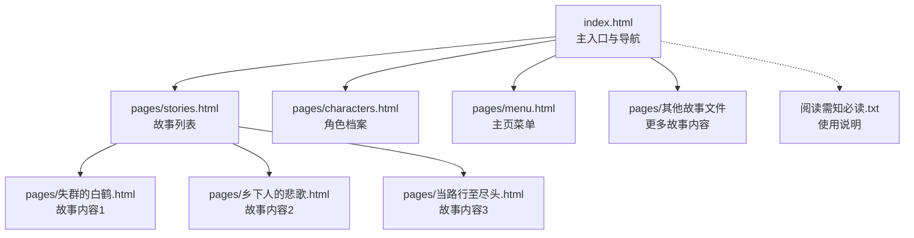
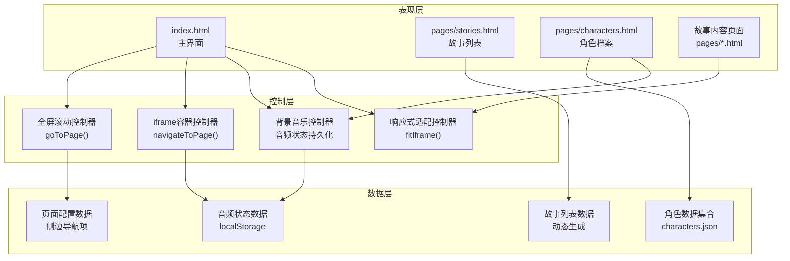
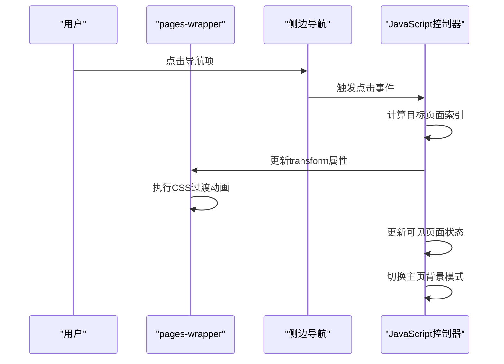
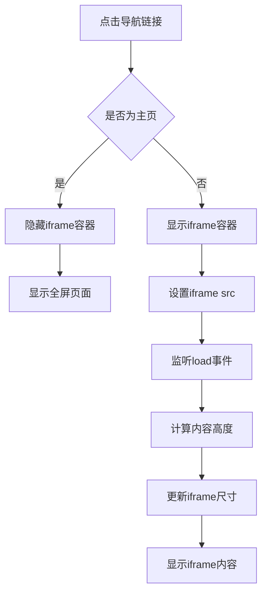
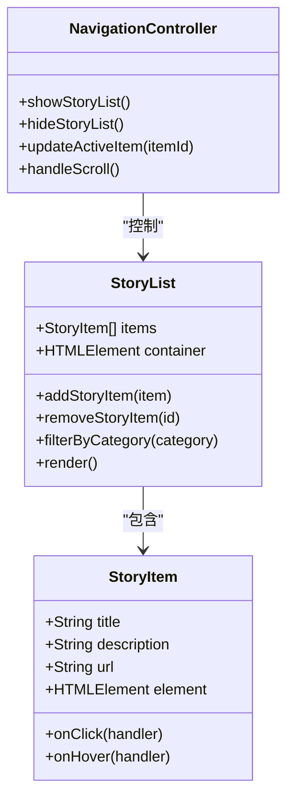
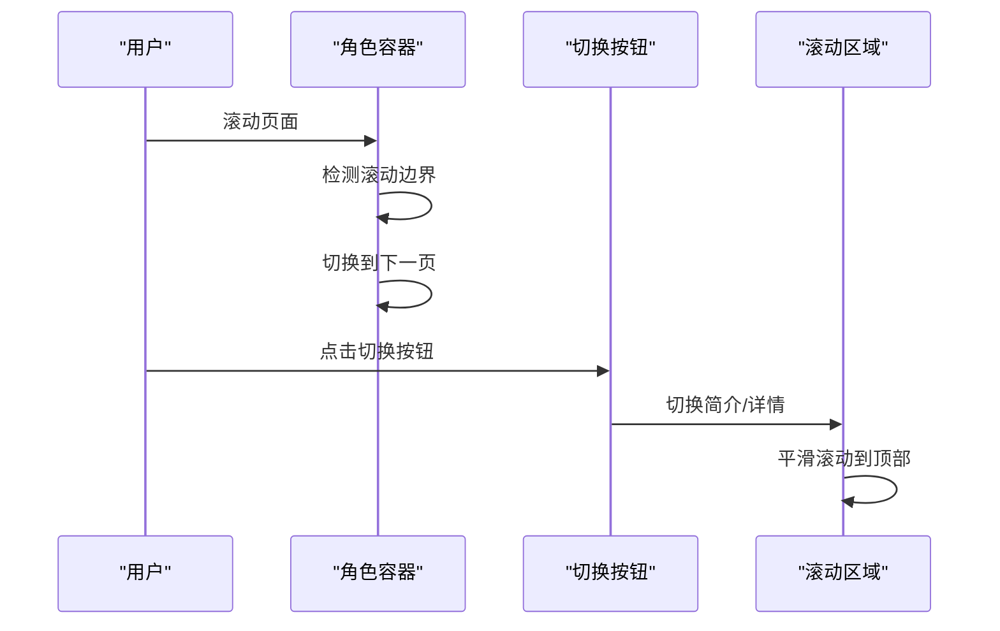
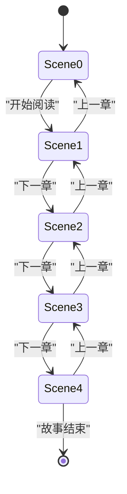
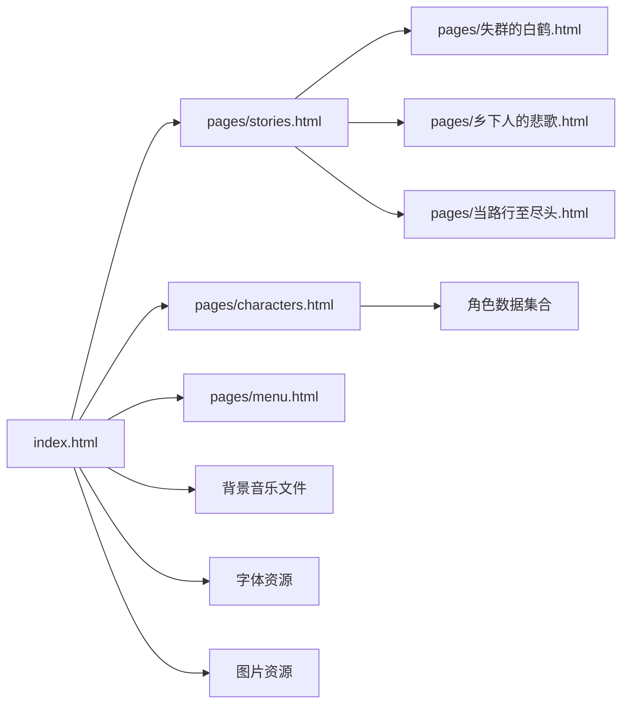

# 故事导航系统

<cite>
**本文档引用的文件**
- [index.html](file://index.html)
- [stories.html](file://pages/stories.html)
- [characters.html](file://pages/characters.html)
- [menu.html](file://pages/menu.html)
- [失群的白鹤.html](file://pages/失群的白鹤.html)
- [乡下人的悲歌.html](file://pages/乡下人的悲歌.html)
- [当路行至尽头.html](file://pages/当路行至尽头.html)
- [阅读需知（必读）.txt](file://阅读需知（必读）.txt)
</cite>

## 目录
1. [简介](#简介)
2. [项目结构](#项目结构)
3. [核心组件](#核心组件)
4. [架构概览](#架构概览)
5. [详细组件分析](#详细组件分析)
6. [依赖关系分析](#依赖关系分析)
7. [性能考量](#性能考量)
8. [故障排除指南](#故障排除指南)
9. [结论](#结论)
10. [附录](#附录)

## 简介
本系统是一个基于HTML/CSS/JavaScript的单页应用型故事导航平台，围绕《夙日不再》世界观构建，提供沉浸式的阅读体验。系统采用全屏滚动架构，结合iframe容器实现页面间无缝切换，支持故事章节的组织管理、外部链接处理和多终端响应式布局。核心功能包括：
- 全屏滚动页面导航与过渡动画
- iframe容器实现的页面集成策略
- 响应式布局适配移动端与桌面端
- 故事章节的组织结构与导航控制
- 背景音乐状态持久化与自动播放处理
- 跨域与安全考虑（file://协议限制）

## 项目结构
系统采用模块化文件组织，核心文件分布如下：
- 根目录入口：index.html（主界面与导航）
- 故事页面：pages/stories.html（故事列表页）
- 角色页面：pages/characters.html（角色档案页）
- 菜单页面：pages/menu.html（主页菜单页）
- 故事内容：pages/目录下的多个HTML故事文件
- 文档说明：阅读需知（必读）.txt

**图表来源**
- [index.html](file://index.html)
- [stories.html](file://pages/stories.html)
- [characters.html](file://pages/characters.html)
- [menu.html](file://pages/menu.html)

**章节来源**
- [index.html](file://index.html)
- [stories.html](file://pages/stories.html)
- [characters.html](file://pages/characters.html)
- [menu.html](file://pages/menu.html)

## 核心组件
系统由以下核心组件构成：

### 1. 主入口与导航系统
- 全屏滚动页面容器（pages-wrapper）
- 侧边导航栏（sidebar-nav）
- 固定头部导航（global-header）
- iframe容器（iframe-container）

### 2. 故事列表管理系统
- 故事列表页面（stories.html）
- 动态故事项生成
- 响应式布局适配

### 3. 角色档案系统
- 角色滑动展示（character-slide）
- 简介/详情切换
- 背景音乐状态管理

### 4. 故事章节阅读系统
- 多场景故事页面
- 章节切换控制
- 自动高度适配

**章节来源**
- [index.html](file://index.html)
- [stories.html](file://pages/stories.html)
- [characters.html](file://pages/characters.html)

## 架构概览
系统采用客户端单页应用架构，通过JavaScript控制页面切换与状态管理。整体架构分为三层：

**图表来源**
- [index.html](file://index.html)
- [stories.html](file://pages/stories.html)
- [characters.html](file://pages/characters.html)

## 详细组件分析

### 全屏滚动导航系统
全屏滚动系统通过CSS transform实现页面切换，配合JavaScript控制过渡动画和状态管理。

**图表来源**
- [index.html](file://index.html)

**章节来源**
- [index.html](file://index.html)

### iframe容器实现原理
系统采用iframe容器实现页面集成，通过隐藏/显示控制实现无缝切换。

**图表来源**
- [index.html](file://index.html)

**章节来源**
- [index.html](file://index.html)

### 故事列表管理系统
故事列表页面采用动态生成方式，支持响应式布局和交互效果。

**图表来源**
- [stories.html](file://pages/stories.html)

**章节来源**
- [stories.html](file://pages/stories.html)

### 角色档案系统
角色档案系统提供滑动展示和简介/详情切换功能。

**图表来源**
- [characters.html](file://pages/characters.html)

**章节来源**
- [characters.html](file://pages/characters.html)

### 故事章节阅读系统
故事章节采用多场景设计，支持章节间的无缝切换。

**图表来源**
- [失群的白鹤.html](file://pages/失群的白鹤.html)
- [乡下人的悲歌.html](file://pages/乡下人的悲歌.html)
- [当路行至尽头.html](file://pages/当路行至尽头.html)

**章节来源**
- [失群的白鹤.html](file://pages/失群的白鹤.html)
- [乡下人的悲歌.html](file://pages/乡下人的悲歌.html)
- [当路行至尽头.html](file://pages/当路行至尽头.html)

## 依赖关系分析

### 文件间依赖关系
系统文件间存在以下依赖关系：

**图表来源**
- [index.html](file://index.html)
- [stories.html](file://pages/stories.html)
- [characters.html](file://pages/characters.html)

### 外部依赖
- Google Fonts：Noto Serif SC、Cinzel Decorative、Dancing Script
- TailwindCSS：pages目录下的页面使用
- 本地资源：背景音乐、图片、字体文件

**章节来源**
- [index.html](file://index.html)
- [stories.html](file://pages/stories.html)
- [characters.html](file://pages/characters.html)

## 性能考量
系统在性能方面采取了多项优化措施：

### 1. 渲染性能优化
- 使用will-change属性启用GPU加速
- CSS transform替代DOM属性修改
- 适当的CSS动画使用requestAnimationFrame

### 2. 资源加载优化
- 图片懒加载（onerror回退处理）
- 字体预加载策略
- 音频资源预加载与状态持久化

### 3. 内存管理
- 事件监听器的正确绑定与解绑
- DOM元素的及时释放
- localStorage状态管理的节流处理

### 4. 移动端优化
- 触摸事件的passive选项
- 响应式布局的媒体查询
- 触摸友好的交互设计

## 故障排除指南

### 常见问题与解决方案

#### 1. 背景音乐无法自动播放
**问题描述**：浏览器阻止自动播放音频
**解决方案**：
- 用户首次交互后自动播放
- 提供音量控制按钮
- 使用localStorage保存播放状态

#### 2. iframe跨域访问被阻止
**问题描述**：file://协议下iframe跨域访问被浏览器拦截
**解决方案**：
- 改为直接页面跳转（window.location.href）
- 避免跨域iframe通信
- 使用相对路径确保同源访问

#### 3. 页面滚动卡顿
**问题描述**：全屏滚动时出现卡顿
**解决方案**：
- 启用GPU加速（will-change: transform）
- 减少重绘重排操作
- 优化CSS动画性能

#### 4. 移动端触摸响应慢
**问题描述**：移动端触摸事件响应延迟
**解决方案**：
- 使用passive事件监听器
- 优化触摸事件处理逻辑
- 调整触摸区域大小

**章节来源**
- [index.html](file://index.html)
- [阅读需知（必读）.txt](file://阅读需知（必读）.txt)

## 结论
本故事导航系统通过精心设计的架构实现了流畅的用户体验和良好的可维护性。系统的主要优势包括：

1. **沉浸式体验**：全屏滚动和精美的视觉设计提供了出色的阅读体验
2. **模块化架构**：清晰的文件组织和组件划分便于维护和扩展
3. **响应式设计**：完善的移动端适配确保多终端一致性
4. **性能优化**：多项性能优化措施保证了流畅的运行体验
5. **安全性考虑**：合理的跨域处理和安全策略

系统为《夙日不再》世界观的展示提供了完整的基础设施，支持故事内容的扩展和功能的持续改进。

## 附录

### 开发与部署指南
- 使用本地服务器而非file://协议
- 确保所有资源路径正确
- 测试不同分辨率下的显示效果
- 验证移动端触摸交互

### 扩展开发建议
- 新增故事章节时遵循现有文件命名规范
- 使用统一的样式变量和主题颜色
- 保持JavaScript代码的模块化和可测试性
- 定期备份localStorage状态数据