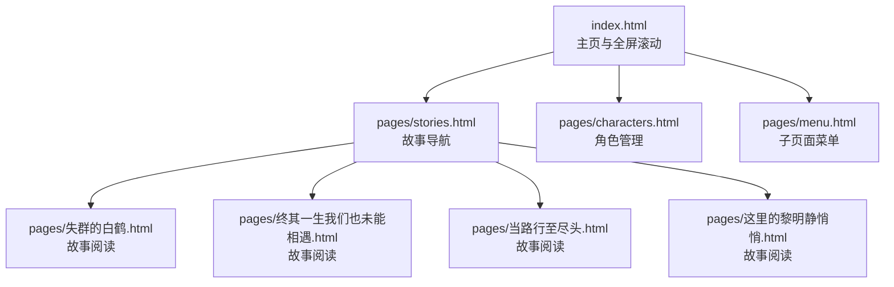
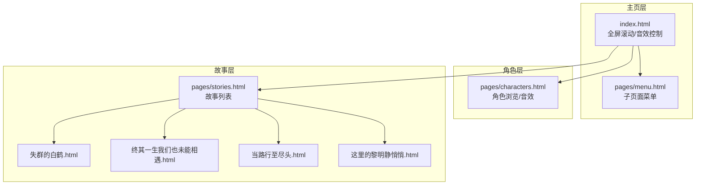
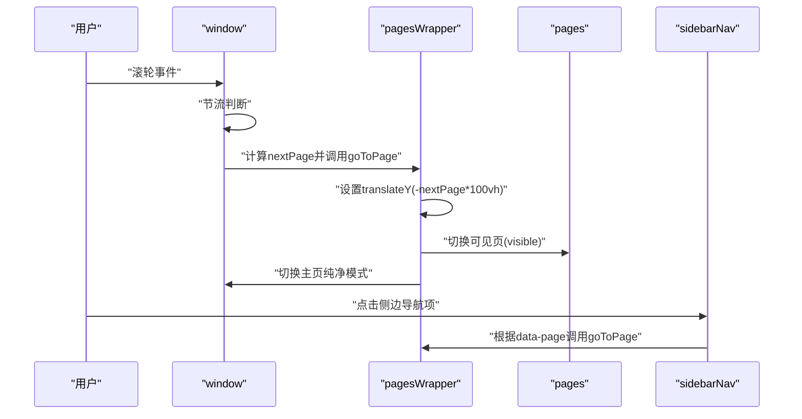
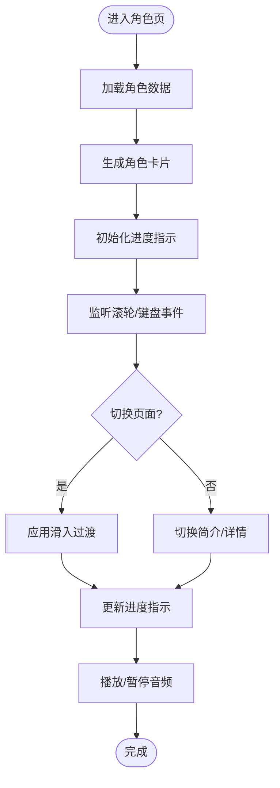
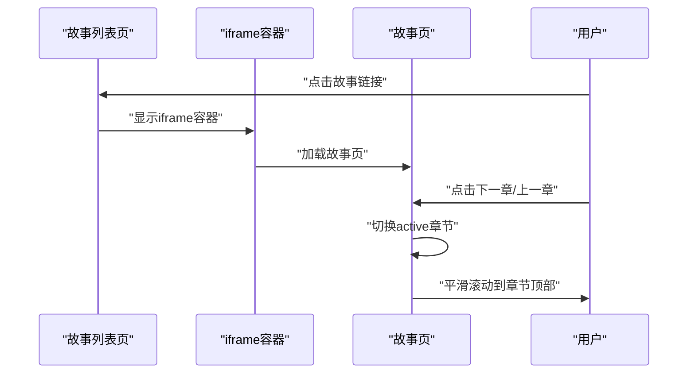
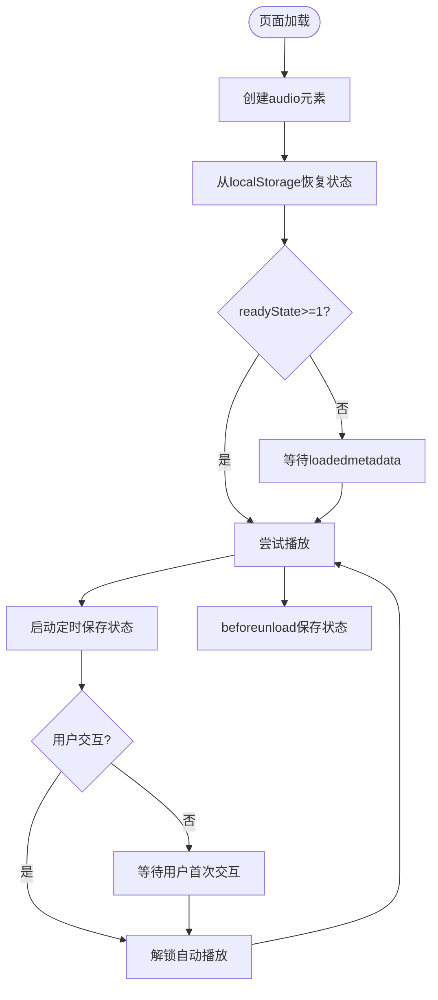
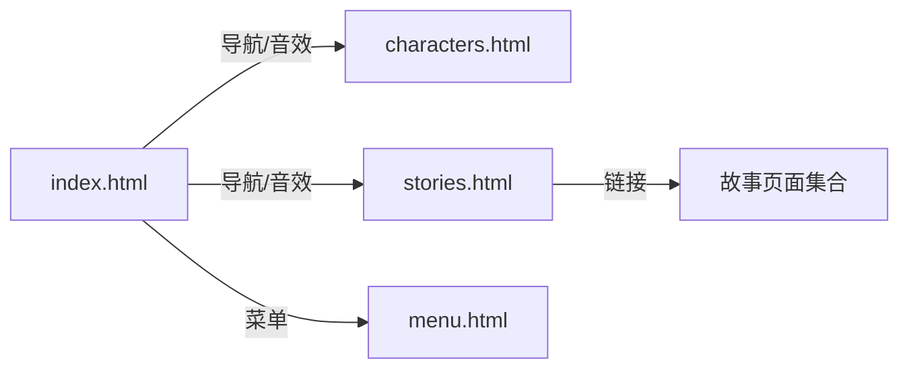

# 核心功能模块

<cite>
**本文档引用的文件**
- [index.html](file://index.html)
- [characters.html](file://pages/characters.html)
- [stories.html](file://pages/stories.html)
- [menu.html](file://pages/menu.html)
- [失群的白鹤.html](file://pages/失群的白鹤.html)
- [终其一生我们也未能相遇.html](file://pages/终其一生我们也未能相遇.html)
- [当路行至尽头.html](file://pages/当路行至尽头.html)
- [这里的黎明静悄悄.html](file://pages/这里的黎明静悄悄.html)
- [阅读需知（必读）.txt](file://阅读需知（必读）.txt)
</cite>

## 目录
1. [引言](#引言)
2. [项目结构](#项目结构)
3. [核心组件](#核心组件)
4. [架构总览](#架构总览)
5. [详细组件分析](#详细组件分析)
6. [依赖关系分析](#依赖关系分析)
7. [性能考虑](#性能考虑)
8. [故障排除指南](#故障排除指南)
9. [结论](#结论)
10. [附录](#附录)

## 引言
本项目为《夙日不再世界观》的前端展示系统，围绕四大核心功能模块构建：全屏滚动导航系统、角色管理系统、故事导航系统与音效控制系统。本文档旨在系统化阐述各模块的设计理念、技术实现与用户体验价值，解析模块间的协作关系与数据流向，并提供使用示例与最佳实践建议。

## 项目结构
项目采用静态HTML/CSS/JavaScript组织，主入口为站点首页，辅以角色与故事子页面，配合若干历史故事页面构成完整体验。核心文件分布如下：
- 主页与全局样式：index.html
- 角色展示页：pages/characters.html
- 故事列表页：pages/stories.html
- 子页面菜单：pages/menu.html
- 多个故事页面：pages/*.html
- 使用说明：阅读需知（必读）.txt

**图表来源**
- [index.html](file://index.html)
- [stories.html](file://pages/stories.html)
- [characters.html](file://pages/characters.html)
- [menu.html](file://pages/menu.html)
- [失群的白鹤.html](file://pages/失群的白鹤.html)
- [终其一生我们也未能相遇.html](file://pages/终其一生我们也未能相遇.html)
- [当路行至尽头.html](file://pages/当路行至尽头.html)
- [这里的黎明静悄悄.html](file://pages/这里的黎明静悄悄.html)

**章节来源**
- [index.html](file://index.html)
- [stories.html](file://pages/stories.html)
- [characters.html](file://pages/characters.html)
- [menu.html](file://pages/menu.html)
- [阅读需知（必读）.txt](file://阅读需知（必读）.txt)

## 核心组件
- 全屏滚动导航系统：基于transform与CSS过渡实现的全屏页面切换，支持鼠标滚轮与侧边导航点击，具备主页纯净模式与过渡动画。
- 角色管理系统：角色卡片滑动浏览、简介/详情切换、进度指示与背景复古风格，内置角色音频播放控制。
- 故事导航系统：故事列表页链接到具体故事页面，故事页面采用章节切换UI，支持键盘与滚轮导航。
- 音效控制系统：全局背景音乐播放与静音控制，状态持久化到localStorage，自动播放解锁与循环播放。

**章节来源**
- [index.html](file://index.html)
- [characters.html](file://pages/characters.html)
- [stories.html](file://pages/stories.html)

## 架构总览
四大模块协同工作：主页通过全局导航进入角色与故事子页面；角色页提供角色浏览与音效；故事页提供章节阅读；音效贯穿全局与角色页，保证沉浸式体验。

**图表来源**
- [index.html](file://index.html)
- [characters.html](file://pages/characters.html)
- [stories.html](file://pages/stories.html)
- [menu.html](file://pages/menu.html)
- [失群的白鹤.html](file://pages/失群的白鹤.html)
- [终其一生我们也未能相遇.html](file://pages/终其一生我们也未能相遇.html)
- [当路行至尽头.html](file://pages/当路行至尽头.html)
- [这里的黎明静悄悄.html](file://pages/这里的黎明静悄悄.html)

## 详细组件分析

### 全屏滚动导航系统
- 设计理念：提供沉浸式全屏阅读体验，减少横向滚动，强调纵向叙事节奏；主页采用“纯净模式”突出视觉焦点。
- 技术实现：
  - transform: translateY(-page*100vh) 实现页面垂直切换；
  - CSS cubic-bezier 缓动曲线保证流畅过渡；
  - 鼠标滚轮事件监听，节流防止连续触发；
  - 侧边导航栏点击切换对应页面；
  - 主页模式通过添加/移除类名隐藏复古纹理层。
- 用户体验价值：统一的视觉节奏、直观的导航方式、沉浸式的阅读体验。
- 数据流向：用户交互 → 事件监听 → 计算目标页 → 更新transform与可见页 → 切换主页纯净模式。

**图表来源**
- [index.html](file://index.html)

**章节来源**
- [index.html](file://index.html)

### 角色管理系统
- 设计理念：卡片式角色档案，左右滑动浏览，简介/详情切换，进度指示，复古风格背景。
- 技术实现：
  - 角色数据数组驱动DOM生成；
  - CSS动画类实现滑入效果；
  - 滚轮事件委托到可滚动区域，避免干扰页面滚动；
  - 简介/详情切换通过类名切换实现；
  - 进度指示实时更新当前页码；
  - 角色页内嵌背景音乐，状态持久化。
- 用户体验价值：清晰的角色信息呈现、顺畅的浏览体验、可选的语音增强。
- 数据流向：角色数据 → DOM生成 → 事件监听 → 切换页/切换简介/详情 → 更新进度指示 → 音频播放控制。

**图表来源**
- [characters.html](file://pages/characters.html)

**章节来源**
- [characters.html](file://pages/characters.html)

### 故事导航系统
- 设计理念：故事列表页提供入口，故事页采用章节化阅读，支持章节前进/后退与平滑滚动。
- 技术实现：
  - 故事列表页包含多个故事链接；
  - 故事页采用类名切换控制章节显示；
  - 提供上一章/下一章按钮，支持键盘与滚轮导航；
  - 平滑滚动至章节顶部提升阅读连贯性。
- 用户体验价值：清晰的入口与路径、章节化阅读降低认知负担、一致的交互反馈。
- 数据流向：列表页链接 → iframe容器/新窗口 → 故事页章节切换 → 导航按钮/滚轮事件 → 切换章节。

**图表来源**
- [stories.html](file://pages/stories.html)
- [index.html](file://index.html)

**章节来源**
- [stories.html](file://pages/stories.html)
- [失群的白鹤.html](file://pages/失群的白鹤.html)
- [终其一生我们也未能相遇.html](file://pages/终其一生我们也未能相遇.html)
- [当路行至尽头.html](file://pages/当路行至尽头.html)
- [这里的黎明静悄悄.html](file://pages/这里的黎明静悄悄.html)

### 音效控制系统
- 设计理念：全局背景音乐贯穿体验，支持静音控制与状态持久化，自动播放解锁适配浏览器策略。
- 技术实现：
  - 动态创建audio元素，设置loop与preload；
  - 通过localStorage保存播放状态（静音/当前时间）；
  - 页面加载时恢复状态，定时保存播放进度；
  - 自动播放失败时监听用户交互解锁播放；
  - 退出页面时保存状态，避免丢失。
- 用户体验价值：无缝的背景音乐体验、跨会话状态延续、自动播放适配现代浏览器限制。
- 数据流向：页面加载 → 创建audio → 恢复状态 → 尝试播放 → 用户交互解锁 → 定时保存状态 → 页面卸载保存。

**图表来源**
- [index.html](file://index.html)
- [characters.html](file://pages/characters.html)

**章节来源**
- [index.html](file://index.html)
- [characters.html](file://pages/characters.html)

## 依赖关系分析
- 模块耦合：
  - 主页与子页面通过iframe容器或直接跳转实现解耦；
  - 角色页与故事页相互独立，通过主页导航串联；
  - 音效控制在主页与角色页分别实现，存在重复逻辑但职责清晰。
- 外部依赖：
  - 字体与背景纹理通过CDN引入；
  - 音频文件通过本地路径加载；
  - ResizeObserver用于动态适配iframe高度。

**图表来源**
- [index.html](file://index.html)
- [characters.html](file://pages/characters.html)
- [stories.html](file://pages/stories.html)
- [menu.html](file://pages/menu.html)

**章节来源**
- [index.html](file://index.html)
- [characters.html](file://pages/characters.html)
- [stories.html](file://pages/stories.html)
- [menu.html](file://pages/menu.html)

## 性能考虑
- 渲染优化：
  - 使用will-change: transform与backface-visibility减少重绘；
  - transformZ(0)强制GPU加速，提升滚动流畅度；
  - 侧边导航与页面滚动条自定义，避免全局滚动冲突。
- 资源加载：
  - 音频预加载与循环播放，减少首帧延迟；
  - 角色页图片懒加载与placeholder占位，降低首屏压力；
  - 复古纹理与背景图使用CSS混合模式，避免额外JS计算。
- 交互节流：
  - 滚轮事件节流与过渡锁定，避免频繁切换导致卡顿；
  - iframe高度动态适配使用ResizeObserver，降低轮询成本。

[本节为通用指导，无需列出具体文件来源]

## 故障排除指南
- 音频无法自动播放：
  - 确认浏览器允许自动播放，首次交互后解锁播放；
  - 检查音频文件路径与格式，确保可访问；
  - 查看控制台是否有跨域或CORS错误。
- 滚轮切换无效：
  - 检查isTransitioning状态是否被长时间占用；
  - 确认wheel事件监听未被其他滚动容器拦截；
  - 验证CSS transform与transition是否生效。
- iframe高度异常：
  - 确保iframe内容可被同源访问；
  - 检查ResizeObserver是否被浏览器策略限制；
  - 在窗口resize时延时适配，避免频繁测量。
- 角色页滚动冲突：
  - 确保章节内滚动容器具有明确高度；
  - 检查滚轮事件委托是否正确阻止默认行为；
  - 避免全局滚动与局部滚动同时触发。

**章节来源**
- [index.html](file://index.html)
- [characters.html](file://pages/characters.html)
- [stories.html](file://pages/stories.html)
- [阅读需知（必读）.txt](file://阅读需知（必读）.txt)

## 结论
本项目通过全屏滚动导航、角色管理、故事导航与音效控制四大模块，构建了沉浸式的多页面阅读体验。模块间职责清晰、协作有序，既满足了内容展示需求，又兼顾了性能与用户体验。建议后续可在音效控制与角色页交互上进一步抽象共享逻辑，以提升可维护性与一致性。

[本节为总结性内容，无需列出具体文件来源]

## 附录
- 实际使用示例：
  - 主页全屏滚动：通过鼠标滚轮或侧边导航切换页面；
  - 角色浏览：使用滚轮或键盘上下键切换角色，点击右侧切换按钮在简介与详情间切换；
  - 故事阅读：点击故事列表中的条目进入故事页，使用章节按钮或滚轮进行章节切换；
  - 音效控制：点击右上角音量图标切换静音状态，状态自动保存。
- 最佳实践建议：
  - 为移动端提供更友好的导航与触摸手势；
  - 对音频播放失败进行更详细的错误提示与重试机制；
  - 在角色页增加搜索与筛选功能，便于快速定位角色；
  - 对iframe内容进行跨域与安全策略检查，确保加载稳定性。

[本节为通用指导，无需列出具体文件来源]