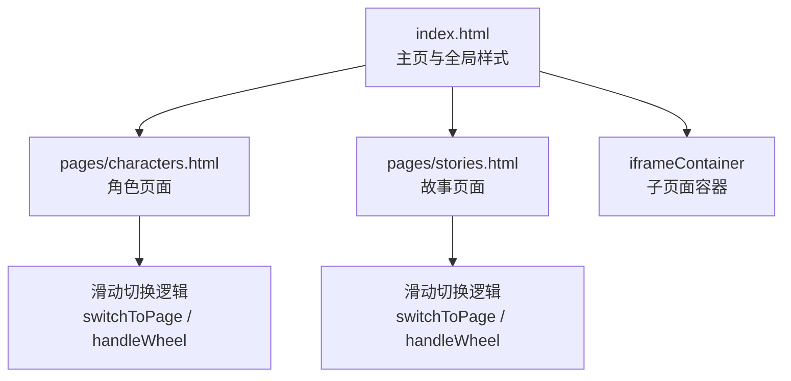
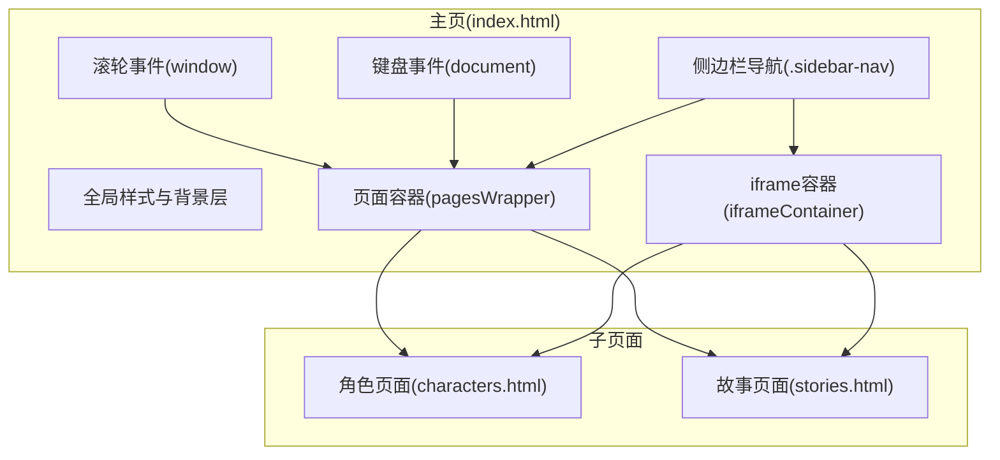
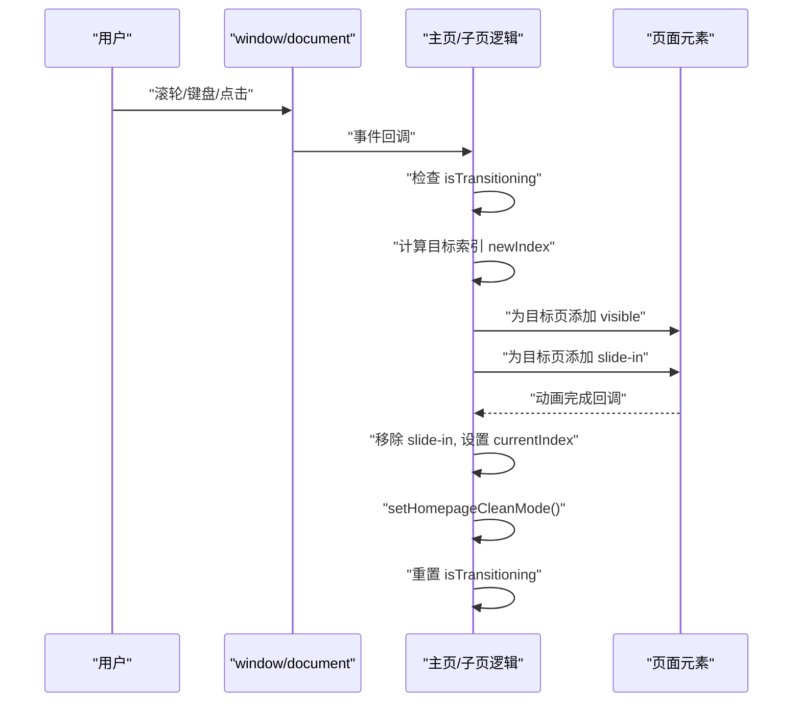
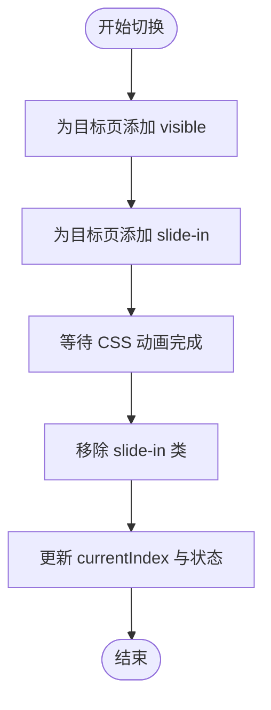
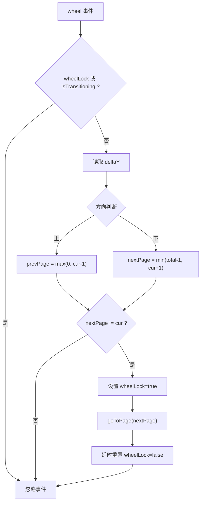
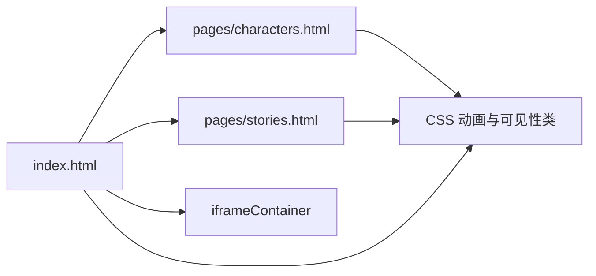

# 滑动切换系统

<cite>
**本文档引用的文件**
- [index.html](file://index.html)
- [characters.html](file://pages/characters.html)
- [stories.html](file://pages/stories.html)
</cite>

## 目录
1. [简介](#简介)
2. [项目结构](#项目结构)
3. [核心组件](#核心组件)
4. [架构总览](#架构总览)
5. [详细组件分析](#详细组件分析)
6. [依赖关系分析](#依赖关系分析)
7. [性能考虑](#性能考虑)
8. [故障排查指南](#故障排查指南)
9. [结论](#结论)
10. [附录](#附录)

## 简介
本项目实现了一个基于页面级滑动切换的阅读体验系统，支持滚轮导航、键盘方向键导航与侧边栏点击导航，并在主页与子页面之间进行无缝切换。系统通过 CSS3 的 transform 和 transition 实现平滑过渡动画，配合 JavaScript 控制动画状态与页面索引，确保流畅的交互体验。

## 项目结构
- 根页面：index.html 提供全局样式、主页内容、背景复古纹理与滑动切换主逻辑。
- 子页面：pages/characters.html 与 pages/stories.html 分别承载角色与故事内容，内部实现独立的滑动切换与滚动穿透处理。
- 页面容器：通过 iframe 容器在主页与子页面间切换显示。

**图表来源**
- [index.html](file://index.html)
- [characters.html](file://pages/characters.html)
- [stories.html](file://pages/stories.html)

**章节来源**
- [index.html](file://index.html)
- [characters.html](file://pages/characters.html)
- [stories.html](file://pages/stories.html)

## 核心组件
- 页面级滑动切换引擎：负责计算目标页、应用可见性类、更新背景模式与进度状态。
- 滚轮事件处理器：根据 delta 判断方向，避免在动画期间重复触发，并对子页面内的可滚动区域进行穿透判断。
- 键盘事件处理器：监听上下方向键，触发相邻页面切换。
- 侧边栏导航：点击菜单项直接跳转到指定页面。
- 背景与氛围层：主页与子页面采用不同的背景模式，切换时自动切换复古纹理与纯色背景。

**章节来源**
- [index.html](file://index.html)
- [characters.html](file://pages/characters.html)

## 架构总览
系统采用“主页面 + 子页面 iframe”的双层架构。主页负责全局导航与背景氛围，子页面负责各自内容的滑动切换。滑动切换由 switchToPage 函数统一调度，结合 CSS 的 transform/transition 实现视觉过渡。

**图表来源**
- [index.html](file://index.html)
- [characters.html](file://pages/characters.html)
- [stories.html](file://pages/stories.html)

## 详细组件分析

### 页面切换算法与 switchToPage 机制
- 触发条件：用户通过滚轮、键盘或侧边栏点击触发页面切换。
- 状态管理：isTransitioning 标记当前是否处于过渡中，防止并发切换；currentIndex 记录当前页面索引。
- 可见性控制：通过给页面元素添加/移除 visible 类，控制当前页与目标页的显隐。
- 动画执行：目标页进入时添加 slide-in 类，利用 CSS transition 实现滑入动画；动画结束后移除类并重置 isTransitioning。
- 背景模式：当切换到主页时启用纯净背景模式，离开主页时恢复复古纹理层。
- 进度更新：切换完成后更新进度状态。

**图表来源**
- [index.html](file://index.html)
- [characters.html](file://pages/characters.html)

**章节来源**
- [index.html](file://index.html)
- [characters.html](file://pages/characters.html)

### 过渡动画的 CSS 实现与 JavaScript 控制
- CSS3 变换与过渡：使用 transform 与 transition 实现页面滑入/滑出效果；will-change 与 backface-visibility 提升渲染性能。
- 动画类：slide-in 用于触发动画；visible 控制页面可见性。
- 背景层：复古纹理与半调覆层通过 opacity 与 transition 平滑切换；主页与子页面采用不同滤镜与混合模式。

**图表来源**
- [index.html](file://index.html)
- [characters.html](file://pages/characters.html)

**章节来源**
- [index.html](file://index.html)
- [characters.html](file://pages/characters.html)

### 鼠标滚轮事件处理
- 事件监听：在 window 上注册 wheel 事件，设置 { passive: false } 以允许 preventDefault。
- 防抖策略：wheelLock 标志位在一次切换后短暂锁定，避免连续触发。
- 方向判断：通过 deltaY 正负判断上下滚动，限制在有效范围内切换。
- 子页面穿透：若滚轮发生在具有特定类名的可滚动区域且已到达顶部/底部，则透传滚轮事件到父容器，从而触发页面切换。

**图表来源**
- [index.html](file://index.html)
- [characters.html](file://pages/characters.html)

**章节来源**
- [index.html](file://index.html)
- [characters.html](file://pages/characters.html)

### 键盘事件响应
- 事件监听：在 document 上注册 keydown 事件。
- 行为定义：向上方向键切换到上一页，向下方向键切换到下一页；preventDefault 避免页面滚动干扰。
- 边界保护：仅在有效索引范围内切换。

**章节来源**
- [index.html](file://index.html)
- [characters.html](file://pages/characters.html)

### 触摸手势支持
- 当前实现：未发现专门的触摸事件处理逻辑。
- 建议方案：可参考移动端滑动切换的通用模式，在 touchstart/touchmove/touchend 中记录位移差并结合 CSS transform 实现滑动预览与释放切换。

[本小节为概念性建议，不对应具体源码文件]

### 事件监听器的注册与注销机制
- 注册位置：在页面加载完成后注册事件监听器（如 window.addEventListener）。
- 注销策略：当前代码未显式移除事件监听器；可在页面卸载或切换到新页面时统一移除，避免内存泄漏。
- 一次性监听：部分音频相关事件采用 { once: true } 策略，减少重复绑定。

**章节来源**
- [index.html](file://index.html)
- [characters.html](file://pages/characters.html)

### 动画状态管理
- 状态标志：isTransitioning 用于串行化切换流程；wheelLock 用于滚轮防抖。
- 延时回调：通过 setTimeout 在动画结束后重置状态，确保后续事件可被处理。
- 进度更新：切换完成后更新进度状态，保持 UI 与数据一致。

**章节来源**
- [index.html](file://index.html)
- [characters.html](file://pages/characters.html)

## 依赖关系分析
- 主页与子页面通过 iframe 容器解耦，彼此独立维护各自的切换逻辑。
- 共享样式与背景层：主页提供全局复古纹理与氛围层，子页面进入时自动关闭纯净背景模式。
- 事件依赖：滚轮与键盘事件依赖页面可见性与当前索引状态；侧边栏点击依赖 data-page 属性。

**图表来源**
- [index.html](file://index.html)
- [characters.html](file://pages/characters.html)
- [stories.html](file://pages/stories.html)

**章节来源**
- [index.html](file://index.html)
- [characters.html](file://pages/characters.html)
- [stories.html](file://pages/stories.html)

## 性能考虑
- GPU 加速：使用 will-change 与 backface-visibility 提升 transform 渲染效率。
- 动画节流：isTransitioning 与 wheelLock 防止并发与频繁触发，降低主线程压力。
- 延迟与防抖：setTimeout 与延时重置避免动画堆积与状态错乱。
- 资源优化：背景纹理与滤镜在子页面关闭时自动回收，减少不必要的绘制开销。

**章节来源**
- [index.html](file://index.html)
- [characters.html](file://pages/characters.html)

## 故障排查指南
- 页面无法切换
  - 检查 isTransitioning 是否被意外置为 true 且未复位。
  - 确认 wheelLock 是否长时间锁定，导致滚轮事件被忽略。
- 滚轮穿透问题
  - 确保子页面内可滚动区域具备正确类名，以便正确识别边界。
  - 检查 preventDefault 是否按预期调用。
- 键盘无效
  - 确认 keydown 事件已绑定到 document，且未被其他元素拦截。
- 背景模式异常
  - 切换到主页时应启用纯净背景模式，离开主页时恢复复古纹理层；检查 setHomepageCleanMode 的调用时机。

**章节来源**
- [index.html](file://index.html)
- [characters.html](file://pages/characters.html)

## 结论
该滑动切换系统通过统一的 switchToPage 机制与 CSS3 动画实现了流畅的页面切换体验。配合滚轮、键盘与侧边栏导航，用户可在多种输入方式下高效浏览内容。建议在未来版本中补充触摸手势支持与事件监听器的统一注销机制，进一步提升跨设备兼容性与稳定性。

## 附录
- 关键函数与事件路径
  - [switchToPage:566-584](file://pages/characters.html#L566-L584)
  - [handleWheel:586-614](file://pages/characters.html#L586-L614)
  - [window wheel 事件:612-624](file://index.html#L612-L624)
  - [document keydown 事件:615-618](file://index.html#L615-L618)
  - [侧边栏点击事件:626-631](file://index.html#L626-L631)
  - [背景模式切换:607-608](file://index.html#L607-L608)