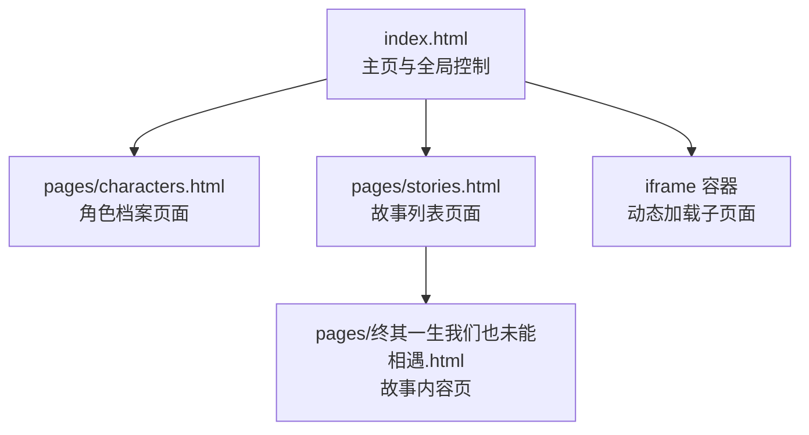
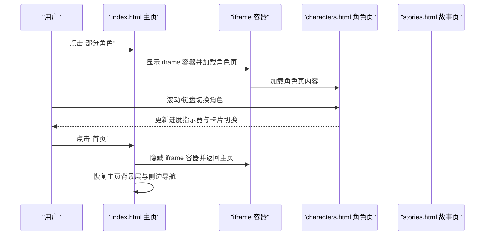
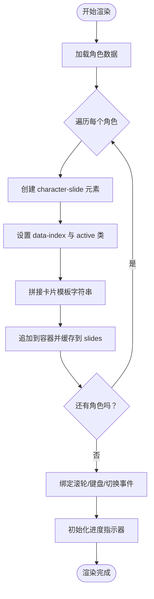
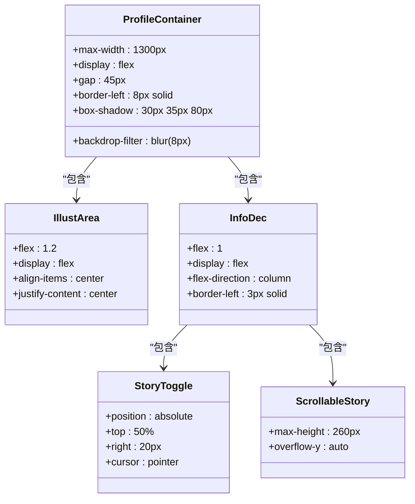
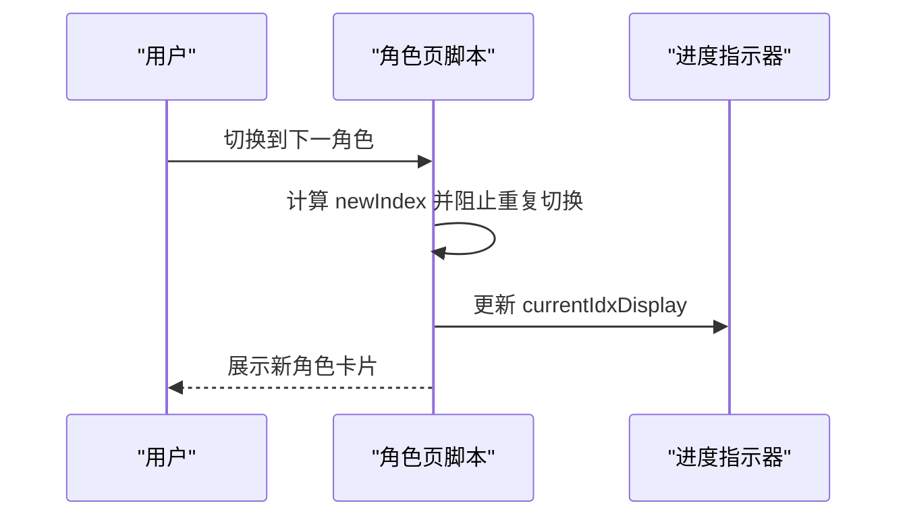
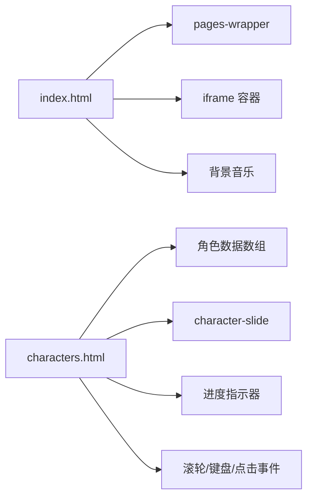

# 界面渲染引擎

<cite>
**本文档引用的文件**
- [index.html](file://index.html)
- [characters.html](file://pages/characters.html)
- [stories.html](file://pages/stories.html)
- [终其一生我们也未能相遇.html](file://pages/终其一生我们也未能相遇.html)
- [阅读需知（必读）.txt](file://阅读需知（必读）.txt)
</cite>

## 目录
1. [引言](#引言)
2. [项目结构](#项目结构)
3. [核心组件](#核心组件)
4. [架构总览](#架构总览)
5. [详细组件分析](#详细组件分析)
6. [依赖关系分析](#依赖关系分析)
7. [性能考量](#性能考量)
8. [故障排除指南](#故障排除指南)
9. [结论](#结论)
10. [附录](#附录)

## 引言
本项目是一个以“夙日不再”为主题的世界观展示与角色档案页面集合，采用全屏滚动与 iframe 子页面相结合的界面渲染架构。本文档聚焦于界面渲染引擎的技术实现，深入解析以下主题：
- 角色信息的动态渲染流程：DOM 元素创建、属性设置与事件绑定
- 角色档案卡片布局设计：图片展示区域、信息描述区域与技能标签的实现
- 进度指示器的更新机制
- 页面标题的动态显示与响应式布局适配策略
- 样式定制指南：颜色方案、字体选择与动画效果的修改方法
- 无障碍访问支持与性能优化技巧

## 项目结构
项目采用“主页 + 子页面”的混合架构：
- 主页 index.html：负责全局样式、全屏滚动、侧边导航、背景音乐与 iframe 容器的控制
- 角色档案页面 pages/characters.html：负责角色卡片的动态渲染、滑动切换、简介/详情切换与进度指示器
- 故事页面集合 pages/stories.html：提供故事列表入口，点击后以 iframe 打开对应 HTML 文章
- 其他故事页面：pages/终其一生我们也未能相遇.html 等，作为具体故事内容页

**图表来源**
- [index.html:490-580](file://index.html#L490-L580)
- [characters.html:353-362](file://pages/characters.html#L353-L362)
- [stories.html:200-211](file://pages/stories.html#L200-L211)

**章节来源**
- [index.html:444-736](file://index.html#L444-L736)
- [characters.html:1-611](file://pages/characters.html#L1-L611)
- [stories.html:1-250](file://pages/stories.html#L1-L250)

## 核心组件
- 全屏滚动与页面切换：通过 translateY 的 transform 实现页面垂直切换，结合可见性类控制过渡与可见性
- iframe 子页面：通过 iframe 容器在全屏页面与子页面间切换，进入子页面时隐藏侧边导航并恢复主页背景层
- 角色档案卡片：动态构建角色卡片，包含图片、姓名、副标题、技能标签、简介/详情切换与音频控件
- 进度指示器：右侧固定位置显示当前索引与总数，随页面切换实时更新
- 背景音乐：自动播放、状态持久化与图标切换，支持跨页面状态恢复

**章节来源**
- [index.html:581-733](file://index.html#L581-L733)
- [characters.html:434-609](file://pages/characters.html#L434-L609)

## 架构总览
整体架构围绕“主页容器 + 子页面容器”的双层结构展开：
- 主页容器负责全局 UI 与交互（全屏滚动、侧边导航、背景音乐）
- 子页面容器负责具体业务（角色档案、故事列表与内容）

**图表来源**
- [index.html:634-680](file://index.html#L634-L680)
- [characters.html:523-582](file://pages/characters.html#L523-L582)

## 详细组件分析

### 角色信息动态渲染流程
角色信息通过 JavaScript 动态构建 DOM 并绑定事件：
- 数据源：角色数组包含 id、name、subtitle、skill、brief、detail、img、hasAudio、audioSrc 等字段
- 渲染步骤：
  1) 创建 character-slide 容器并设置 active 类
  2) 设置 data-index 属性以便后续切换
  3) 使用模板字符串拼接卡片结构，包含图片、姓名、副标题、技能标签、简介/详情区域与音频控件
  4) 将卡片追加到容器中并缓存到 slides 数组
- 事件绑定：
  - 鼠标滚轮与键盘方向键：在卡片滚动区域内允许滚动，超出边界时触发页面切换
  - 简介/详情切换：通过事件委托监听切换按钮，切换对应角色的简介与详情显示
  - 进度指示器：切换时更新当前索引与总数

**图表来源**
- [characters.html:434-521](file://pages/characters.html#L434-L521)
- [characters.html:523-609](file://pages/characters.html#L523-L609)

**章节来源**
- [characters.html:434-521](file://pages/characters.html#L434-L521)
- [characters.html:523-609](file://pages/characters.html#L523-L609)

### 角色档案卡片布局设计
卡片采用 Flex 布局，分为三个区域：
- 图片展示区域（illust-area）：居中展示角色头像，支持占位图回退
- 信息描述区域（info-dec）：包含姓名、副标题、技能标签、简介/详情滚动区域与音频控件
- 技能标签：使用强调文本突出技能类别，正文描述技能说明
- 切换按钮：右侧固定位置，点击在简介与详情之间切换

**图表来源**
- [characters.html:139-287](file://pages/characters.html#L139-L287)

**章节来源**
- [characters.html:139-287](file://pages/characters.html#L139-L287)

### 进度指示器更新机制
进度指示器位于右侧固定位置，显示“当前索引/总数”：
- 初始化：渲染完成后设置总数
- 切换时：更新当前索引显示
- 切换动画：使用 slide-in 类触发动画，避免布局抖动

**图表来源**
- [characters.html:523-547](file://pages/characters.html#L523-L547)

**章节来源**
- [characters.html:523-547](file://pages/characters.html#L523-L547)

### 页面标题的动态显示与响应式布局
- 页面标题：主页使用 hero-title 与 intro-desc，其他页面使用 h4 标题
- 响应式策略：针对不同屏幕宽度调整字体大小、边距与滚动条样式，确保在移动端具备良好可读性
- 主页背景：通过 homepage-clean 类在主页时隐藏复古纹理层，突出背景图片

**章节来源**
- [index.html:351-441](file://index.html#L351-L441)
- [index.html:425-435](file://index.html#L425-L435)

### 样式定制指南
- 颜色方案：主体采用深蓝/墨绿基调，金色/琥珀色作为点缀；可通过修改背景、边框与阴影颜色变量快速替换
- 字体选择：全局使用 Noto Serif SC，标题使用 Cinzel Decorative；可在全局样式中统一替换
- 动画效果：复古纹理与半调层通过 CSS 动画实现；可通过调整动画时长与混合模式参数进行定制
- 响应式适配：媒体查询针对宽度阈值进行断点调整，建议在新增断点时保持比例一致

**章节来源**
- [index.html:13-442](file://index.html#L13-L442)
- [characters.html:12-342](file://pages/characters.html#L12-L342)

### 无障碍访问支持
- 键盘导航：支持上下方向键进行角色切换
- 滚动区域：在简介/详情滚动区域内优先处理滚轮事件，避免误触页面切换
- 音频控制：提供音量按钮与自动解锁机制，确保音频可播放
- 图片回退：角色头像 onerror 使用占位图，避免空白块影响可访问性

**章节来源**
- [characters.html:577-581](file://pages/characters.html#L577-L581)
- [characters.html:500-501](file://pages/characters.html#L500-L501)
- [index.html:716-728](file://index.html#L716-L728)

## 依赖关系分析
- index.html 依赖：
  - 全屏滚动与 iframe 控制：通过 JS 操作 pages-wrapper 与 iframe 容器
  - 背景音乐：动态创建 audio 元素并持久化状态
- characters.html 依赖：
  - 角色数据：静态数组提供角色信息
  - DOM 事件：滚轮、键盘与点击事件委托
  - 进度指示器：通过 ID 获取并更新

**图表来源**
- [index.html:581-733](file://index.html#L581-L733)
- [characters.html:434-609](file://pages/characters.html#L434-L609)

**章节来源**
- [index.html:581-733](file://index.html#L581-L733)
- [characters.html:434-609](file://pages/characters.html#L434-L609)

## 性能考量
- GPU 加速：通过 will-change 与 transform 提升动画性能
- 滚动优化：在简介/详情滚动区域内拦截滚轮事件，减少不必要的页面切换
- 资源加载：图片使用 async 与占位图回退，降低首屏阻塞
- 状态持久化：背景音乐播放位置与静音状态通过本地存储保存，减少重新加载成本
- 响应式：媒体查询按需调整样式，避免在小屏设备上加载冗余资源

**章节来源**
- [index.html:37-41](file://index.html#L37-L41)
- [characters.html:560-576](file://pages/characters.html#L560-L576)
- [index.html:682-728](file://index.html#L682-L728)

## 故障排除指南
- 角色页面加载缓慢：提示中说明首次加载需要等待约 10 秒，属正常现象
- 背景音乐无声：点击页面任意位置以解锁音频自动播放；检查浏览器静音策略
- 子页面无法返回：点击“首页”按钮或刷新页面，确保 iframe 容器被正确隐藏
- 特效加载失败：提示中说明部分特效需 VPN 支持，建议在支持网络环境下打开

**章节来源**
- [阅读需知（必读）.txt:1-7](file://阅读需知（必读）.txt#L1-L7)
- [index.html:716-728](file://index.html#L716-L728)

## 结论
本界面渲染引擎通过“主页 + 子页面”的架构实现了流畅的全屏滚动体验与丰富的角色档案展示。其动态渲染流程清晰、事件绑定合理、进度指示器与响应式布局完善，并提供了完善的样式定制与无障碍支持。通过持续优化资源加载与状态持久化，可进一步提升用户体验与性能表现。

## 附录
- 故事页面入口：pages/stories.html 中的链接指向各故事 HTML 文件
- 故事内容页示例：pages/终其一生我们也未能相遇.html 展示了场景切换与按钮交互

**章节来源**
- [stories.html:200-211](file://pages/stories.html#L200-L211)
- [终其一生我们也未能相遇.html:97-112](file://pages/终其一生我们也未能相遇.html#L97-L112)