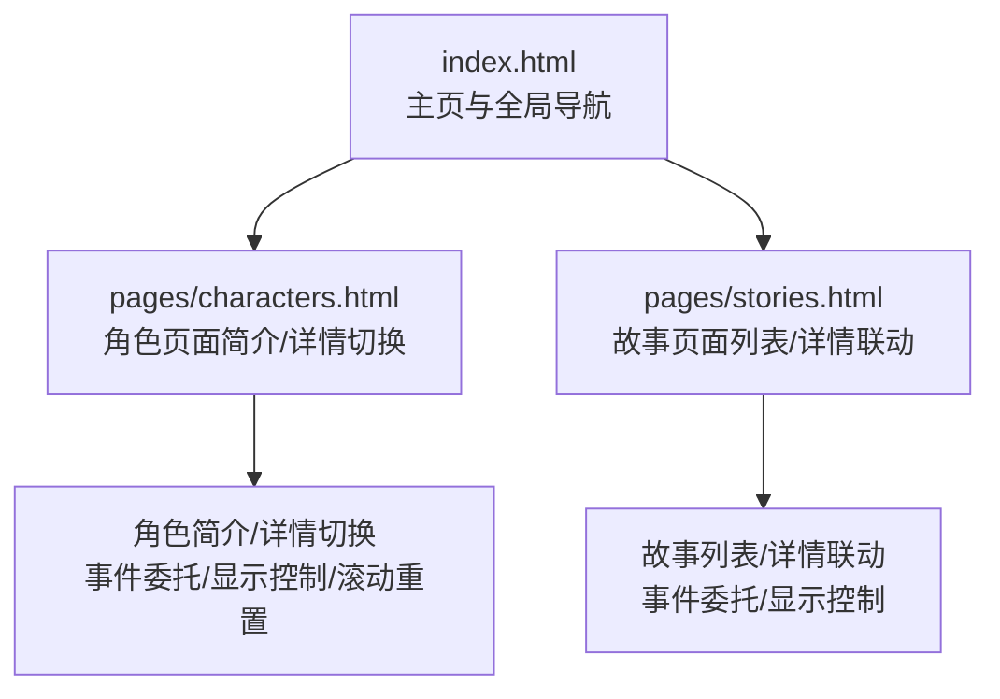
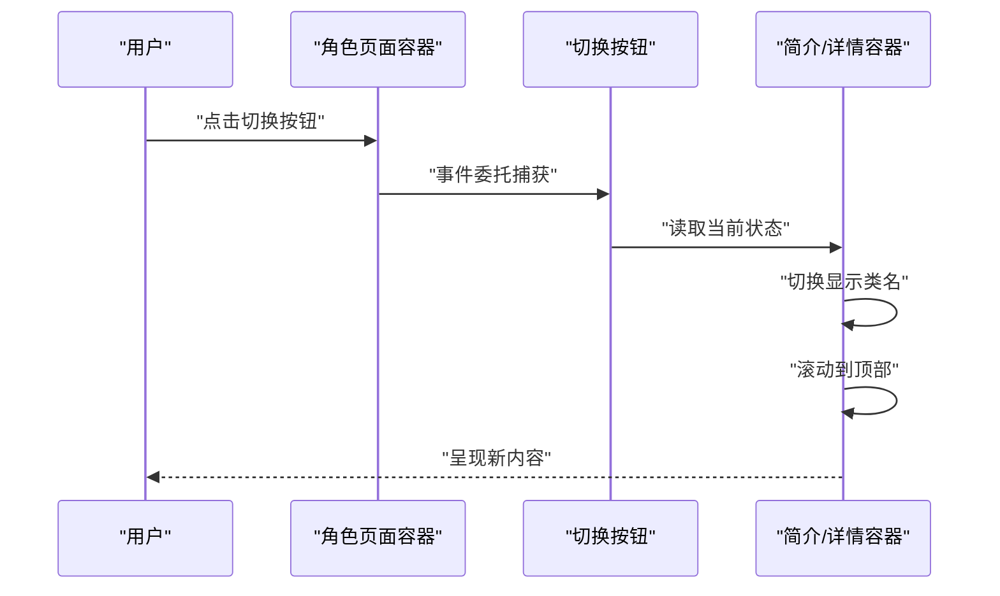
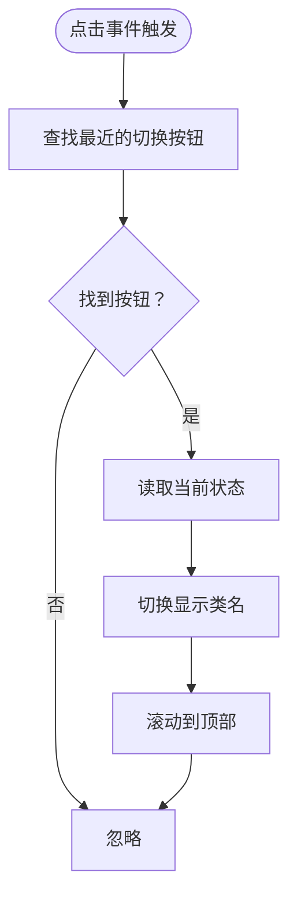
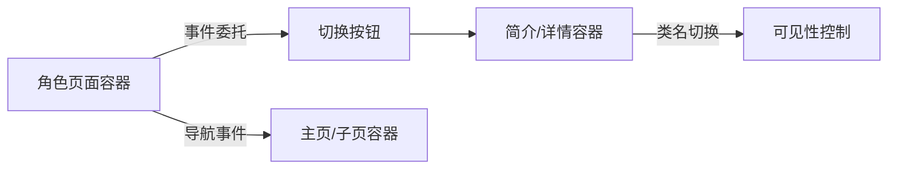

# 简介详情切换机制

<cite>
**本文引用的文件**
- [index.html](file://index.html)
- [characters.html](file://pages/characters.html)
- [stories.html](file://pages/stories.html)
</cite>

## 目录
1. [引言](#引言)
2. [项目结构](#项目结构)
3. [核心组件](#核心组件)
4. [架构概览](#架构概览)
5. [详细组件分析](#详细组件分析)
6. [依赖分析](#依赖分析)
7. [性能考虑](#性能考虑)
8. [故障排查指南](#故障排查指南)
9. [结论](#结论)
10. [附录](#附录)

## 引言
本技术文档聚焦于“简介/详情切换机制”，围绕以下目标展开：
- 解释事件委托机制、DOM元素的显示/隐藏控制与滚动位置重置
- 阐述切换按钮的交互设计（SVG图标动画、悬停效果、点击反馈）
- 解释文本内容的动态切换过程（简述文本与详细描述的互斥显示）
- 提供切换状态的持久化方案与用户体验优化策略
- 包含常见交互问题的调试方法与解决方案

本机制在角色页面中以“角色简介/详情”为典型场景，同时在主页与故事页面中也存在类似的页面级切换与导航逻辑。

## 项目结构
该项目采用多页面结构，主页负责全局导航与页面容器切换；角色页面承载“简介/详情”切换的具体实现；故事页面提供列表与详情联动示例。

图表来源
- [index.html](file://index.html)
- [characters.html](file://pages/characters.html)
- [stories.html](file://pages/stories.html)

章节来源
- [index.html](file://index.html)
- [characters.html](file://pages/characters.html)
- [stories.html](file://pages/stories.html)

## 核心组件
- 切换按钮与容器
  - 切换按钮采用类名标识，绑定在每个角色卡片上，用于触发简介/详情切换
  - 容器包含“简介文本”和“详细描述文本”，二者互斥显示
- 事件委托
  - 在角色页面的容器上注册点击事件监听，通过事件冒泡定位最近的切换按钮
- 显示/隐藏控制
  - 通过类名切换控制“简介文本”和“详细描述文本”的可见性
- 滚动位置重置
  - 切换时将容器滚动到顶部，确保用户获得一致的阅读起点
- 图标与交互反馈
  - 使用SVG图标，结合悬停与点击反馈，提升可用性

章节来源
- [characters.html](file://pages/characters.html)

## 架构概览
简介/详情切换在角色页面中通过事件委托实现，点击切换按钮后，根据当前状态决定显示“简介文本”或“详细描述文本”，并重置滚动位置。该流程与页面级导航（主页/iframe子页）相互独立，但共享统一的事件处理与DOM操作范式。

图表来源
- [characters.html](file://pages/characters.html)

## 详细组件分析

### 切换按钮与样式体系
- 切换按钮类名与尺寸
  - 类名用于识别按钮元素，支持不同屏幕尺寸下的尺寸调整
  - SVG图标尺寸与按钮尺寸保持比例一致
- 悬停与焦点反馈
  - 悬停态改变透明度或背景，提供即时视觉反馈
  - 点击态通过过渡动画体现响应性
- 响应式适配
  - 在窄屏设备上调整按钮尺寸与间距，保证触控可达性

章节来源
- [characters.html](file://pages/characters.html)

### 事件委托与点击处理
- 容器级事件监听
  - 在角色页面的容器上注册点击事件，利用事件冒泡定位最近的切换按钮
- 目标识别
  - 通过最近的切换按钮标识，读取关联的角色ID或状态标记
- 状态切换
  - 根据当前状态切换“简介文本”和“详细描述文本”的可见性
- 滚动重置
  - 切换完成后将容器滚动到顶部，避免阅读体验受滚动位置影响

图表来源
- [characters.html](file://pages/characters.html)

章节来源
- [characters.html](file://pages/characters.html)

### 文本内容的动态切换
- 内容来源
  - “简介文本”与“详细描述文本”由数据源提供，切换时动态注入HTML
- 互斥显示机制
  - 通过类名控制“简介文本”和“详细描述文本”的可见性，二者在同一时刻仅显示其一
- 动画与过渡
  - 切换过程中可结合CSS过渡或淡入动画，提升视觉连贯性

章节来源
- [characters.html](file://pages/characters.html)

### 页面级导航与容器切换（补充）
- 主页容器切换
  - 主页通过切换容器显示/隐藏，实现全屏模式与iframe子页模式的切换
- 导航项事件
  - 导航项点击事件负责加载对应页面URL并更新容器状态
- 与简介/详情切换的关系
  - 页面级切换与角色页面内的切换互不影响，分别作用于不同层级的容器

章节来源
- [index.html](file://index.html)

### 故事页面的列表/详情联动（补充）
- 列表项点击
  - 列表项点击后，通过事件委托定位目标并切换详情区域的显示状态
- 内容注入
  - 将选中项的详情内容注入到详情容器，实现列表与详情的联动
- 滚动与布局
  - 切换后将详情区域滚动到可视范围，保证用户阅读连续性

章节来源
- [stories.html](file://pages/stories.html)

## 依赖分析
- DOM结构依赖
  - 切换按钮与目标容器的类名约定是事件委托与状态切换的基础
- 事件模型依赖
  - 事件委托依赖容器与按钮的层级关系，确保事件冒泡路径正确
- CSS类名依赖
  - 可见性控制依赖预定义的类名（如“隐藏类”），确保切换逻辑与样式解耦
- 页面容器依赖
  - 主页与子页容器的切换逻辑相互独立，但共享事件处理与状态管理范式

图表来源
- [characters.html](file://pages/characters.html)
- [index.html](file://index.html)

章节来源
- [characters.html](file://pages/characters.html)
- [index.html](file://index.html)

## 性能考虑
- 事件委托的性能优势
  - 在容器上注册单个监听器，减少重复绑定带来的内存占用
- 最小化DOM操作
  - 仅在必要时切换类名与滚动位置，避免不必要的重排与重绘
- 动画与过渡
  - 合理使用CSS过渡与硬件加速属性，降低JavaScript侧计算压力
- 滚动重置
  - 切换后滚动到顶部，避免滚动位置对后续渲染造成额外开销

## 故障排查指南
- 症状：点击切换按钮无效
  - 排查事件委托是否绑定在正确的容器上
  - 检查切换按钮是否具有预期的类名或属性标识
- 症状：内容未切换或显示异常
  - 确认“简介文本”和“详细描述文本”的可见性类名是否正确切换
  - 检查容器中是否存在冲突的样式规则
- 症状：滚动位置未重置
  - 确认切换后是否调用了滚动到顶部的操作
  - 检查容器的overflow设置是否影响滚动行为
- 症状：移动端点击无反馈
  - 检查触摸事件与CSS hover状态的兼容性
  - 确保按钮尺寸与间距满足触控可达性要求
- 症状：页面级切换与角色切换冲突
  - 分析事件冒泡路径，避免同一容器上重复绑定导致的冲突
  - 确保不同层级容器的事件处理逻辑清晰分离

章节来源
- [characters.html](file://pages/characters.html)
- [index.html](file://index.html)

## 结论
简介/详情切换机制通过事件委托与类名控制实现了简洁高效的UI交互，结合滚动重置与SVG图标反馈提升了用户体验。该机制在角色页面与故事页面中均有应用，既可独立运行，也可与页面级导航协同工作。通过合理的样式与脚本解耦、最小化DOM操作与合理的动画策略，可在多端环境下保持流畅的交互体验。

## 附录
- 状态持久化建议
  - 使用本地存储记录当前角色与详情状态，页面加载时恢复状态
  - 对于列表/详情联动，可记录当前选中项ID，切换后恢复选中态
- 用户体验优化策略
  - 为切换按钮提供明确的图标与文字提示
  - 在切换过程中添加适度的过渡动画，避免突兀
  - 在移动端提供更大的点击区域与更清晰的视觉反馈