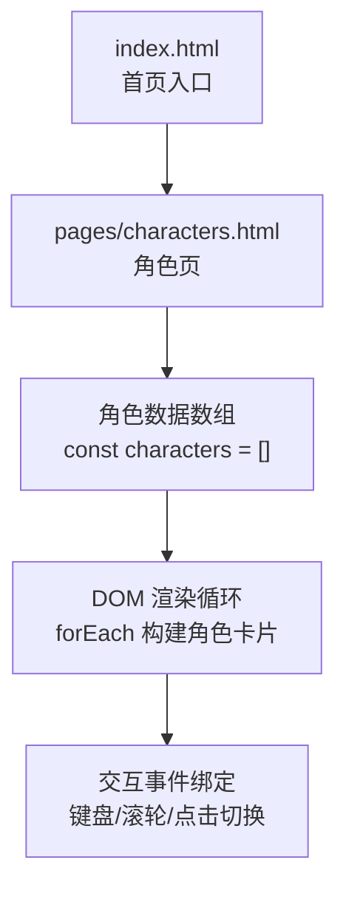
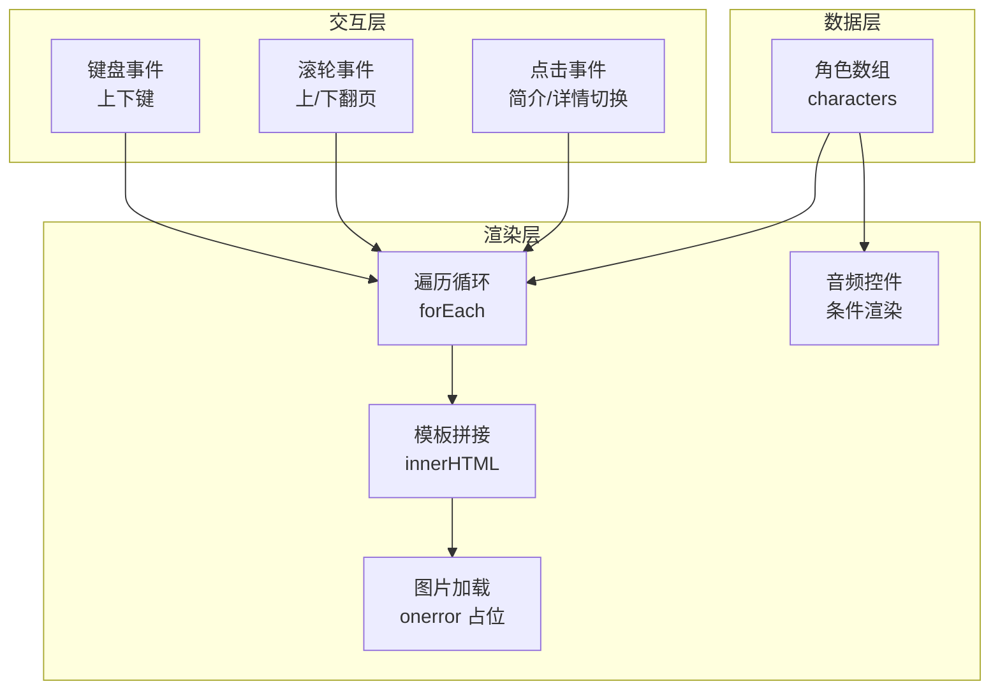
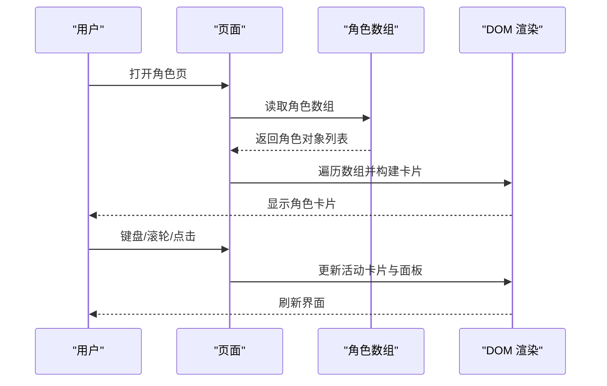
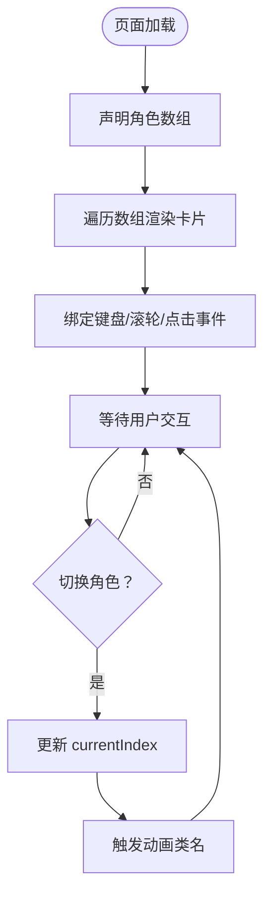
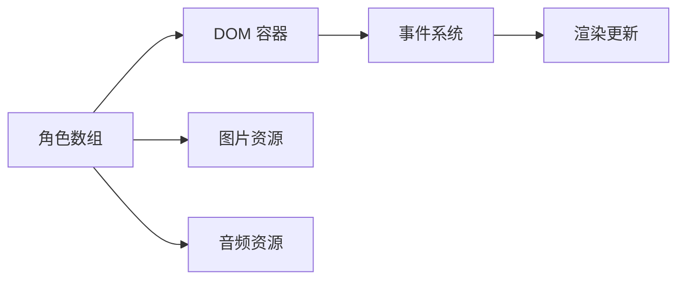

# 角色数据模型

<cite>
**本文引用的文件**
- [pages/characters.html](file://pages/characters.html)
- [index.html](file://index.html)
</cite>

## 目录
1. [引言](#引言)
2. [项目结构](#项目结构)
3. [核心组件](#核心组件)
4. [架构总览](#架构总览)
5. [详细组件分析](#详细组件分析)
6. [依赖分析](#依赖分析)
7. [性能考虑](#性能考虑)
8. [故障排查指南](#故障排查指南)
9. [结论](#结论)
10. [附录](#附录)

## 引言
本文件围绕角色数据模型展开，系统化说明角色数据结构的设计原理、字段定义与用途、数据组织方式、验证规则与扩展机制，并提供增删改查（CRUD）操作指南、与界面渲染的映射关系、JavaScript 数组管理角色集合的方法、数据格式规范与最佳实践，以及常见问题的解决方案。本文所有分析均基于仓库中的实际实现。

## 项目结构
本项目采用静态页面组织，角色数据与界面渲染集中在单页应用式 HTML 文件中。角色数据以 JavaScript 数组的形式内嵌在页面脚本区，通过 DOM 操作动态生成角色卡片与故事面板。

图表来源
- [pages/characters.html:377-470](file://pages/characters.html#L377-L470)
- [pages/characters.html:471-522](file://pages/characters.html#L471-L522)
- [pages/characters.html:529-558](file://pages/characters.html#L529-L558)

章节来源
- [pages/characters.html:377-470](file://pages/characters.html#L377-L470)
- [pages/characters.html:471-522](file://pages/characters.html#L471-L522)
- [pages/characters.html:529-558](file://pages/characters.html#L529-L558)

## 核心组件
角色数据模型的核心是一个 JavaScript 对象数组，每个对象代表一个角色。该数组在页面加载时被声明并用于驱动界面渲染与交互。

- 数据容器：角色数据数组
  - 类型：数组（Array）
  - 元素类型：对象（Object）
  - 关键属性：id、name、subtitle、skill、brief、detail、img、hasAudio、audioSrc
  - 初始化位置：页面脚本区的角色数据声明段落

- 渲染引擎：DOM 循环与模板拼接
  - 使用 forEach 遍历角色数组，为每个角色生成一个角色卡片元素
  - 通过字符串模板将角色字段注入到 HTML 结构中
  - 动态设置图片资源、技能展示、简介/详情切换、音频控件等

- 交互控制器：键盘、滚轮与点击事件
  - 键盘上下方向键控制角色翻页
  - 鼠标滚轮控制角色翻页
  - 点击“展开/收起”按钮在简介与详情之间切换

章节来源
- [pages/characters.html:471-522](file://pages/characters.html#L471-L522)
- [pages/characters.html:529-558](file://pages/characters.html#L529-L558)
- [pages/characters.html:614-618](file://pages/characters.html#L614-L618)
- [pages/characters.html:621-636](file://pages/characters.html#L621-L636)

## 架构总览
角色数据模型的运行时架构由“数据层—渲染层—交互层”三部分组成，数据层提供角色数组，渲染层负责将数据映射为 DOM，交互层处理用户输入并更新视图。

图表来源
- [pages/characters.html:471-522](file://pages/characters.html#L471-L522)
- [pages/characters.html:529-558](file://pages/characters.html#L529-L558)
- [pages/characters.html:614-618](file://pages/characters.html#L614-L618)
- [pages/characters.html:621-636](file://pages/characters.html#L621-L636)

## 详细组件分析

### 角色数据结构定义
角色对象包含以下字段，每个字段均有明确用途与约束：

- id
  - 类型：字符串（String）
  - 必填：是
  - 唯一性：全局唯一（用于 DOM 元素 ID 与事件绑定）
  - 示例路径：[角色条目:472-522](file://pages/characters.html#L472-L522)

- name
  - 类型：字符串（String）
  - 必填：是
  - 用途：显示角色名称
  - 示例路径：[角色条目:472-522](file://pages/characters.html#L472-L522)

- subtitle
  - 类型：字符串（String）
  - 必填：是
  - 用途：显示角色副标题或别名
  - 示例路径：[角色条目:472-522](file://pages/characters.html#L472-L522)

- skill
  - 类型：字符串（String）
  - 必填：是
  - 用途：显示角色所属与能力描述
  - 渲染逻辑：通过分隔符拆分为两行展示
  - 示例路径：[角色条目:472-522](file://pages/characters.html#L472-L522)

- brief
  - 类型：字符串（String）
  - 必填：是
  - 用途：简短人物介绍
  - 示例路径：[角色条目:472-522](file://pages/characters.html#L472-L522)

- detail
  - 类型：HTML 字符串（String）
  - 必填：是
  - 用途：详细人物档案与背景
  - 示例路径：[角色条目:472-522](file://pages/characters.html#L472-L522)

- img
  - 类型：字符串（String）
  - 必填：是
  - 用途：角色头像或立绘地址
  - 行为：加载失败时回退到占位图
  - 示例路径：[角色条目:472-522](file://pages/characters.html#L472-L522)

- hasAudio
  - 类型：布尔值（Boolean）
  - 必填：否
  - 默认值：false
  - 用途：是否启用音频控件
  - 示例路径：[角色条目:472-522](file://pages/characters.html#L472-L522)

- audioSrc
  - 类型：字符串（String）
  - 必填：当 hasAudio 为 true 时为必要
  - 用途：音频资源地址
  - 示例路径：[角色条目:472-522](file://pages/characters.html#L472-L522)

字段复杂度与存储特性
- 时间复杂度：单条角色对象访问为 O(1)，数组遍历为 O(n)
- 存储特性：纯前端内存结构，适合小型静态数据集

章节来源
- [pages/characters.html:472-522](file://pages/characters.html#L472-L522)

### 数据验证规则
- 必填校验
  - id、name、subtitle、skill、brief、detail、img 为必填字段
  - 当 hasAudio 为 true 时，audioSrc 必须存在
- 唯一性校验
  - id 在数组中必须唯一，否则会导致 DOM 查询冲突与事件绑定异常
- 类型校验
  - id、name、subtitle、skill、brief、detail、img 应为字符串
  - hasAudio 应为布尔值
  - audioSrc 应为字符串（若启用音频）
- 渲染一致性
  - skill 字符串应包含可识别的分隔符以便拆分为两行
  - detail 应为合法的 HTML 字符串，避免注入风险

章节来源
- [pages/characters.html:472-522](file://pages/characters.html#L472-L522)
- [pages/characters.html:537-552](file://pages/characters.html#L537-L552)

### 扩展机制
- 新增角色
  - 在角色数组末尾追加新对象，确保 id 唯一
  - 补充 img 资源或使用占位图
  - 若启用音频，设置 hasAudio 并提供 audioSrc
- 动态字段
  - 可在对象上添加新字段（如 tags、tagsColor），但需同步更新渲染逻辑
- 分离数据与视图
  - 将角色数组抽取为独立模块或外部 JSON，便于维护与测试
- 多媒体扩展
  - 支持多音频轨道、视频预览等，需扩展 hasAudio/audioSrc 结构

章节来源
- [pages/characters.html:471-522](file://pages/characters.html#L471-L522)
- [pages/characters.html:537-552](file://pages/characters.html#L537-L552)

### CRUD 操作指南

新增角色
- 步骤
  - 在角色数组中添加新对象，填写必填字段与可选字段
  - 确保 id 唯一且与 DOM 元素 ID 匹配
  - 如启用音频，提供有效音频地址
  - 预览效果：刷新页面后自动渲染新角色
- 最佳实践
  - 使用一致的字段顺序与缩进，便于审查
  - 为 img 提供高分辨率资源，减少移动端加载压力
  - 将 detail 中的 HTML 保持简洁，避免长列表导致滚动卡顿

删除角色
- 步骤
  - 从数组中移除对应索引的对象
  - 确保无其他模块依赖该 id
  - 刷新页面验证删除生效
- 注意事项
  - 删除前备份原数组，便于回滚
  - 检查是否有事件监听器绑定到该 id

修改角色
- 步骤
  - 定位目标对象，更新相应字段
  - 若修改 id，需同步更新所有依赖该 id 的 DOM 与事件
  - 验证渲染与交互是否正常
- 最佳实践
  - 采用不可变更新策略，先复制再修改，最后替换数组项
  - 对 detail 字段进行 XSS 风险评估

查询角色
- 步骤
  - 使用数组方法（如 find、filter）按 id 或其他字段检索
  - 在渲染阶段通过 data-index 属性快速定位当前角色
- 性能建议
  - 对大型数据集建议建立 id → 索引的映射表，查询复杂度降为 O(1)

章节来源
- [pages/characters.html:471-522](file://pages/characters.html#L471-L522)
- [pages/characters.html:529-558](file://pages/characters.html#L529-L558)

### 界面渲染关系
角色数据与界面的映射关系如下：
- 角色数组 → DOM 循环 → 角色卡片
- 字段映射
  - id → data-index、元素 ID 前缀、事件绑定目标
  - name → 标题
  - subtitle → 副标题
  - skill → 技能展示（拆分为两行）
  - brief/detail → 简介/详情面板
  - img → 图片资源，错误时回退占位图
  - hasAudio/audioSrc → 音频控件条件渲染
- 交互映射
  - 键盘/滚轮事件 → 切换当前角色
  - 点击“展开/收起”按钮 → 切换简介/详情显示

图表来源
- [pages/characters.html:471-522](file://pages/characters.html#L471-L522)
- [pages/characters.html:529-558](file://pages/characters.html#L529-L558)
- [pages/characters.html:614-618](file://pages/characters.html#L614-L618)
- [pages/characters.html:621-636](file://pages/characters.html#L621-L636)

章节来源
- [pages/characters.html:529-558](file://pages/characters.html#L529-L558)
- [pages/characters.html:614-618](file://pages/characters.html#L614-L618)
- [pages/characters.html:621-636](file://pages/characters.html#L621-L636)

### JavaScript 数组管理角色集合
- 声明与初始化
  - 在脚本区声明角色数组，作为全局数据源
- 遍历与渲染
  - 使用 forEach 逐条渲染，同时记录滑块元素与索引
- 状态管理
  - currentIndex 记录当前活动角色
  - isTransitioning 防抖动画过程中的重复切换
- 事件驱动
  - 键盘与滚轮事件触发角色切换
  - 点击事件在简介与详情间切换

图表来源
- [pages/characters.html:471-522](file://pages/characters.html#L471-L522)
- [pages/characters.html:529-558](file://pages/characters.html#L529-L558)
- [pages/characters.html:614-618](file://pages/characters.html#L614-L618)
- [pages/characters.html:621-636](file://pages/characters.html#L621-L636)

章节来源
- [pages/characters.html:471-522](file://pages/characters.html#L471-L522)
- [pages/characters.html:529-558](file://pages/characters.html#L529-L558)
- [pages/characters.html:614-618](file://pages/characters.html#L614-L618)
- [pages/characters.html:621-636](file://pages/characters.html#L621-L636)

## 依赖分析
- 内部依赖
  - 角色数组依赖 DOM 容器与样式类名
  - 事件绑定依赖 data-index 与 data-role 属性
- 外部依赖
  - 图片资源与音频资源的可用性
  - 浏览器对音频与滚动事件的支持
- 耦合与内聚
  - 数据与渲染耦合度适中，便于维护
  - 交互逻辑集中，易于扩展

图表来源
- [pages/characters.html:471-522](file://pages/characters.html#L471-L522)
- [pages/characters.html:529-558](file://pages/characters.html#L529-L558)
- [pages/characters.html:614-618](file://pages/characters.html#L614-L618)
- [pages/characters.html:621-636](file://pages/characters.html#L621-L636)

章节来源
- [pages/characters.html:471-522](file://pages/characters.html#L471-L522)
- [pages/characters.html:529-558](file://pages/characters.html#L529-L558)
- [pages/characters.html:614-618](file://pages/characters.html#L614-L618)
- [pages/characters.html:621-636](file://pages/characters.html#L621-L636)

## 性能考虑
- 渲染性能
  - 使用一次性模板拼接减少多次 DOM 修改
  - 图片懒加载与 onerror 回退降低失败成本
- 交互性能
  - isTransitioning 防抖避免频繁切换
  - 事件委托减少监听器数量
- 数据规模
  - 当角色数量增长时，建议引入虚拟滚动或分页
  - 对 detail 字段进行分段加载或延迟渲染

## 故障排查指南
- 图片不显示
  - 检查 img 地址是否正确，是否存在跨域限制
  - 确认 onerror 回退占位图可用
- 音频无法播放
  - 检查 hasAudio 是否为 true 且 audioSrc 有效
  - 确认浏览器允许自动播放策略
- 翻页无效
  - 检查 currentIndex 边界判断与 isTransitioning 状态
  - 确认键盘/滚轮事件未被其他元素拦截
- 简介/详情切换异常
  - 检查 data-role 与元素 ID 前缀是否匹配
  - 确认 hidden-story 类名切换逻辑正确

章节来源
- [pages/characters.html:537-552](file://pages/characters.html#L537-L552)
- [pages/characters.html:614-618](file://pages/characters.html#L614-L618)
- [pages/characters.html:621-636](file://pages/characters.html#L621-L636)

## 结论
角色数据模型以轻量级的 JavaScript 数组为核心，结合 DOM 渲染与事件交互，实现了高效的角色展示与浏览体验。通过明确的字段定义、严格的验证规则与清晰的扩展机制，该模型既满足当前需求，又具备良好的可维护性与可扩展性。建议在角色数量增长时引入模块化与分页策略，进一步提升性能与可维护性。

## 附录

### 数据结构示例（字段清单）
- id：字符串，唯一标识
- name：字符串，角色名
- subtitle：字符串，副标题
- skill：字符串，技能/所属描述
- brief：字符串，简介
- detail：HTML 字符串，详细档案
- img：字符串，图片地址
- hasAudio：布尔值，是否启用音频
- audioSrc：字符串，音频地址（可选）

章节来源
- [pages/characters.html:472-522](file://pages/characters.html#L472-L522)