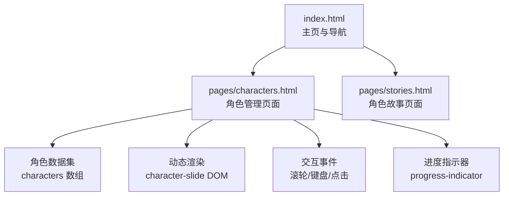
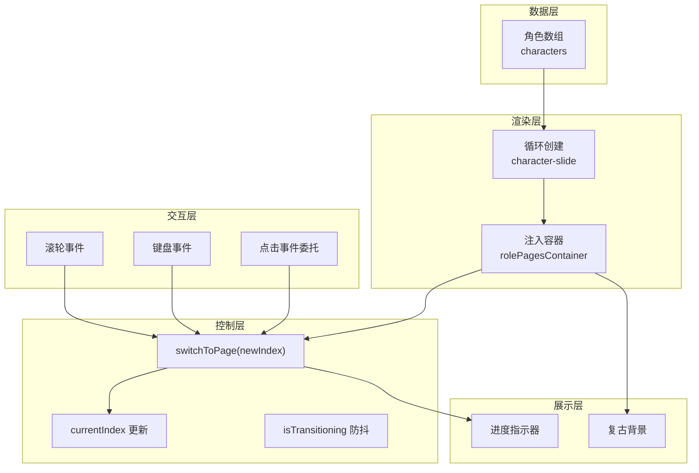
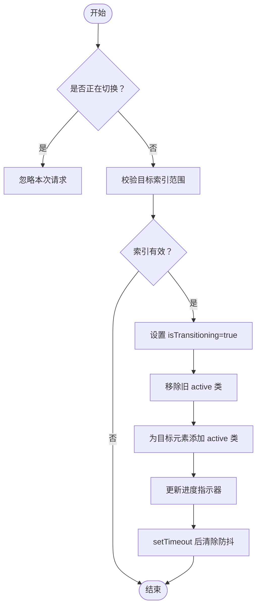
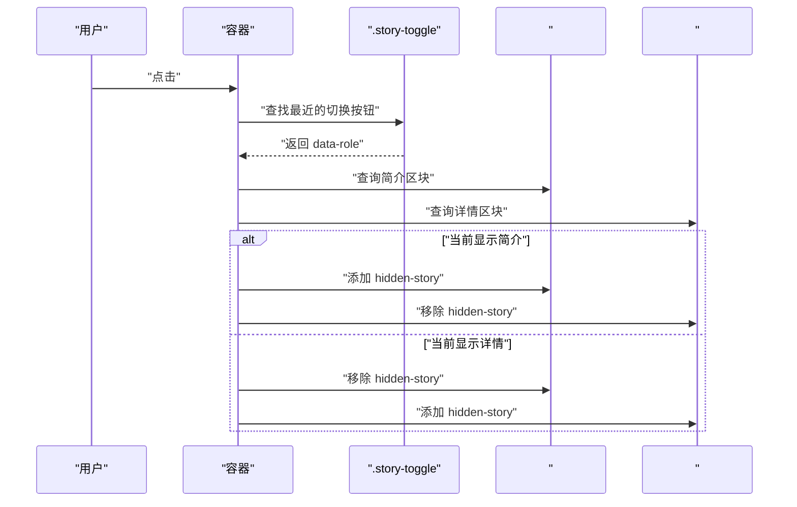
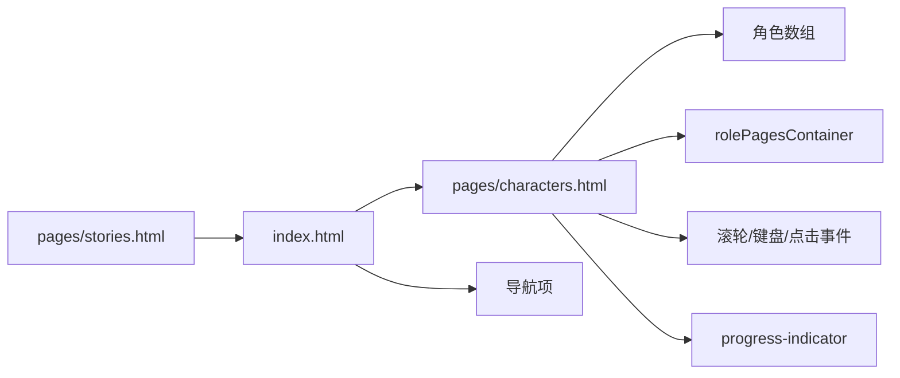

# 角色管理系统

<cite>
**本文引用的文件**
- [pages/characters.html](file://pages/characters.html)
- [index.html](file://index.html)
- [pages/stories.html](file://pages/stories.html)
</cite>

## 目录
1. [引言](#引言)
2. [项目结构](#项目结构)
3. [核心组件](#核心组件)
4. [架构总览](#架构总览)
5. [详细组件分析](#详细组件分析)
6. [依赖关系分析](#依赖关系分析)
7. [性能考量](#性能考量)
8. [故障排除指南](#故障排除指南)
9. [结论](#结论)
10. [附录](#附录)

## 引言
本技术文档围绕角色管理系统展开，重点覆盖角色数据结构设计、角色切换算法与滑动切换系统实现、角色信息展示机制、简介/详情切换功能、进度指示器工作原理、动态渲染过程、DOM 操作优化与内存管理策略，并提供角色扩展开发指南（新增角色流程、数据格式规范、界面定制方法）、实际使用示例与故障排除建议。该系统以单页应用形式运行，通过 JavaScript 动态构建角色卡片，支持滚轮与键盘方向键导航，以及基于点击的简介/详情切换。

## 项目结构
角色管理页面位于 pages/characters.html，采用内联样式与脚本实现完整功能；主页 index.html 提供全局导航与页面跳转入口；角色故事页面 pages/stories.html 作为故事阅读入口之一。整体采用轻量级前端架构，无外部框架依赖，便于维护与部署。

图表来源
- [pages/characters.html](file://pages/characters.html)
- [index.html](file://index.html)
- [pages/stories.html](file://pages/stories.html)

章节来源
- [pages/characters.html](file://pages/characters.html)
- [index.html](file://index.html)
- [pages/stories.html](file://pages/stories.html)

## 核心组件
- 角色数据集：集中定义在角色页面的脚本区，包含角色标识、名称、副标题、技能、简介、详情、图片地址与音频开关等字段。
- 动态渲染容器：页面容器 rolePagesContainer 用于承载所有角色卡片，每个角色对应一个 character-slide 元素。
- 切换系统：通过 switchToPage 函数控制当前索引 currentIndex，配合 DOM 类名切换与过渡动画实现滑动切换。
- 简介/详情切换：通过点击 .story-toggle 按钮，对对应角色的简介与详情区块进行显隐切换。
- 进度指示器：实时显示当前页码与总页数，便于用户了解浏览进度。
- 导航与事件：监听滚轮与键盘上下键，限制边界并触发切换；同时提供返回首页按钮与页面跳转入口。

章节来源
- [pages/characters.html](file://pages/characters.html)

## 架构总览
角色管理页面采用“数据驱动 + 事件驱动”的架构模式：
- 数据层：角色数组 characters 提供统一的数据源。
- 渲染层：遍历角色数组，动态创建 character-slide 并注入容器。
- 控制层：switchToPage 负责切换逻辑，isTransitioning 防抖，currentIndex 记录当前页。
- 交互层：滚轮/键盘/点击事件委托到容器，触发切换或显隐切换。
- 展示层：进度指示器与复古风格背景增强视觉体验。

图表来源
- [pages/characters.html](file://pages/characters.html)

## 详细组件分析

### 角色数据结构设计
- 字段说明
  - id：角色唯一标识，用于关联简介/详情区块与切换按钮。
  - name：角色名称。
  - subtitle：副标题（含英文名）。
  - skill：技能/所属信息，内部以特定分隔符拆分为两行展示。
  - brief：角色简介文本。
  - detail：角色详情文本。
  - img：头像/立绘地址，支持占位图回退。
  - hasAudio：是否具备音频资源（当前页面未启用音频播放）。
- 设计要点
  - 结构简洁，便于扩展；skill 的分行展示通过字符串分割实现。
  - 图片懒加载与错误回退，提升稳定性与用户体验。
  - 使用 data-role 与 data-index 实现 DOM 与数据的弱耦合绑定。

章节来源
- [pages/characters.html](file://pages/characters.html)

### 角色切换算法与滑动切换系统
- 状态变量
  - currentIndex：当前激活角色索引。
  - slides：角色卡片集合，按顺序存储。
  - isTransitioning：切换防抖标志，防止快速连续切换导致的竞态。
- 切换流程
  - 输入：目标索引 newIndex。
  - 边界检查：确保 newIndex 在有效范围内。
  - 防抖处理：若正在切换则忽略新请求。
  - DOM 切换：移除旧 active 类，添加新 active 类；必要时添加进入动画类。
  - 更新进度：同步更新进度指示器的当前页与总数。
  - 回调：切换完成后解除防抖标志，允许下一次切换。
- 交互入口
  - 滚轮事件：根据 deltaY 正负决定上一页或下一页。
  - 键盘事件：ArrowUp/ArrowDown 分别向上/向下切换。
  - 点击事件：点击返回首页按钮或导航项触发页面跳转。

图表来源
- [pages/characters.html](file://pages/characters.html)

章节来源
- [pages/characters.html](file://pages/characters.html)

### 角色信息展示机制
- 头像区域：支持异步解码与错误回退，保证图片加载失败时仍可显示占位图。
- 信息区域：包含名称、副标题、技能（分行展示）、故事内容（简介/详情）。
- 故事内容：通过 .scrollable-story 区域实现滚动阅读，避免页面过长。
- 简介/详情切换：点击 .story-toggle 按钮，根据当前状态切换对应区块显隐。

章节来源
- [pages/characters.html](file://pages/characters.html)

### 简介/详情切换功能
- 事件委托：在容器上监听点击，定位最近的 .story-toggle。
- 状态判断：通过目标角色的简介区块是否隐藏，决定切换方向。
- DOM 操作：对简介与详情区块切换 hidden-story 类，实现显隐切换。
- 关联字段：依赖角色 id 与 DOM ID 的命名约定（brief-与 detail-前缀）。

图表来源
- [pages/characters.html](file://pages/characters.html)

章节来源
- [pages/characters.html](file://pages/characters.html)

### 进度指示器工作原理
- 结构组成：包含当前页数字与总页数文本、标签文字“卷·录”。
- 更新时机：每次成功切换角色后，同步更新当前页与总页数显示。
- 用户反馈：帮助用户了解浏览进度，尤其在大量角色场景下提升可用性。

章节来源
- [pages/characters.html](file://pages/characters.html)

### 动态渲染过程
- 数据遍历：遍历角色数组，为每个角色创建 character-slide 元素。
- 类名初始化：首个角色添加 active 类，其余初始为非激活状态。
- 属性绑定：为每个 slide 设置 data-index，便于后续事件处理。
- 内容注入：将角色信息拼接为 HTML 片段，注入到 slide 中。
- 容器挂载：将所有 slide 添加到 rolePagesContainer。

章节来源
- [pages/characters.html](file://pages/characters.html)

### DOM 操作优化与内存管理
- 事件委托：将滚轮、键盘与点击事件委托到容器，减少重复监听器数量。
- 防抖机制：isTransitioning 防止快速连续切换引发的 UI 抖动与状态错乱。
- 最小化重排：仅对需要的元素添加/移除类名，避免大规模 DOM 变更。
- 图片优化：异步解码与错误回退，降低阻塞风险。
- 内存释放：页面卸载时由浏览器回收，切换过程中不持有额外大对象引用。

章节来源
- [pages/characters.html](file://pages/characters.html)

### 角色扩展开发指南
- 新增角色流程
  - 在角色数组中追加一条记录，填写 id、name、subtitle、skill、brief、detail、img、hasAudio 等字段。
  - 确保 id 唯一且与 DOM ID 命名约定一致（如 brief-与 detail-前缀）。
  - 如需音频，可在后续版本启用音频播放逻辑。
- 数据格式规范
  - id：字符串，推荐使用英文或拼音缩写组合，避免空格与特殊字符。
  - name/subtitle：字符串，注意换行与分行展示需求。
  - skill：字符串，内部以特定分隔符拆分为两行展示。
  - brief/detail：字符串，建议分段清晰，配合滚动容器阅读。
  - img：URL 或占位图，确保跨域安全与加载稳定性。
  - hasAudio：布尔值，当前页面未启用音频播放。
- 界面定制方法
  - 修改 CSS 变量与选择器，调整字体、颜色与布局。
  - 自定义 character-slide 的结构与样式，保持与脚本中的选择器兼容。
  - 扩展进度指示器与复古背景，保持性能与一致性。

章节来源
- [pages/characters.html](file://pages/characters.html)

### 实际使用示例
- 浏览角色：使用滚轮或键盘上下键在角色间切换。
- 查看详情：点击角色卡片右上角的切换按钮，即可在简介与详情之间切换。
- 返回首页：点击左上角返回首页按钮，跳转到主页。
- 页面跳转：通过主页导航项跳转到角色管理页面或故事页面。

章节来源
- [pages/characters.html](file://pages/characters.html)
- [index.html](file://index.html)
- [pages/stories.html](file://pages/stories.html)

## 依赖关系分析
- 角色页面依赖
  - 角色数组：提供数据源。
  - DOM 容器：承载动态渲染结果。
  - 事件监听：滚轮、键盘、点击。
  - 进度指示器：显示当前页与总数。
- 主页依赖
  - 导航项：跳转到角色管理页面与故事页面。
  - 页面切换：通过直接跳转避免跨域问题。
- 间接依赖
  - 复古背景与样式：提升视觉一致性，不直接影响功能。

图表来源
- [pages/characters.html](file://pages/characters.html)
- [index.html](file://index.html)
- [pages/stories.html](file://pages/stories.html)

章节来源
- [pages/characters.html](file://pages/characters.html)
- [index.html](file://index.html)
- [pages/stories.html](file://pages/stories.html)

## 性能考量
- GPU 加速：通过 will-change 与混合模式优化动画性能。
- 防抖与节流：isTransitioning 与滚轮锁避免频繁切换造成的性能损耗。
- 图片优化：异步解码与错误回退减少主线程阻塞。
- 事件委托：降低监听器数量，减少内存占用。
- CSS 动画：使用 transform 与 opacity 实现硬件加速的过渡效果。

章节来源
- [pages/characters.html](file://pages/characters.html)
- [index.html](file://index.html)

## 故障排除指南
- 无法切换角色
  - 检查 currentIndex 与边界条件，确认 isTransitioning 是否被意外置为 true。
  - 确认 DOM 中存在对应索引的 character-slide 元素。
- 简介/详情不切换
  - 检查 .story-toggle 的 data-role 是否正确，对应 DOM ID 是否存在。
  - 确认 hidden-story 类的添加/移除逻辑是否被执行。
- 滚轮无效
  - 确认事件监听器是否绑定到 window，passive: false 是否生效。
  - 检查 deltaY 方向与阈值判断。
- 图片不显示
  - 检查 img 地址是否可访问，onerror 回退是否生效。
- 返回首页按钮无效
  - 确认链接路径 ../index.html 是否正确，页面是否存在。
- 页面跳转异常
  - 确认主页导航项的跳转逻辑是否使用直接跳转方式，避免 file:// 协议下的跨域拦截。

章节来源
- [pages/characters.html](file://pages/characters.html)
- [index.html](file://index.html)

## 结论
该角色管理系统以简洁的数据结构与高效的动态渲染为核心，结合事件委托与防抖机制，实现了流畅的滑动切换与简介/详情切换体验。通过进度指示器与复古风格背景增强了用户的浏览体验。系统易于扩展，遵循统一的数据格式与 DOM 命名约定，便于新增角色与界面定制。建议在后续版本中引入音频播放能力与更完善的错误处理与可访问性支持。

## 附录
- 快速参考
  - 角色数组位置：角色页面脚本区。
  - 容器与进度指示器：rolePagesContainer 与 progress-indicator。
  - 切换函数：switchToPage。
  - 简介/详情切换：.story-toggle 与 brief-/detail- 前缀的 DOM ID。
  - 导航入口：主页导航项与返回首页按钮。

章节来源
- [pages/characters.html](file://pages/characters.html)
- [index.html](file://index.html)
- [pages/stories.html](file://pages/stories.html)