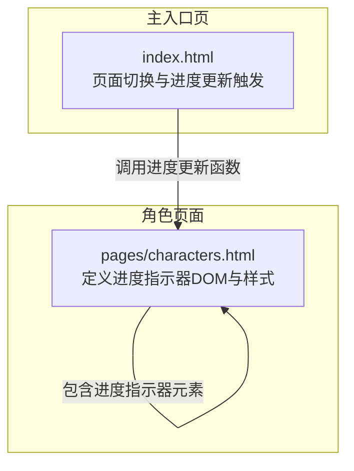
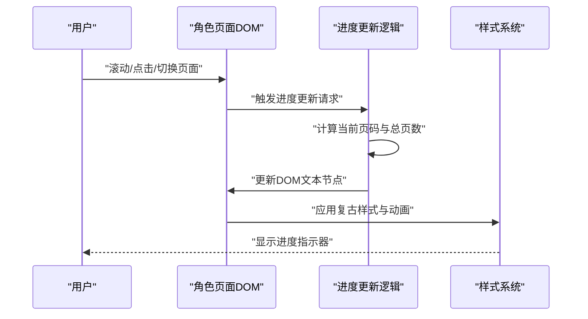
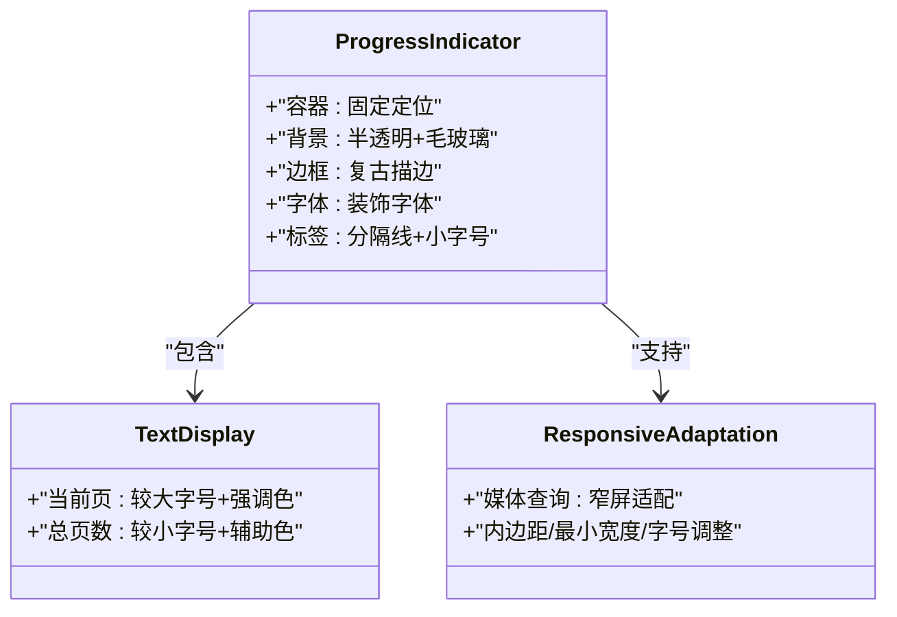
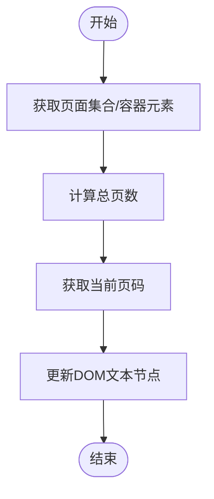
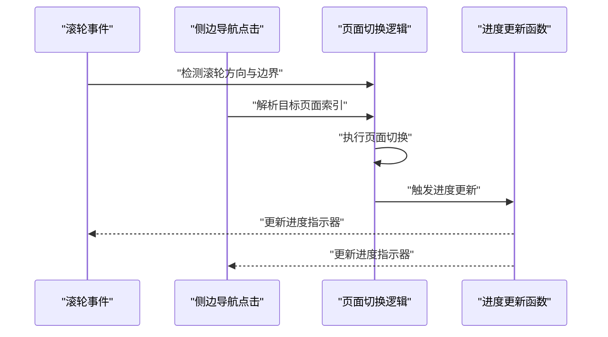
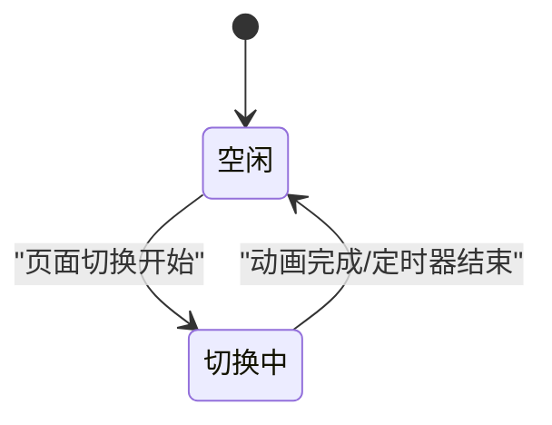
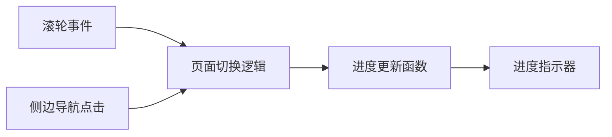

# 进度指示器

<cite>
**本文引用的文件**
- [pages/characters.html](file://pages/characters.html)
- [index.html](file://index.html)
</cite>

## 目录
1. [简介](#简介)
2. [项目结构](#项目结构)
3. [核心组件](#核心组件)
4. [架构概览](#架构概览)
5. [详细组件分析](#详细组件分析)
6. [依赖关系分析](#依赖关系分析)
7. [性能考虑](#性能考虑)
8. [故障排除指南](#故障排除指南)
9. [结论](#结论)
10. [附录](#附录)

## 简介
本技术文档围绕进度指示器展开，系统性阐述其实现原理、样式设计、交互触发机制、定制化选项以及性能与体验优化策略。进度指示器在页面中以"当前页码/总页数"的形式展示阅读进度，并通过复古风格视觉效果与动画过渡增强沉浸感。本文将结合实际代码文件，从架构到细节逐层解析。

## 项目结构
该项目采用多页面结构，进度指示器主要出现在角色页面中，同时在主入口页中存在页面切换逻辑，二者共同构成完整的进度指示器体系。

**图表来源**
- [pages/characters.html:355-360](file://pages/characters.html#L355-L360)
- [index.html:604-624](file://index.html#L604-L624)

**章节来源**
- [pages/characters.html:288-328](file://pages/characters.html#L288-L328)
- [index.html:604-624](file://index.html#L604-L624)

## 核心组件
- 进度指示器容器：位于角色页面右侧固定定位，采用半透明背景、毛玻璃模糊与复古边框，文字使用装饰字体，整体呈现复古质感。
- 文本区域：包含当前页码与总页数，分别设置不同字号与色彩，突出当前进度。
- 标签区域：显示简短说明文字，配合顶部分隔线与复古边框，强化视觉层次。
- 触发机制：页面切换、滚轮事件、侧边导航点击等均会触发进度更新；窗口尺寸变化时通过媒体查询进行响应式适配。

**章节来源**
- [pages/characters.html:288-328](file://pages/characters.html#L288-L328)
- [pages/characters.html:355-360](file://pages/characters.html#L355-L360)
- [index.html:604-631](file://index.html#L604-L631)

## 架构概览
进度指示器的运行链路由三部分组成：DOM结构与样式定义、数据更新逻辑、交互触发机制。DOM结构由角色页面提供，样式定义确保复古风格与响应式布局；数据更新逻辑负责计算当前页码与总页数；交互触发机制在多种用户行为下驱动进度更新。

**图表来源**
- [pages/characters.html:355-360](file://pages/characters.html#L355-L360)
- [pages/characters.html:288-328](file://pages/characters.html#L288-L328)
- [index.html:604-624](file://index.html#L604-L624)

## 详细组件分析

### DOM结构与样式设计
- 容器定位：固定定位，右上角居中偏移，z-index保证层级高于内容，避免遮挡。
- 背景与模糊：半透明深色背景与毛玻璃模糊，搭配复古描边，营造复古氛围。
- 字体与排版：使用装饰字体，字号与字重区分当前页与总页数，标签区域采用较小字号与分隔线。
- 响应式适配：在窄屏设备上调整内边距、最小宽度与字号，确保可读性与可用性。

**图表来源**
- [pages/characters.html:288-328](file://pages/characters.html#L288-L328)

**章节来源**
- [pages/characters.html:288-328](file://pages/characters.html#L288-L328)

### 百分比计算与数据流
- 数据来源：当前页码由页面切换逻辑维护，总页数通过页面集合长度或容器内元素数量确定。
- 更新时机：页面切换完成、滚轮事件处理、侧边导航点击后触发更新。
- 显示逻辑：将当前页码与总页数写入对应DOM节点，形成"当前/总计"的文本展示。

**图表来源**
- [pages/characters.html:525-546](file://pages/characters.html#L525-L546)
- [index.html:604-624](file://index.html#L604-L624)

**章节来源**
- [pages/characters.html:525-546](file://pages/characters.html#L525-L546)
- [index.html:604-624](file://index.html#L604-L624)

### 交互触发机制
- 页面切换事件：主入口页通过滚轮事件与侧边导航点击触发页面切换，切换完成后更新进度。
- 滚轮事件：检测滚轮方向与滚动边界，到达边界时切换到相邻页面并更新进度。
- 窗口大小变化：通过媒体查询在不同断点下调整布局与字号，保证在移动设备上的可读性。
- 用户交互响应：键盘方向键同样可触发页面切换，确保多样化的操作方式。

**图表来源**
- [index.html:613-631](file://index.html#L613-L631)
- [pages/characters.html:549-574](file://pages/characters.html#L549-L574)

**章节来源**
- [index.html:613-631](file://index.html#L613-L631)
- [pages/characters.html:549-574](file://pages/characters.html#L549-L574)

### 动画过渡与视觉反馈
- 切换动画：页面切换过程中包含过渡类名与定时器，确保动画结束后才允许再次切换。
- 指示器动画：进度指示器本身为静态显示，但通过容器的定位与样式变化体现视觉连贯性。
- 锁定机制：切换期间设置锁定标志，防止重复触发导致的冲突。

**图表来源**
- [pages/characters.html:539-546](file://pages/characters.html#L539-L546)

**章节来源**
- [pages/characters.html:539-546](file://pages/characters.html#L539-L546)

### 定制化选项
- 颜色主题：可通过修改容器背景、边框与文字颜色实现不同复古色调；标签区域与分隔线颜色可独立调整。
- 字体样式：装饰字体与字号组合可按品牌风格替换；建议保持对比度以提升可读性。
- 位置调整：容器定位与变换属性可按页面布局需求调整；注意与内容区域的层级关系。
- 响应式参数：媒体查询断点与内边距、最小宽度、字号阈值可根据目标设备特性微调。

**章节来源**
- [pages/characters.html:288-328](file://pages/characters.html#L288-L328)

## 依赖关系分析
进度指示器与页面切换逻辑存在直接依赖：页面切换完成后必须更新进度指示器，以确保用户获得准确的阅读进度反馈。交互事件（滚轮、点击、键盘）作为触发源，间接影响进度指示器的刷新频率与时机。

**图表来源**
- [index.html:613-631](file://index.html#L613-L631)
- [pages/characters.html:549-574](file://pages/characters.html#L549-L574)

**章节来源**
- [index.html:613-631](file://index.html#L613-L631)
- [pages/characters.html:549-574](file://pages/characters.html#L549-L574)

## 性能考虑
- 事件节流：滚轮事件可能高频触发，建议在切换期间设置防抖或节流，避免频繁DOM更新。
- 渲染优化：进度更新仅涉及少量文本节点，通常开销较低；若页面元素众多，可考虑批量更新或虚拟化策略。
- 动画帧率：切换动画时长与定时器间隔需与浏览器合成线程协调，避免掉帧。
- 内存管理：进度指示器为静态元素，无需额外内存回收；但需确保事件监听在页面卸载时正确移除。

## 故障排除指南
- 进度不更新：检查页面切换逻辑是否正确调用进度更新函数；确认DOM节点是否存在且可访问。
- 文本错位：核对媒体查询断点与字号设置，确保在目标设备上生效。
- 动画卡顿：检查切换动画时长与定时器设置，避免过长的过渡时间。
- 交互无响应：确认事件监听是否绑定到正确的元素，且未被其他层覆盖。

**章节来源**
- [pages/characters.html:549-574](file://pages/characters.html#L549-L574)
- [index.html:613-631](file://index.html#L613-L631)

## 结论
进度指示器通过简洁的DOM结构与复古风格样式，在多种交互场景下提供稳定的阅读进度反馈。其与页面切换逻辑紧密耦合，确保用户在翻页过程中的连续性与可感知性。通过合理的定制化与性能优化，可在不同设备与使用场景下维持良好的用户体验。

## 附录
- 相关实现位置参考：
  - 进度指示器容器与样式定义：[pages/characters.html:288-328](file://pages/characters.html#L288-L328)
  - 进度指示器DOM结构：[pages/characters.html:355-360](file://pages/characters.html#L355-L360)
  - 页面切换与进度更新触发：[index.html:604-631](file://index.html#L604-L631)
  - 滚轮事件与页面切换逻辑：[index.html:613-624](file://index.html#L613-L624)
  - 角色页面内的进度更新调用：[pages/characters.html](file://pages/characters.html#L546)