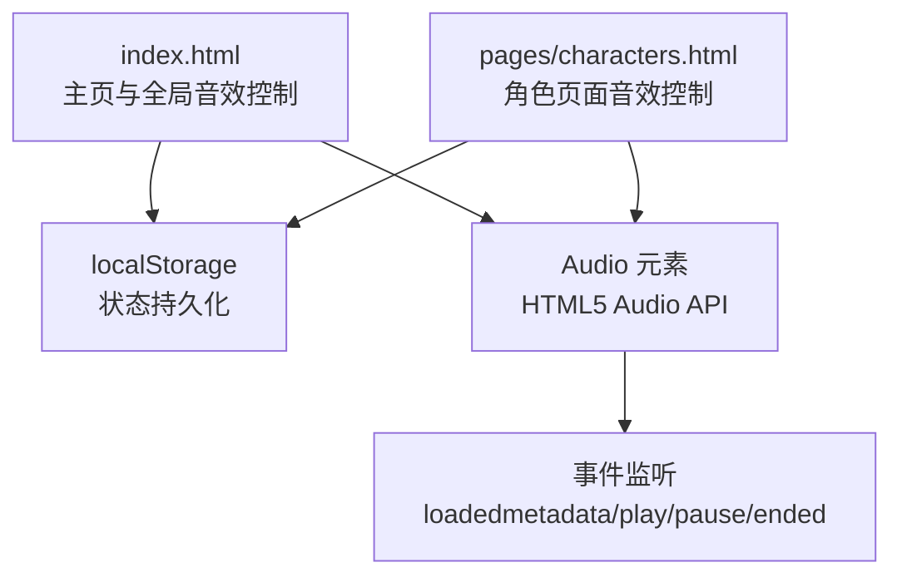
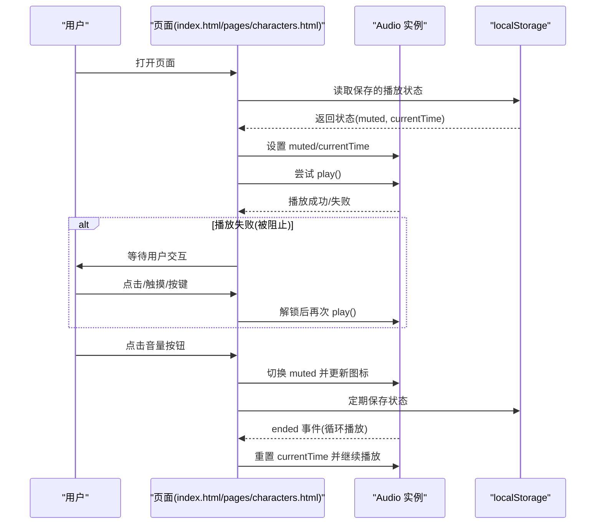
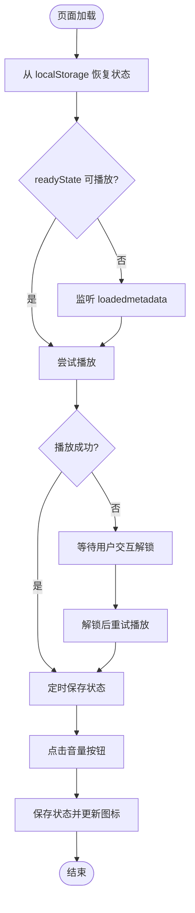
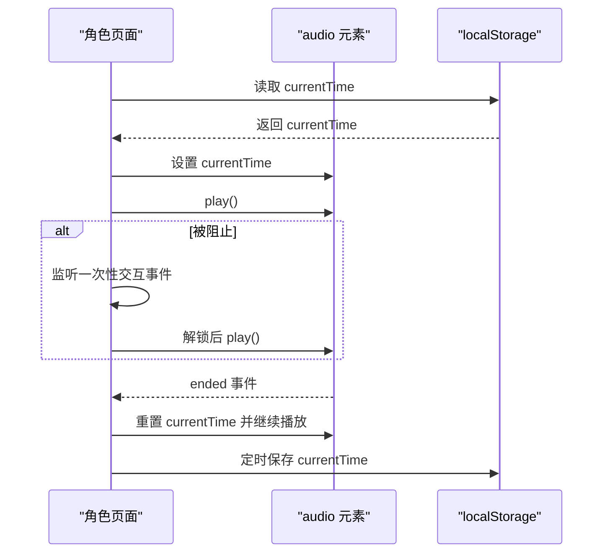
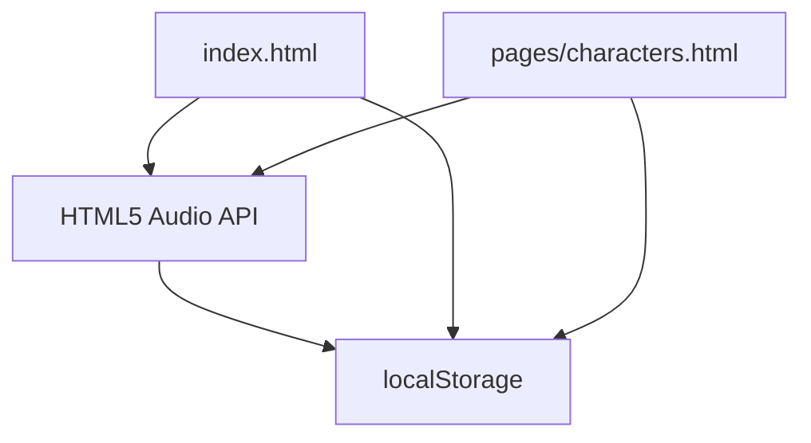

# 音效控制系统

<cite>
**本文档引用的文件**
- [index.html](file://index.html)
- [characters.html](file://pages/characters.html)
</cite>

## 目录
1. [引言](#引言)
2. [项目结构](#项目结构)
3. [核心组件](#核心组件)
4. [架构概览](#架构概览)
5. [详细组件分析](#详细组件分析)
6. [依赖关系分析](#依赖关系分析)
7. [性能考虑](#性能考虑)
8. [故障排除指南](#故障排除指南)
9. [结论](#结论)
10. [附录](#附录)

## 引言
本文件为《夙日不再》项目的音效控制系统技术文档，聚焦于HTML5 Audio API的使用、音频播放机制与状态持久化设计。文档详细解释音量控制、静音切换逻辑与用户偏好保存策略，阐述浏览器兼容性处理、自动播放限制与用户交互触发机制，说明音频元数据管理、播放状态同步与错误处理方案，并提供音效扩展开发指南与常见问题解决方案。

## 项目结构
音效控制主要分布在两个页面：
- 主页与全局音效控制：在 index.html 中实现背景音乐的自动播放、静音切换、状态持久化与跨页面恢复。
- 角色页面音效控制：在 pages/characters.html 中实现角色页面背景音乐的自动播放与状态恢复。

图表来源
- [index.html:678-751](file://index.html#L678-L751)
- [characters.html:399-469](file://pages/characters.html#L399-L469)

章节来源
- [index.html:678-751](file://index.html#L678-L751)
- [characters.html:399-469](file://pages/characters.html#L399-L469)

## 核心组件
- 音频元素与初始化
  - 在主页通过动态创建 audio 元素并设置循环播放与预加载，初始音量为 0.6。
  - 在角色页面直接使用内嵌的 audio 元素，具备相同行为。
- 自动播放与用户交互解锁
  - 使用 Promise 的 play() 返回值判断是否需要等待用户交互解锁。
  - 监听点击、触摸与键盘事件一次性绑定解锁逻辑。
- 状态持久化与恢复
  - 使用 localStorage 存储静音状态与音频播放位置，页面加载时恢复。
  - 定期保存播放位置，窗口卸载时保存最终状态。
- 静音切换与图标更新
  - 点击音量按钮切换静音状态，更新 SVG 图标以反映当前状态。
  - 静音状态变化时同步到 HTMLMediaElement.muted 属性。

章节来源
- [index.html:678-751](file://index.html#L678-L751)
- [characters.html:402-469](file://pages/characters.html#L402-L469)

## 架构概览
音效控制采用“页面级音频实例 + 全局状态持久化”的架构，确保不同页面间的状态一致与用户体验连续。

图表来源
- [index.html:678-751](file://index.html#L678-L751)
- [characters.html:402-469](file://pages/characters.html#L402-L469)

## 详细组件分析

### 主页音效控制（index.html）
- 初始化与自动播放
  - 动态创建 audio 元素，设置 loop、preload 与初始音量。
  - 在 readyState 达到可播放状态后尝试播放，否则监听 loadedmetadata 事件。
- 用户交互解锁
  - 若 play() 返回 Promise 且抛错，则注册一次性事件监听器，等待用户交互后解锁并重试播放。
- 状态持久化与恢复
  - 从 localStorage 读取保存的静音状态与播放位置，必要时在 metadata 加载完成后设置 currentTime。
  - 定时保存播放状态，窗口卸载时保存最终状态。
- 静音切换与图标更新
  - 点击音量按钮切换 isMuted，同步到 HTMLMediaElement.muted，并更新 SVG 图标。
- 结束事件处理
  - 监听 ended 事件，重置 currentTime 并继续播放，实现无缝循环。

图表来源
- [index.html:678-751](file://index.html#L678-L751)

章节来源
- [index.html:678-751](file://index.html#L678-L751)

### 角色页面音效控制（pages/characters.html）
- 初始化与自动播放
  - 使用内嵌 audio 元素，具备与主页相同的循环播放与预加载行为。
  - 页面 load 后恢复播放位置并尝试播放，若被阻止则等待一次性交互事件。
- 状态持久化
  - 仅保存 currentTime，定期保存并在窗口卸载时保存。
- 可见性与后台恢复
  - 监听 visibilitychange 事件，页面可见时尝试播放，保证后台切换后继续播放。
- 结束事件处理
  - 监听 ended 事件，重置 currentTime 并继续播放。

图表来源
- [characters.html:402-469](file://pages/characters.html#L402-L469)

章节来源
- [characters.html:402-469](file://pages/characters.html#L402-L469)

### 音量控制与静音切换
- 静音状态管理
  - 使用布尔变量 isMuted 控制静音状态，同步到 HTMLMediaElement.muted。
- 图标更新
  - 根据 isMuted 动态更新音量按钮的 SVG 图标，直观反馈当前状态。
- 用户偏好保存
  - 将静音状态与播放位置组合保存到 localStorage，确保跨页面与刷新后状态一致。

章节来源
- [index.html:691-712](file://index.html#L691-L712)
- [index.html:707-748](file://index.html#L707-L748)

### 浏览器兼容性与自动播放限制
- 自动播放策略
  - 通过 play() 的 Promise 返回值判断是否被浏览器阻止，若被阻止则注册一次性交互事件监听器，等待用户首次交互后解锁并重试播放。
- 事件监听
  - 监听 click、touchstart、keydown 等事件，确保在移动端与桌面端均可触发解锁。
- 元数据加载
  - 在 readyState 达到可播放状态后尝试播放，避免因音频未就绪导致播放失败。

章节来源
- [index.html:713-729](file://index.html#L713-L729)
- [characters.html:422-434](file://pages/characters.html#L422-L434)

### 音频元数据管理与播放状态同步
- 元数据与播放位置
  - 使用 HTMLMediaElement 的 readyState 与 currentTime 属性管理音频元数据与播放位置。
- 状态同步
  - 在页面加载时恢复静音状态与播放位置，在播放过程中定期保存状态，确保状态与媒体元素保持一致。
- 循环播放
  - 监听 ended 事件，重置 currentTime 并继续播放，实现无缝循环。

章节来源
- [index.html:692-706](file://index.html#L692-L706)
- [index.html:749-751](file://index.html#L749-L751)
- [characters.html:416-419](file://pages/characters.html#L416-L419)
- [characters.html:466-469](file://pages/characters.html#L466-L469)

### 错误处理方案
- 播放失败处理
  - 捕获 play() 的 Promise 错误，注册一次性交互事件监听器，等待用户交互后解锁并重试播放。
- 跨域与协议限制
  - 避免 file:// 协议下的跨域限制，采用页面跳转而非 iframe 加载，减少跨源拦截风险。
- 状态保存异常
  - 对 localStorage 操作进行 try/catch 包装，防止异常影响主流程。

章节来源
- [index.html:713-729](file://index.html#L713-L729)
- [index.html:707](file://index.html#L707)
- [characters.html:422-434](file://pages/characters.html#L422-L434)
- [characters.html:416-420](file://pages/characters.html#L416-L420)

## 依赖关系分析
- 组件耦合
  - 音频控制逻辑与页面结构松耦合，通过 DOM 查询与事件驱动实现。
- 外部依赖
  - 依赖 HTML5 Audio API 与 localStorage，无需第三方库。
- 潜在循环依赖
  - 无循环依赖，事件监听器在页面生命周期内按需注册与清理。

图表来源
- [index.html:678-751](file://index.html#L678-L751)
- [characters.html:399-469](file://pages/characters.html#L399-L469)

章节来源
- [index.html:678-751](file://index.html#L678-L751)
- [characters.html:399-469](file://pages/characters.html#L399-L469)

## 性能考虑
- 预加载策略
  - 使用 preload="auto" 提前加载音频，减少首播延迟。
- 定时保存频率
  - 主页每 1.5 秒保存一次状态，角色页面每 1 秒保存一次，平衡性能与体验。
- 事件监听清理
  - 使用一次性事件监听器（once: true）避免重复绑定与内存泄漏。
- GPU 加速与渲染
  - 页面其他部分使用 GPU 加速与合成属性，音效控制不影响页面整体性能。

## 故障排除指南
- 播放被阻止
  - 症状：页面加载后音频不播放。
  - 排查：确认是否触发了用户交互解锁；检查控制台是否有 play() Promise 错误。
  - 处理：在页面上添加交互提示，引导用户点击或按键以解锁音频。
- 状态未恢复
  - 症状：刷新后播放位置不正确。
  - 排查：确认 localStorage 中的保存格式与字段名称一致；检查 readyState 与 currentTime 设置时机。
  - 处理：在 metadata 加载完成后设置 currentTime，避免未就绪导致的设置失败。
- 静音状态不同步
  - 症状：点击音量按钮后图标不变或实际静音状态不一致。
  - 排查：确认 isMuted 与 HTMLMediaElement.muted 的同步逻辑；检查事件绑定与保存时机。
  - 处理：确保点击事件后立即同步 isMuted 与 muted，并更新图标。
- 结束事件未触发循环
  - 症状：音频播放结束后停止。
  - 排查：确认 ended 事件监听器是否注册；检查是否在事件回调中重置 currentTime 并继续播放。
  - 处理：在 ended 事件中重置 currentTime 并调用 play()。

章节来源
- [index.html:713-729](file://index.html#L713-L729)
- [index.html:749-751](file://index.html#L749-L751)
- [characters.html:466-469](file://pages/characters.html#L466-L469)

## 结论
音效控制系统通过 HTML5 Audio API 与 localStorage 实现了稳定的自动播放、静音切换与状态持久化。系统在浏览器自动播放限制下采用用户交互解锁策略，确保在不同平台与环境下的一致体验。通过合理的事件监听与状态同步机制，系统实现了跨页面的状态一致性与无缝循环播放。

## 附录

### 音效扩展开发指南
- 新增音频文件
  - 将音频文件放置在项目根目录或对应页面目录，并确保路径正确。
  - 更新页面中的 audio 元素 src 属性或动态创建 audio 元素时设置 src。
- 音效配置
  - 配置 loop 与 preload 属性以满足场景需求。
  - 设置初始音量与静音状态，确保用户体验一致。
- 性能优化技巧
  - 合理设置预加载策略，避免占用过多带宽。
  - 控制状态保存频率，平衡性能与体验。
  - 使用一次性事件监听器，避免重复绑定与内存泄漏。

### 常见问题与调试方法
- 自动播放被阻止
  - 使用浏览器开发者工具查看 Console，确认 play() Promise 是否抛错。
  - 添加交互提示，引导用户进行点击或按键操作以解锁音频。
- 状态恢复失败
  - 检查 localStorage 中的保存格式，确保字段名称与解析逻辑一致。
  - 在 readyState 达到可播放状态后再设置 currentTime。
- 静音状态不同步
  - 确认 isMuted 与 HTMLMediaElement.muted 的同步逻辑，及时更新图标。
- 结束事件未触发循环
  - 确认 ended 事件监听器已注册，并在回调中重置 currentTime 并继续播放。