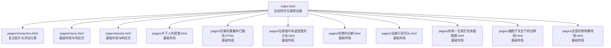
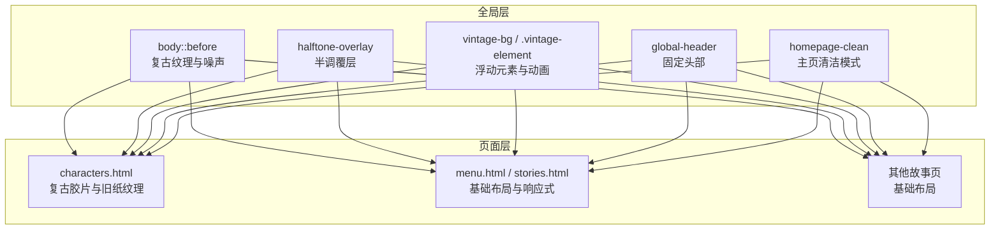
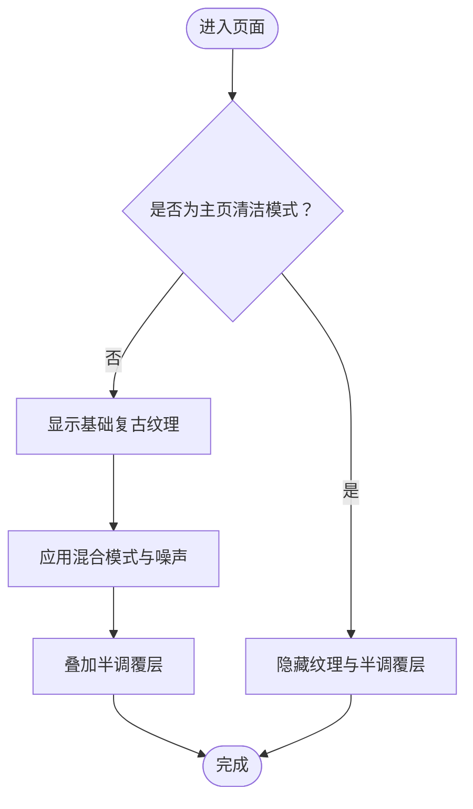
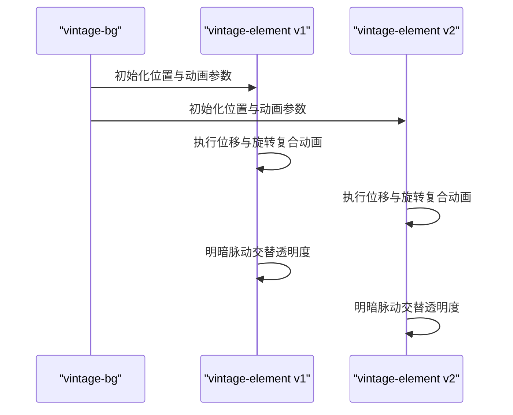
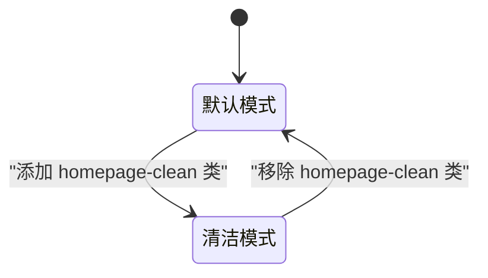
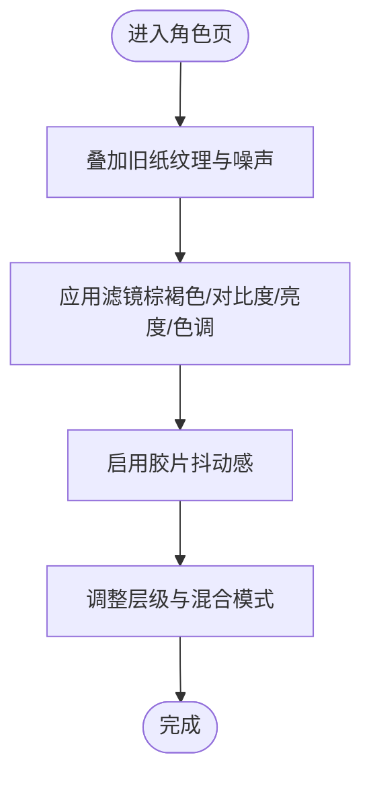
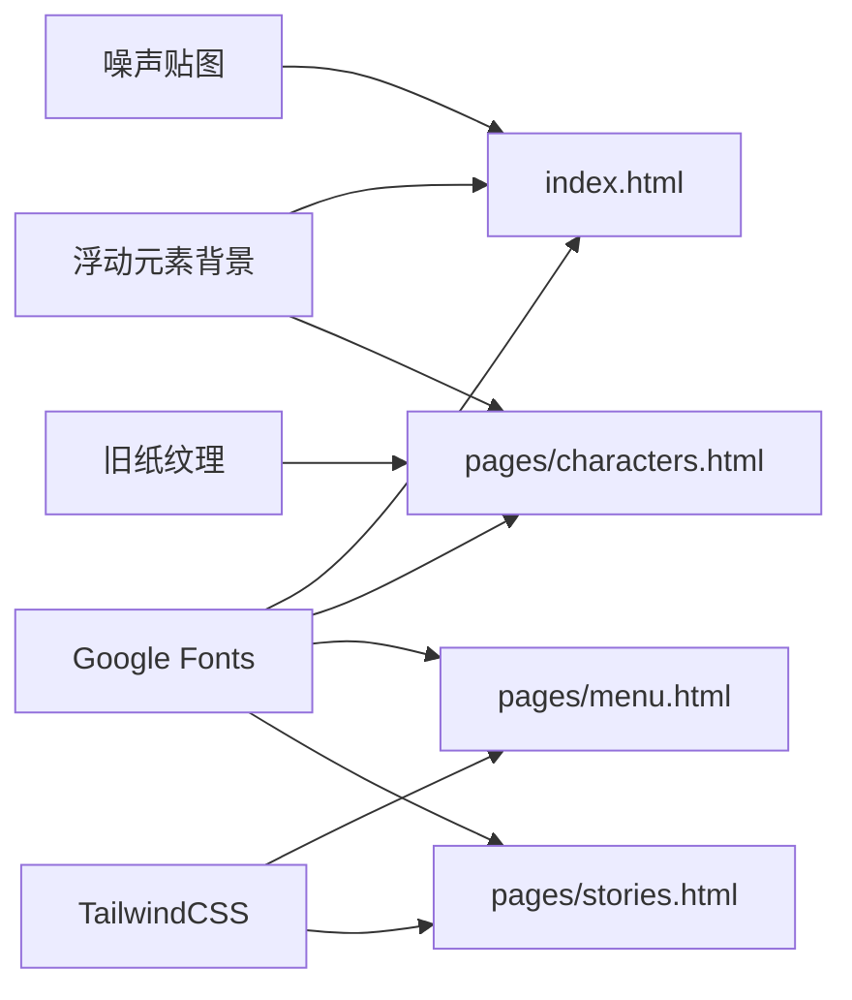

# 视觉设计系统

<cite>
**本文引用的文件**
- [index.html](file://index.html)
- [pages/characters.html](file://pages/characters.html)
- [pages/menu.html](file://pages/menu.html)
- [pages/stories.html](file://pages/stories.html)
- [pages/乡下人的悲歌.html](file://pages/乡下人的悲歌.html)
- [pages/伦敦的雾霾早已散去.HTML](file://pages/伦敦的雾霾早已散去.HTML)
- [pages/在废墟中央渴望爱的少女.html](file://pages/在废墟中央渴望爱的少女.html)
- [pages/失群的白鹤.html](file://pages/失群的白鹤.html)
- [pages/当路行至尽头.html](file://pages/当路行至尽头.html)
- [pages/终其一生我们也未能相遇.html](file://pages/终其一生我们也未能相遇.html)
- [pages/被困于天空下的白桦树.html](file://pages/被困于天空下的白桦树.html)
- [pages/这里的黎明静悄悄.html](file://pages/这里的黎明静悄悄.html)
</cite>

## 目录
1. 引言
2. 项目结构
3. 核心组件
4. 架构总览
5. 详细组件分析
6. 依赖关系分析
7. 性能考量
8. 故障排查指南
9. 结论
10. 附录

## 引言
本文件系统化梳理《夙日不再世界观》的视觉设计系统，围绕复古风格理念展开，重点覆盖：
- 纹理叠加与半调覆层的组合应用
- CSS3 动画与滤镜的协同实现
- 色彩搭配与混合模式的层次组织
- 响应式设计策略与多端适配
- 字体体系与排版规范（含 Google Fonts）
- 设计系统的可扩展性与主题定制方法

## 项目结构
该仓库以“页面集合”为核心组织方式，首页负责全局样式与通用动画，各子页面按主题扩展局部装饰与动画。整体采用“全局样式 + 页面级增强”的分层结构。

图表来源
- [index.html](file://index.html)
- [pages/characters.html](file://pages/characters.html)
- [pages/menu.html](file://pages/menu.html)
- [pages/stories.html](file://pages/stories.html)
- [pages/乡下人的悲歌.html](file://pages/乡下人的悲歌.html)
- [pages/伦敦的雾霾早已散去.HTML](file://pages/伦敦的雾霾早已散去.HTML)
- [pages/在废墟中央渴望爱的少女.html](file://pages/在废墟中央渴望爱的少女.html)
- [pages/失群的白鹤.html](file://pages/失群的白鹤.html)
- [pages/当路行至尽头.html](file://pages/当路行至尽头.html)
- [pages/终其一生我们也未能相遇.html](file://pages/终其一生我们也未能相遇.html)
- [pages/被困于天空下的白桦树.html](file://pages/被困于天空下的白桦树.html)
- [pages/这里的黎明静悄悄.html](file://pages/这里的黎明静悄悄.html)

章节来源
- [index.html](file://index.html)
- [pages/characters.html](file://pages/characters.html)
- [pages/menu.html](file://pages/menu.html)
- [pages/stories.html](file://pages/stories.html)
- [pages/乡下人的悲歌.html](file://pages/乡下人的悲歌.html)
- [pages/伦敦的雾霾早已散去.HTML](file://pages/伦敦的雾霾早已散去.HTML)
- [pages/在废墟中央渴望爱的少女.html](file://pages/在废墟中央渴望爱的少女.html)
- [pages/失群的白鹤.html](file://pages/失群的白鹤.html)
- [pages/当路行至尽头.html](file://pages/当路行至尽头.html)
- [pages/终其一生我们也未能相遇.html](file://pages/终其一生我们也未能相遇.html)
- [pages/被困于天空下的白桦树.html](file://pages/被困于天空下的白桦树.html)
- [pages/这里的黎明静悄悄.html](file://pages/这里的黎明静悄悄.html)

## 核心组件
- 全局复古纹理层（::before）：通过多层渐变与噪声贴图叠加，形成细腻的复古底纹；配合混合模式与过渡，实现柔和的遮罩感。
- 半调覆层（.halftone-overlay）：固定覆盖全屏，使用混合模式与透明度营造“老照片”质感。
- 复古浮动元素组（.vintage-bg/.vintage-element）：多个绝对定位元素，使用位移与旋转复合动画，配合明暗脉动，形成轻柔漂浮的背景氛围。
- 主页清洁模式（body.homepage-clean）：在特定状态下隐藏干扰层，突出主背景图像。
- 固定头部（.global-header）：模糊背景与边框，结合字体与阴影，保证导航在复杂背景上的可读性。
- 文字阴影与高对比文本：在特殊页面中增强文字在背景纹理上的可读性。
- 响应式微调（@media）：针对窄屏调整内边距、字号与布局间距，确保移动端体验。

章节来源
- [index.html](file://index.html)
- [pages/characters.html](file://pages/characters.html)

## 架构总览
整体架构由“全局样式层 + 页面增强层”构成。全局层提供统一的复古基底与动画骨架，页面层按主题叠加纹理、滤镜与浮动元素，最终形成一致而富有层次的视觉语言。

图表来源
- [index.html](file://index.html)
- [pages/characters.html](file://pages/characters.html)
- [pages/menu.html](file://pages/menu.html)
- [pages/stories.html](file://pages/stories.html)

## 详细组件分析

### 复古纹理与半调覆层
- 纹理构成：多层线性渐变（对角方向）、重复线性渐变（网格），叠加噪声贴图与径向渐变，形成细腻的“老电影”底纹。
- 混合模式：通过混合模式叠加，使纹理在深色背景下呈现柔和的对比与层次。
- 透明度与过渡：使用过渡动画平滑显隐，避免突兀切换。
- 半调覆层：独立的全屏覆层，使用混合模式与透明度，进一步强化复古颗粒感。

图表来源
- [index.html](file://index.html)

章节来源
- [index.html](file://index.html)

### 复古浮动元素组
- 定位与层级：使用固定定位与层级控制，确保元素在内容之上但不影响交互。
- 动画机制：位移动画与旋转动画复合，配合明暗脉动，形成自然的漂浮与呼吸感。
- 滤镜与混合：适度的滤镜与混合模式提升与背景的融合度，避免割裂。

图表来源
- [index.html](file://index.html)

章节来源
- [index.html](file://index.html)

### 主页清洁模式
- 目标：在主页场景下隐藏所有干扰层，让背景图像成为主导。
- 实现：通过类名切换，隐藏纹理与半调覆层，并将透明度置零，确保背景图像完全不被干扰。

图表来源
- [index.html](file://index.html)

章节来源
- [index.html](file://index.html)

### 字体体系与排版规范
- 字体引入：通过 Google Fonts 引入中文字体与手写体，确保在不同平台的一致性。
- 字体选择：
  - 标题与装饰性文本：使用装饰性字体，强调复古与艺术感。
  - 正文与导航：使用衬线体，提升阅读性与层次感。
- 排版要点：
  - 字间距与行高：在不同页面中保持稳定的比例，确保长文本可读性。
  - 文字阴影：在特殊页面中增加阴影，提升在复杂背景上的可读性。

章节来源
- [index.html](file://index.html)
- [pages/characters.html](file://pages/characters.html)
- [pages/menu.html](file://pages/menu.html)
- [pages/stories.html](file://pages/stories.html)

### 响应式设计策略
- 移动优先：在窄屏下减少内边距与字号，压缩导航项间距，避免内容拥挤。
- 自适应布局：使用相对单位与弹性布局，保证在不同宽度下的比例协调。
- 视口与缩放：通过媒体查询对关键元素进行微调，确保在小屏设备上仍具可读性与可用性。

章节来源
- [index.html](file://index.html)
- [pages/menu.html](file://pages/menu.html)
- [pages/stories.html](file://pages/stories.html)

### 页面级增强：复古胶片与旧纸纹理
- 特定页面（如角色页）叠加旧纸纹理与噪声，配合滤镜（如棕褐色、对比度、亮度、色调旋转）模拟胶片质感。
- 动画：使用步进动画模拟胶片抖动感，增强年代感。
- 层级与混合：通过层级与混合模式，使纹理与前景内容自然融合。

图表来源
- [pages/characters.html](file://pages/characters.html)

章节来源
- [pages/characters.html](file://pages/characters.html)

## 依赖关系分析
- 外部资源依赖：
  - Google Fonts：提供中英文字体资源，用于正文与标题。
  - TailwindCSS：部分页面引入，用于快速构建基础布局与响应式断点。
  - 图片资源：噪声贴图、旧纸纹理、浮动元素背景等外部图片链接。
- 内部样式依赖：
  - index.html 提供全局样式与动画基座，其他页面按需叠加。
  - 各页面共享通用类名（如 halftone-overlay、vintage-bg 等），确保风格一致性。

图表来源
- [index.html](file://index.html)
- [pages/characters.html](file://pages/characters.html)
- [pages/menu.html](file://pages/menu.html)
- [pages/stories.html](file://pages/stories.html)

章节来源
- [index.html](file://index.html)
- [pages/characters.html](file://pages/characters.html)
- [pages/menu.html](file://pages/menu.html)
- [pages/stories.html](file://pages/stories.html)

## 性能考量
- GPU 加速：通过声明式提示与可见性优化，减少重绘与回流，提升动画流畅度。
- 动画优化：使用复合动画（位移与旋转）替代频繁的布局计算；控制动画时长与缓动，避免卡顿。
- 资源加载：外部图片与字体建议开启缓存与懒加载策略，降低首屏压力。
- 混合模式与滤镜：在低端设备上谨慎使用复杂混合与滤镜，必要时提供降级方案或开关。

## 故障排查指南
- 动画不生效
  - 检查动画关键帧是否正确声明，以及元素是否处于可动画上下文中。
  - 确认 GPU 加速类是否应用到目标元素。
- 纹理层遮挡内容
  - 调整层级与透明度，或在特定页面隐藏干扰层。
- 字体加载失败
  - 确认网络可达与跨域策略，必要时提供本地回退字体。
- 响应式异常
  - 检查媒体查询断点与元素尺寸设置，确保在目标设备上生效。

章节来源
- [index.html](file://index.html)
- [pages/characters.html](file://pages/characters.html)
- [pages/menu.html](file://pages/menu.html)
- [pages/stories.html](file://pages/stories.html)

## 结论
该视觉设计系统以“复古纹理 + 半调覆层 + 浮动元素动画”为核心语言，结合 Google Fonts 的字体体系与响应式策略，实现了统一而富有层次的视觉表达。通过全局样式与页面增强的分层设计，既保证了风格一致性，又为不同页面提供了个性化的装饰与氛围。建议在后续扩展中，继续完善主题变量与动画参数的模块化管理，以便更高效地维护与迭代。

## 附录
- 扩展指南
  - 自定义主题：新增主题时，优先复用全局类名与动画骨架，再在页面层叠加局部装饰。
  - 样式修改：集中管理颜色变量与字体变量，便于批量替换与一致性维护。
  - 动画参数：将动画时长、延迟与缓动函数抽象为变量，支持按场景动态调整。
- 最佳实践
  - 保持混合模式与滤镜的适度使用，避免过度渲染。
  - 在移动端优先保证可读性与交互效率，再考虑装饰效果的降级。