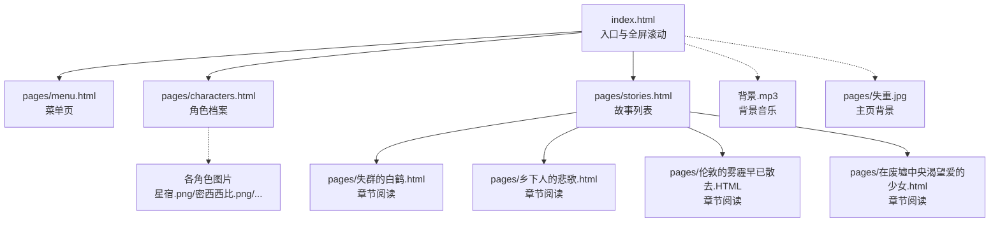
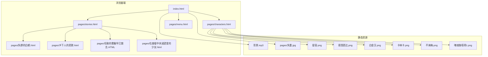
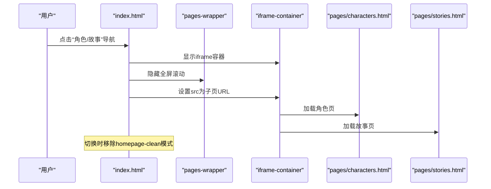
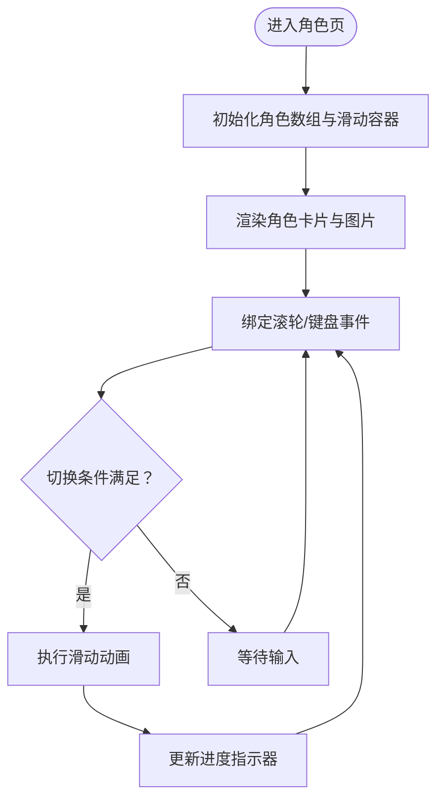
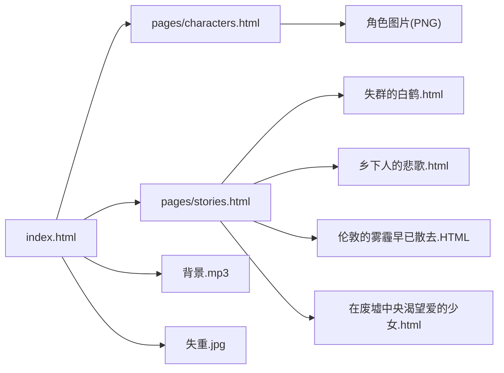

# 部署与维护

<cite>
**本文引用的文件**
- [index.html](file://index.html)
- [menu.html](file://pages/menu.html)
- [characters.html](file://pages/characters.html)
- [stories.html](file://pages/stories.html)
- [失群的白鹤.html](file://pages/失群的白鹤.html)
- [乡下人的悲歌.html](file://pages/乡下人的悲歌.html)
- [伦敦的雾霾早已散去.HTML](file://pages/伦敦的雾霾早已散去.HTML)
- [在废墟中央渴望爱的少女.html](file://pages/在废墟中央渴望爱的少女.html)
- [阅读需知（必读）.txt](file://阅读需知（必读）.txt)
- [背景.mp3](file://背景.mp3)
- [失重.jpg](file://pages/失重.jpg)
- [星宿.png](file://pages/星宿.png)
- [密西西比.png](file://pages/密西西比.png)
- [白金汉.png](file://pages/白金汉.png)
- [卡林卡.png](file://pages/卡林卡.png)
- [不来梅.png](file://pages/不来梅.png)
- [喀琅施塔得1.png](file://pages/喀琅施塔得1.png)
- [time.png](file://pages/time.png)
- [0.png](file://pages/0.png)
- [1.png](file://pages/1.png)
- [你好，星宿同志.mp3](file://pages/你好，星宿同志.mp3)
- [对话实验.mp3](file://pages/对话实验.mp3)
- [对话实验2.mp3](file://pages/对话实验2.mp3)
- [白金汉.mp3](file://pages/白金汉.mp3)
</cite>

## 目录
1. [简介](#简介)
2. [项目结构](#项目结构)
3. [核心组件](#核心组件)
4. [架构总览](#架构总览)
5. [详细组件分析](#详细组件分析)
6. [依赖分析](#依赖分析)
7. [性能考量](#性能考量)
8. [故障排除指南](#故障排除指南)
9. [结论](#结论)
10. [附录](#附录)

## 简介
本指南面向《夙日不再世界观》项目的本地部署与维护，涵盖文件准备、服务器配置、CDN部署策略、内容更新与维护流程、版本管理与回滚策略、性能监控、故障排除与安全建议。项目采用纯静态HTML/CSS/JS与少量音频资源，适合单机或内网部署，亦可通过CDN实现全球加速与缓存优化。

## 项目结构
项目采用扁平的静态站点结构，根目录包含入口页面与说明文档，pages目录存放子页面与资源。核心页面包括：
- 入口页：index.html（全屏滚动+iframe子页切换）
- 子页导航：pages/menu.html
- 角色档案：pages/characters.html（角色滑动浏览+背景音乐）
- 故事列表：pages/stories.html（故事链接集合）
- 历史故事：pages/失群的白鹤.html、pages/乡下人的悲歌.html、pages/伦敦的雾霾早已散去.HTML、pages/在废墟中央渴望爱的少女.html（章节式阅读）
- 资源：背景.mp3、失重.jpg、角色图片与PNG等

图表来源
- [index.html](file://index.html)
- [menu.html](file://pages/menu.html)
- [characters.html](file://pages/characters.html)
- [stories.html](file://pages/stories.html)
- [失群的白鹤.html](file://pages/失群的白鹤.html)
- [乡下人的悲歌.html](file://pages/乡下人的悲歌.html)
- [伦敦的雾霾早已散去.HTML](file://pages/伦敦的雾霾早已散去.HTML)
- [在废墟中央渴望爱的少女.html](file://pages/在废墟中央渴望爱的少女.html)
- [背景.mp3](file://背景.mp3)
- [失重.jpg](file://pages/失重.jpg)
- [星宿.png](file://pages/星宿.png)
- [密西西比.png](file://pages/密西西比.png)
- [白金汉.png](file://pages/白金汉.png)
- [卡林卡.png](file://pages/卡林卡.png)
- [不来梅.png](file://pages/不来梅.png)
- [喀琅施塔得1.png](file://pages/喀琅施塔得1.png)

章节来源
- [index.html](file://index.html)
- [menu.html](file://pages/menu.html)
- [characters.html](file://pages/characters.html)
- [stories.html](file://pages/stories.html)
- [失群的白鹤.html](file://pages/失群的白鹤.html)
- [乡下人的悲歌.html](file://pages/乡下人的悲歌.html)
- [伦敦的雾霾早已散去.HTML](file://pages/伦敦的雾霾早已散去.HTML)
- [在废墟中央渴望爱的少女.html](file://pages/在废墟中央渴望爱的少女.html)

## 核心组件
- 入口页（index.html）：全屏滚动页面容器、侧边导航、iframe子页切换、背景音乐控制、主页净化模式。
- 角色页（pages/characters.html）：角色滑动浏览、简介/详情切换、背景音乐、进度指示器。
- 故事页（pages/stories.html）：故事列表、音量控制样式。
- 章节阅读页（多HTML）：章节切换、对话与场景渲染。
- 资源：背景音乐（MP3）、主页背景图（JPG）、角色图片（PNG）。

章节来源
- [index.html](file://index.html)
- [characters.html](file://pages/characters.html)
- [stories.html](file://pages/stories.html)
- [失群的白鹤.html](file://pages/失群的白鹤.html)
- [乡下人的悲歌.html](file://pages/乡下人的悲歌.html)
- [伦敦的雾霾早已散去.HTML](file://pages/伦敦的雾霾早已散去.HTML)
- [在废墟中央渴望爱的少女.html](file://pages/在废墟中央渴望爱的少女.html)

## 架构总览
静态站点采用浏览器端路由与iframe嵌套，通过点击导航在全屏滚动与iframe之间切换。资源通过相对路径引用，部分外部资源通过CDN加载。

图表来源
- [index.html](file://index.html)
- [characters.html](file://pages/characters.html)
- [stories.html](file://pages/stories.html)
- [menu.html](file://pages/menu.html)
- [失群的白鹤.html](file://pages/失群的白鹤.html)
- [乡下人的悲歌.html](file://pages/乡下人的悲歌.html)
- [伦敦的雾霾早已散去.HTML](file://pages/伦敦的雾霾早已散去.HTML)
- [在废墟中央渴望爱的少女.html](file://pages/在废墟中央渴望爱的少女.html)
- [背景.mp3](file://背景.mp3)
- [失重.jpg](file://pages/失重.jpg)
- [星宿.png](file://pages/星宿.png)
- [密西西比.png](file://pages/密西西比.png)
- [白金汉.png](file://pages/白金汉.png)
- [卡林卡.png](file://pages/卡林卡.png)
- [不来梅.png](file://pages/不来梅.png)
- [喀琅施塔得1.png](file://pages/喀琅施塔得1.png)

## 详细组件分析

### 入口页（index.html）
- 功能要点
  - 全屏滚动页面容器与可见页切换
  - 侧边导航点击跳转
  - iframe子页切换（角色/故事）
  - 背景音乐播放与音量控制
  - 主页净化模式（隐藏复古纹理层）
- 性能与体验
  - 使用GPU加速类与will-change优化滚动
  - 音频状态持久化到localStorage
  - iframe高度自适应

图表来源
- [index.html](file://index.html)
- [characters.html](file://pages/characters.html)
- [stories.html](file://pages/stories.html)

章节来源
- [index.html](file://index.html)

### 角色页（pages/characters.html）
- 功能要点
  - 角色滑动浏览（上下滚动/键盘）
  - 简介/详情切换
  - 背景音乐播放与状态持久化
  - 进度指示器
- 性能与体验
  - 滚动容器内滚动优先，避免全局滚动穿透
  - 图片占位与错误回退
  - 音频自动播放与解锁策略

图表来源
- [characters.html](file://pages/characters.html)

章节来源
- [characters.html](file://pages/characters.html)

### 故事页（pages/stories.html）
- 功能要点
  - 故事列表展示
  - 音量控制样式（用于统一风格）
- 性能与体验
  - 响应式布局适配移动端
  - 链接跳转至章节阅读页

章节来源
- [stories.html](file://pages/stories.html)

### 章节阅读页（多HTML）
- 功能要点
  - 场景切换（上一章/下一章）
  - 文本对话与场景渲染
- 性能与体验
  - 平滑滚动至顶部
  - 按钮禁用状态控制

章节来源
- [失群的白鹤.html](file://pages/失群的白鹤.html)
- [乡下人的悲歌.html](file://pages/乡下人的悲歌.html)
- [伦敦的雾霾早已散去.HTML](file://pages/伦敦的雾霾早已散去.HTML)
- [在废墟中央渴望爱的少女.html](file://pages/在废墟中央渴望爱的少女.html)

## 依赖分析
- 外部资源
  - 字体与样式：Google Fonts、TailwindCSS（CDN）
  - 背景音乐：本地MP3
  - 主页背景图：本地JPG
  - 角色图片：本地PNG
- 内部依赖
  - index.html依赖pages/characters.html与pages/stories.html
  - stories.html依赖各章节阅读页
  - characters.html依赖角色图片与音频片段

图表来源
- [index.html](file://index.html)
- [characters.html](file://pages/characters.html)
- [stories.html](file://pages/stories.html)
- [失群的白鹤.html](file://pages/失群的白鹤.html)
- [乡下人的悲歌.html](file://pages/乡下人的悲歌.html)
- [伦敦的雾霾早已散去.HTML](file://pages/伦敦的雾霾早已散去.HTML)
- [在废墟中央渴望爱的少女.html](file://pages/在废墟中央渴望爱的少女.html)
- [背景.mp3](file://背景.mp3)
- [失重.jpg](file://pages/失重.jpg)

## 性能考量
- 资源加载
  - 将背景音乐与图片资源尽量本地化，减少跨域与CDN抖动
  - 使用现代图片格式（WebP）替代PNG/JPG可进一步压缩体积
- 渲染优化
  - 全屏滚动使用transform与will-change，避免重排
  - iframe容器按需显示，减少不必要的DOM
- 缓存策略
  - HTML/CSS/JS设置较长缓存（immutable）
  - 图片与音频设置合理ETag/Last-Modified
- 移动端体验
  - 控制字体数量与大小，避免阻塞渲染
  - 使用媒体查询优化布局

## 故障排除指南
- 常见问题
  - 音频无法自动播放：浏览器限制自动播放，需用户交互解锁；检查音量控制图标与状态保存
  - 图片加载失败：检查图片路径与CDN可用性，使用占位图回退
  - iframe高度异常：监听子页load与ResizeObserver，动态计算高度
  - 主页背景纹理未隐藏：确认homepage-clean类切换逻辑
- 排查步骤
  - 打开浏览器开发者工具，查看Network面板与Console错误
  - 检查localStorage中音频状态键值
  - 确认各页面相对路径正确，无404
  - 验证CDN资源可用性（Google Fonts、TailwindCSS）

章节来源
- [index.html](file://index.html)
- [characters.html](file://pages/characters.html)
- [阅读需知（必读）.txt](file://阅读需知（必读）.txt)

## 结论
本项目为纯静态站点，部署与维护成本低，适合快速上线与内网使用。通过合理的资源组织、CDN缓存与性能优化，可在不同网络环境下提供流畅体验。建议建立标准化的版本管理与回滚流程，确保内容更新与问题修复的可控性。

## 附录

### 本地部署流程
- 准备文件
  - 下载仓库所有文件，确保pages目录下包含所有子页与资源
  - 确保index.html可直接打开，无需服务器
- 测试验证
  - 在浏览器中打开index.html，验证全屏滚动、侧边导航、iframe切换
  - 检查角色页滑动与简介/详情切换
  - 检查故事页链接与章节阅读页
  - 检查背景音乐播放与音量控制
- 注意事项
  - 部分特效可能需要科学上网环境（参考说明文档）
  - 首次加载角色页可能较慢，属正常现象

章节来源
- [index.html](file://index.html)
- [characters.html](file://pages/characters.html)
- [stories.html](file://pages/stories.html)
- [阅读需知（必读）.txt](file://阅读需知（必读）.txt)

### 服务器配置建议
- Web服务器
  - Nginx/Apache均可，建议开启gzip/HTTP/2
  - 设置静态资源缓存头（ETag/Last-Modified）
  - 配置CORS（如需跨域访问）
- 安全建议
  - 限制上传权限，仅允许静态资源
  - 开启HTTPS与HSTS
  - 配置robots.txt与sitemap.xml（如需SEO）

### CDN部署策略
- 资源优化
  - 将Google Fonts与TailwindCSS缓存至CDN
  - 图片使用CDN加速，必要时启用WebP与懒加载
  - 音频资源可缓存至CDN，降低本地带宽压力
- 缓存配置
  - HTML设置短缓存或协商缓存
  - CSS/JS设置长缓存（版本化文件名）
  - 图片与音频设置长缓存（版本化文件名）
- 监控与回滚
  - 使用CDN回源日志与访问统计
  - 发布新版本时逐步切换，保留回滚分支

### 维护流程
- 内容更新
  - 新增角色/故事：在对应HTML中添加条目，补充图片与音频
  - 修改文案：直接编辑HTML/CSS，避免破坏结构
- Bug修复
  - 修复音频播放问题：检查自动播放策略与用户交互
  - 修复图片加载：检查路径与CDN可用性
- 性能监控
  - 使用浏览器性能面板与Lighthouse
  - 监控CDN命中率与延迟
  - 关注移动端加载时间与滚动性能

### 版本管理最佳实践
- 发布周期
  - 每月固定发布一次内容更新
  - 重大修复紧急发布
- 回滚策略
  - 采用蓝绿部署或版本化文件名
  - 回滚时保留最近一次备份
- 兼容性测试
  - 跨浏览器测试（Chrome/Firefox/Safari/Edge）
  - 移动端与桌面端兼容性验证
  - 音频与视频播放能力检测