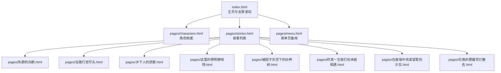
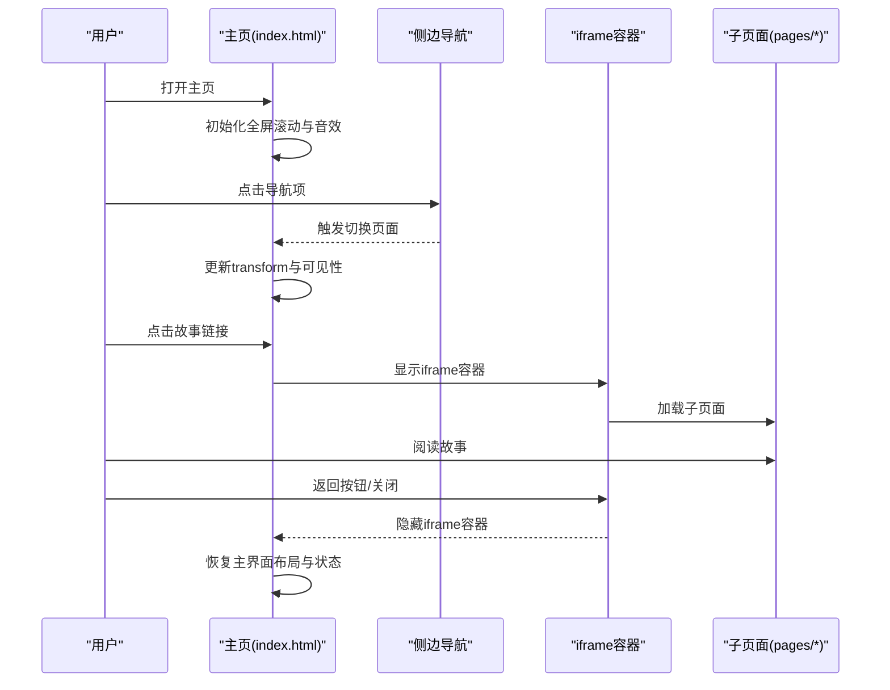
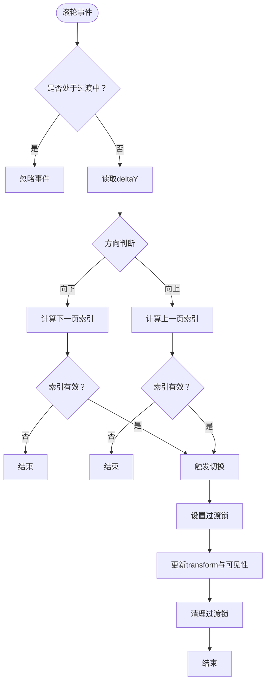
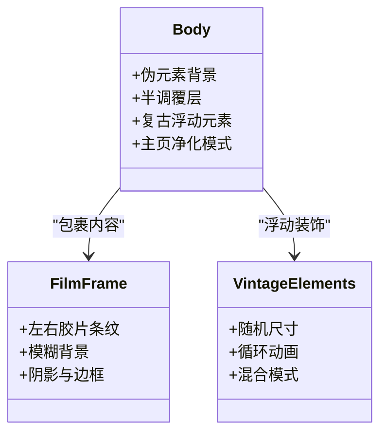
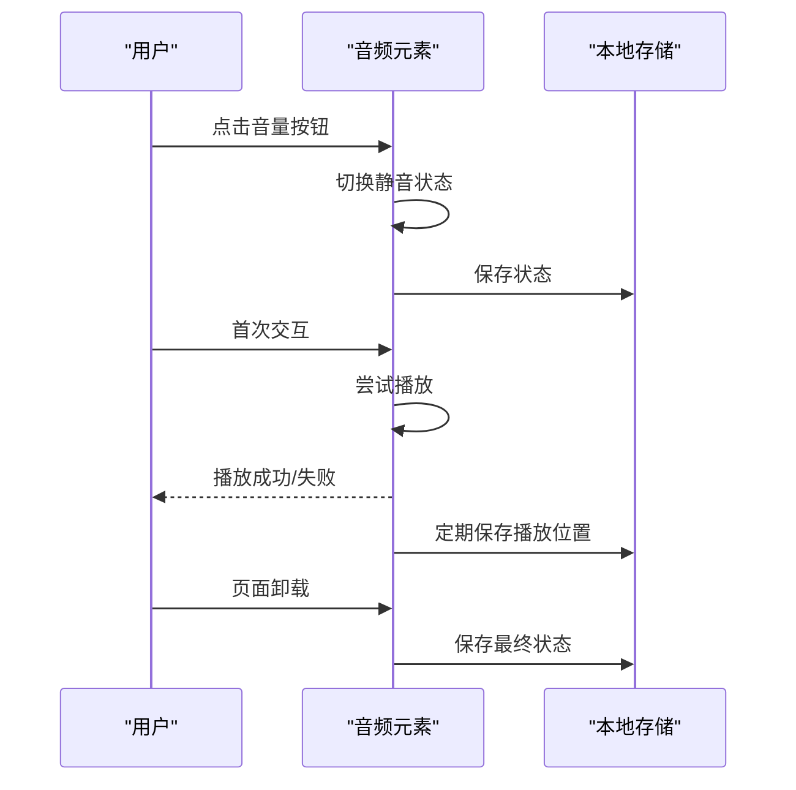
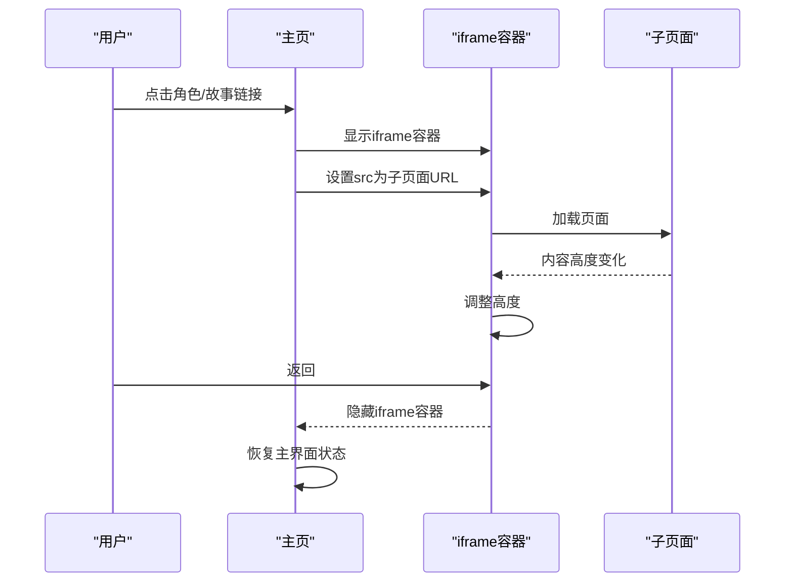
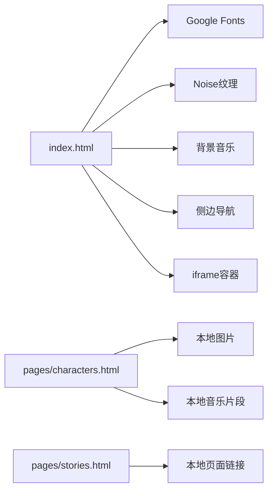

# 项目概述

<cite>
**本文档引用的文件**
- [index.html](file://index.html)
- [pages/characters.html](file://pages/characters.html)
- [pages/stories.html](file://pages/stories.html)
- [pages/失群的白鹤.html](file://pages/失群的白鹤.html)
- [pages/伦敦的雾霾早已散去.html](file://pages/伦敦的雾霾早已散去.html)
- [pages/在废墟中央渴望爱的少女.html](file://pages/在废墟中央渴望爱的少女.html)
- [pages/终其一生我们也未能相遇.html](file://pages/终其一生我们也未能相遇.html)
- [pages/被困于天空下的白桦树.html](file://pages/被困于天空下的白桦树.html)
- [pages/这里的黎明静悄悄.html](file://pages/这里的黎明静悄悄.html)
- [pages/当路行至尽头.html](file://pages/当路行至尽头.html)
- [pages/乡下人的悲歌.html](file://pages/乡下人的悲歌.html)
- [pages/menu.html](file://pages/menu.html)
- [阅读需知（必读）.txt](file://阅读需知（必读）.txt)
</cite>

## 目录
1. [引言](#引言)
2. [项目结构](#项目结构)
3. [核心组件](#核心组件)
4. [架构总览](#架构总览)
5. [详细组件分析](#详细组件分析)
6. [依赖关系分析](#依赖关系分析)
7. [性能考量](#性能考量)
8. [故障排查指南](#故障排查指南)
9. [结论](#结论)
10. [附录](#附录)

## 引言
《夙日不再世界观》是一个基于 HTML5 技术构建的互动式网页应用，围绕“灵能”主题展开跨媒体叙事。项目通过全屏滚动、复古视觉设计与音效控制，为用户提供沉浸式的阅读与探索体验。核心理念在于将历史、科幻与角色故事融合，构建一个“时间线不可改变但裂隙之中藏着真相”的世界观，引导用户在不同历史节点与角色命运之间穿梭，感受“灵能者”在时空夹缝中的挣扎与使命。

## 项目结构
项目采用“单页应用 + 子页面 iframe”混合架构：
- 主页 index.html 提供全局导航、全屏滚动与背景音乐控制
- pages 目录包含角色档案、故事列表与多篇独立故事页面
- 部分页面采用独立 HTML 结构，便于离线阅读与分享

图表来源
- [index.html:490-574](file://index.html#L490-L574)
- [pages/stories.html:201-247](file://pages/stories.html#L201-L247)

章节来源
- [index.html:1-763](file://index.html#L1-L763)
- [pages/characters.html:1-611](file://pages/characters.html#L1-L611)
- [pages/stories.html:1-253](file://pages/stories.html#L1-L253)

## 核心组件
- 全屏滚动系统：通过 CSS transform 实现平滑的垂直滚动，配合可见性切换与过渡动画，营造沉浸式浏览体验
- 复古视觉系统：半调纹理、噪点背景、复古浮动元素与胶片框装饰，强化“老电影”与“档案感”
- 音效控制系统：背景音乐自动播放与静音控制，状态持久化到本地存储
- 子页面跳转：通过 iframe 容器在主界面与子页面间无缝切换，适配移动端与桌面端

章节来源
- [index.html:228-259](file://index.html#L228-L259)
- [index.html:37-117](file://index.html#L37-L117)
- [index.html:682-756](file://index.html#L682-L756)
- [index.html:634-679](file://index.html#L634-L679)

## 架构总览
项目采用纯前端架构，无后端依赖，所有资源通过静态文件提供。核心流程：
- 用户访问 index.html，初始化全屏滚动与音效
- 点击导航或侧边栏切换页面，或点击故事列表进入子页面
- 子页面通过 iframe 展示，返回时恢复主界面布局与状态

图表来源
- [index.html:581-760](file://index.html#L581-L760)
- [pages/stories.html:201-247](file://pages/stories.html#L201-L247)

## 详细组件分析

### 全屏滚动系统
- 页面容器 pages-wrapper 使用 transform: translateY(-n*100vh) 实现垂直分页
- 通过 CSS 过渡与可见性类控制页面显隐，减少重排
- 滚轮事件监听与节流，避免快速切换导致的抖动
- 侧边导航与页码联动，支持点击跳转

图表来源
- [index.html:612-624](file://index.html#L612-L624)
- [index.html:598-610](file://index.html#L598-L610)

章节来源
- [index.html:228-259](file://index.html#L228-L259)
- [index.html:581-632](file://index.html#L581-L632)

### 复古视觉系统
- 半调纹理与噪点背景：通过伪元素与多重渐变叠加，营造胶片质感
- 复古浮动元素：随机尺寸与动画，增强层次与动感
- 胶片框装饰：左右两侧的重复条纹背景，模拟胶片边框
- 主页特殊模式：隐藏干扰层，突出“失重.jpg”背景，提升视觉焦点

图表来源
- [index.html:43-117](file://index.html#L43-L117)
- [index.html:260-284](file://index.html#L260-L284)
- [index.html:335-349](file://index.html#L335-L349)

章节来源
- [index.html:43-117](file://index.html#L43-L117)
- [index.html:260-284](file://index.html#L260-L284)
- [index.html:335-349](file://index.html#L335-L349)

### 音效控制系统
- 自动播放与静音：浏览器自动播放限制通过用户交互解锁
- 状态持久化：使用本地存储保存播放状态与当前时间
- 恢复与续播：页面加载后恢复上次播放位置，避免“未就绪”导致的失败

图表来源
- [index.html:682-756](file://index.html#L682-L756)

章节来源
- [index.html:682-756](file://index.html#L682-L756)

### 子页面跳转与适配
- iframe 容器：在主界面与子页面间无缝切换
- 动态高度：通过 ResizeObserver 与窗口大小变化事件动态调整 iframe 高度
- 返回逻辑：进入子页面时清除主页净化模式，返回时恢复主界面状态

图表来源
- [index.html:634-679](file://index.html#L634-L679)

章节来源
- [index.html:634-679](file://index.html#L634-L679)

### 角色档案页面
- 卡片式布局：左侧插画右侧信息，支持简介/详情切换
- 滚动穿透控制：在详情滚动区域内阻止页面切换，避免误触
- 进度指示器：显示当前角色序号与总数
- 背景音乐：独立的自动播放与状态保存逻辑

章节来源
- [pages/characters.html:103-137](file://pages/characters.html#L103-L137)
- [pages/characters.html:487-521](file://pages/characters.html#L487-L521)
- [pages/characters.html:549-582](file://pages/characters.html#L549-L582)
- [pages/characters.html:364-433](file://pages/characters.html#L364-L433)

### 故事列表页面
- 列表式导航：按主题分类展示多篇独立故事
- 响应式布局：适配移动端与桌面端
- 音量控制：独立的音量按钮与图标切换

章节来源
- [pages/stories.html:201-247](file://pages/stories.html#L201-L247)
- [pages/stories.html:131-157](file://pages/stories.html#L131-L157)

### 典型故事页面（示例）
以《失群的白鹤》为例，页面采用章节化阅读结构，包含场景切换、对话与注释，配合按钮实现前后章节跳转。该结构适合长篇叙事与沉浸式阅读。

章节来源
- [pages/失群的白鹤.html:1-200](file://pages/失群的白鹤.html#L1-L200)

## 依赖关系分析
- 外部资源：Google Fonts 字体、Noise 图片与复古纹理资源
- 本地资源：背景音乐、角色图片与故事文本
- 浏览器特性：CSS transform、will-change、backface-visibility、ResizeObserver、本地存储

图表来源
- [index.html](file://index.html#L11)
- [index.html:447-454](file://index.html#L447-L454)
- [pages/characters.html](file://pages/characters.html#L362)
- [pages/stories.html:201-247](file://pages/stories.html#L201-L247)

章节来源
- [index.html:11-11](file://index.html#L11-L11)
- [pages/characters.html:362-362](file://pages/characters.html#L362-L362)
- [pages/stories.html:201-247](file://pages/stories.html#L201-L247)

## 性能考量
- GPU 加速：通过 will-change 与 backface-visibility 提升动画流畅度
- 减少重排：使用 transform 替代 top/left，避免布局抖动
- 懒加载与占位：图片 onerror 使用占位图，降低空白时间
- 音频优化：预加载与状态持久化，避免重复加载与播放失败
- 响应式设计：媒体查询与弹性布局，适配多端显示

章节来源
- [index.html:37-41](file://index.html#L37-L41)
- [index.html:228-259](file://index.html#L228-L259)
- [pages/characters.html:499-500](file://pages/characters.html#L499-L500)
- [index.html:682-756](file://index.html#L682-L756)

## 故障排查指南
- 页面无法滚动：检查滚轮事件监听与过渡锁状态，确认 isTransitioning 与 wheelLock
- 音乐无法播放：确认浏览器自动播放策略，首次交互后尝试播放；检查本地存储权限
- iframe 高度异常：确认 ResizeObserver 是否可用，监听窗口 resize 事件
- 背景音乐循环播放：监听 ended 事件重置 currentTime 并重新播放
- 资源加载缓慢：提示用户网络环境与本地化加载所需时间

章节来源
- [index.html:612-624](file://index.html#L612-L624)
- [index.html:717-733](file://index.html#L717-L733)
- [index.html:665-680](file://index.html#L665-L680)
- [index.html:755-755](file://index.html#L755-L755)
- [阅读需知（必读）.txt:3-3](file://阅读需知（必读）.txt#L3-L3)

## 结论
《夙日不再世界观》通过纯前端技术实现了高质量的跨媒体叙事体验。全屏滚动、复古视觉与音效控制共同构建了沉浸式阅读环境，角色档案与故事列表提供了清晰的信息架构。项目在技术实现上注重性能与兼容性，同时在创意层面通过“灵能”主题与历史节点的交错，为用户带来独特的沉浸式探索体验。未来可在资源加载优化、故事交互扩展与多语言支持等方面持续迭代。

## 附录
- 项目目标受众：对历史、科幻与角色故事感兴趣的用户
- 使用场景：移动端与桌面端的沉浸式阅读与探索
- 创意价值：将历史、科幻与角色塑造融合，打造跨媒体叙事体验
- 发展历程与规划：项目以“灵能”为主题，逐步扩展角色与故事内容，未来可考虑增加互动式选择分支、多语言版本与移动端原生应用